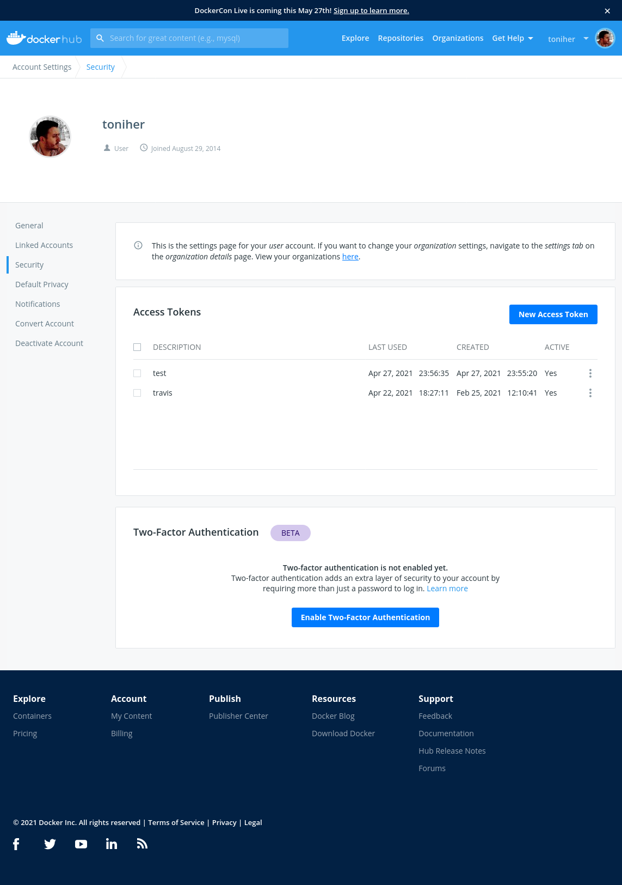
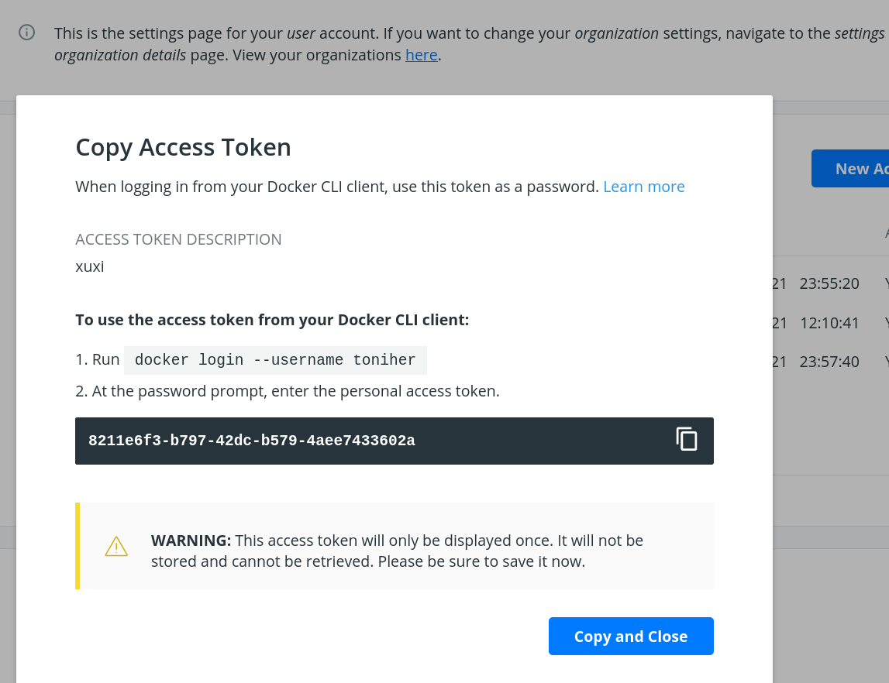
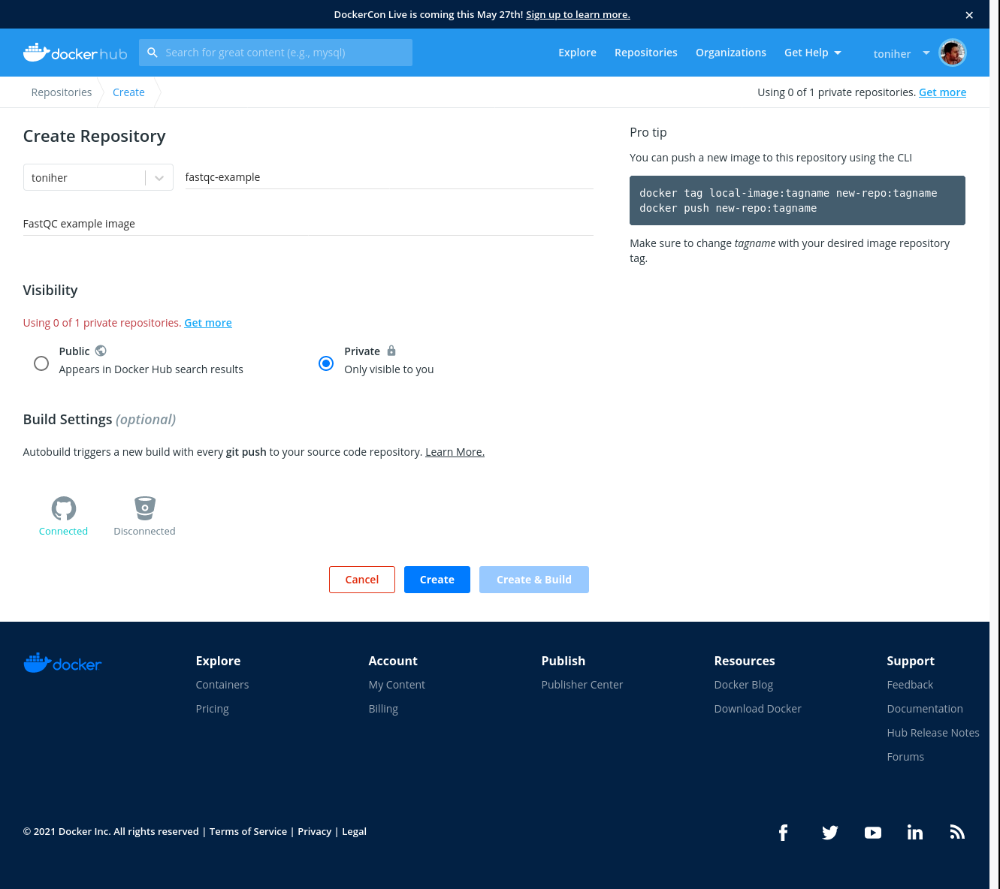
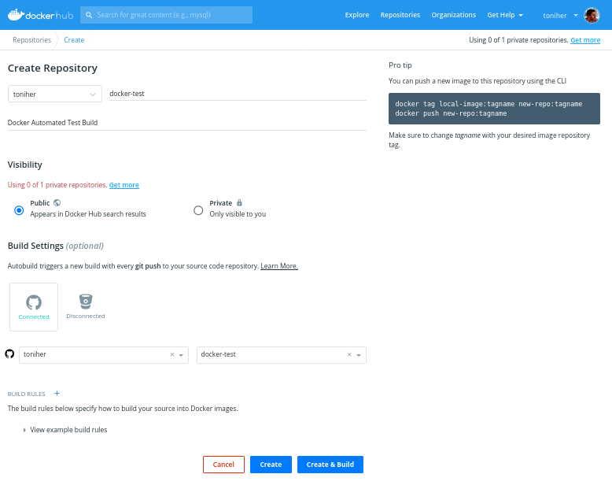
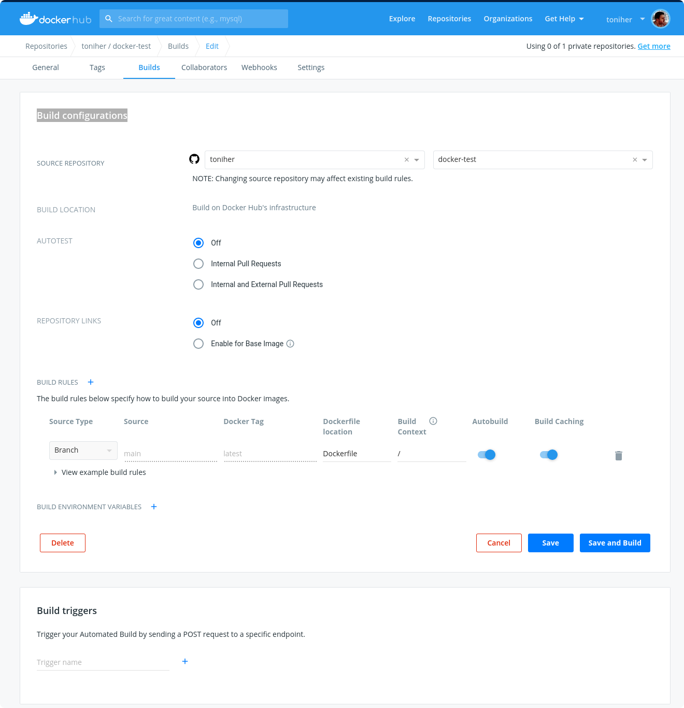

# Docker

```{r, include=FALSE}
knitr::opts_chunk$set(echo = TRUE, eval = FALSE, warning = FALSE)
```

## Introduction to Docker

<a href="https://connpass-tokyo.s3.amazonaws.com/thumbs/80/52/80521f18aec0945dfedbb471dad6aa1a.png"></a>

### What is Docker?

* Platform for developing, shipping and running applications.
* Infrastructure as application / code.
* First version: 2013.
* Company: originally dotCloud (2010), later named Docker.
* Established [Open Container Initiative](https://www.opencontainers.org/).

As a software:

* [Docker Community Edition](https://www.docker.com/products/container-runtime).
* Docker Enterprise Edition.

```{block2, type='rdmnote'}
There is an increasing number of alternative container technologies and providers. Many of them are actually based on software components originally from the Docker stack and they normally try to address some specific use cases or weakpoints. As a example, **Singularity**, that we introduce later in this couse, is focused in HPC environments. Another case, **Podman**, keeps a high functional compatibility with Docker but with a different focus on technology and permissions.
```

### Docker components

<a href="http://apachebooster.com/kb/wp-content/uploads/2017/09/docker-architecture.png"></a>

* Read-only templates.
* Containers are run from them.
* Images are not run.
* Images have several layers.

<a href="https://i.stack.imgur.com/vGuay.png"></a>


### Images versus containers

* **Image**: A set of layers, read-only templates, inert.
* An instance of an image is called a **container**.

When you start an image, you have a running container of this image. You can have many running containers of the same image.

*"The image is the recipe, the container is the cake; you can make as many cakes as you like with a given recipe."*

https://stackoverflow.com/questions/23735149/what-is-the-difference-between-a-docker-image-and-a-container

### Docker vocabulary

Get all the docker commands:

```{bash}
docker
```


Get help on a particular command:

```{bash}
docker run --help
```


## Using existing images

### Getting started

Run the following in the terminal:

```{bash}
docker images
```

The `docker images` command lists the Docker images that you have on your computer.
<br>
Now run the following:

```{bash}
docker pull hello-world
```

Run `docker images` again: now you see the "hello-world" image listed!
<br>
`docker pull` imports by default an image from **Docker Hub**.

<br>
We will see in more details the `docker images` and `docker run` commands, but let's first explore the **Docker images repositories**.


### Explore Docker Hub

Images can be stored locally or shared in a registry.
<br>
[Docker hub](https://hub.docker.com/) is the main public registry for Docker images.
<br>

Let's search the keyword **ubuntu**:


You can also search existing Docker images with the `docker search` command.
<br>
Example: let's look for images that have the keyword **blast** in their name or description.

```{bash}
docker search blast
```

Too many results? You can apply some filters:

* Minimum number of **stars**: `docker search blast --filter stars=5`
* The image is an [**official build**](https://docs.docker.com/docker-hub/official_images/): `docker search blast --filter is-official=true`
* The image is an [**automated build**](https://docs.docker.com/docker-hub/builds/): `docker search blast --filter is-automated=true`

```{bash}
# Apply one filter
docker search blast --filter stars=2

# Apply more than one filter
docker search blast --filter is-automated=true --filter stars=2
```

[https://vsupalov.com/docker-latest-tag/](https://vsupalov.com/docker-latest-tag/) to read more about the latest tag


<center><h4 style="background-color: #e6fadc; display: inline-block;">**HANDS-ON**</h4></center>

Use `docker search` to find a Docker image for the keyword `ubuntu`. Using the filters, answer the following questions:

* How many images are **official builds**?
* How many images have **3 or more stars**?
* How many images are **official builds** AND have **3 or more stars**?
* What is the NAME of the image with the highest number of stars?

<details>
<summary>
<h5 style="background-color: #e6fadc; display: inline-block;">*Answer*</h5>
</summary>

```{bash}
# Official builds
docker search ubuntu --filter is-official=true

# 3 or more stars
docker search ubuntu --filter stars=3

# Both filters
docker search ubuntu --filter is-official=true --filter stars=3
```

</details>


### docker pull: import an image

Say we are now interested in the `ubuntu` image from Docker Hub. We can retrieve it with `docker pull`.

* By default, we get the latest image / latest release.

```{bash}
docker pull ubuntu
```


* You can choose the version of Ubuntu you are fetching; for that, check different tags on the website (*latest* is also a tag):


> Note: `docker search` doesn't allow to search for tags.


Let's get the Ubuntu image with tag **18.04** (version 18.04 of Ubuntu = bionic):


```{bash}
docker pull ubuntu:18.04
```

**Where is the image now?**
<br>
As we have seen before, you can run `docker images` in the terminal to see a list of the most recently created images. The command `docker images` gives you information about:

* Repository.
* Tag.
* Unique image ID (Digest).
* Creation date.
* Image size.


```{block2, type='rmdnote'}
Notice that for some images, such as Ubuntu, the same version tag hosts several Unique Image IDs (Digest). Each ID corresponds to a build for a specific Operating System or Architecture. Docker clients automatically retrieves the suitable one when using ***docker pull***. If the OS/Architecture from the client is not present, an error is raised.

**IMPORTANT:** Digest ID present in Docker hub is **NOT** the same (or a shortened version) of the Image ID you can see when doing **docker images**. Details: https://stackoverflow.com/questions/56364643/whats-the-difference-between-a-docker-images-image-id-and-its-digest
```

```{block2, type='rmdtip'}
It is actually possible, and it can be advisable for reproducibility reasons, to pull an image with a specific digest ID. Example: docker pull ubuntu@sha256:86ac87f73641c920fb42cc9612d4fb57b5626b56ea2a19b894d0673fd5b4f2e9
```

<center><h4 style="background-color: #e6fadc; display: inline-block;">**HANDS-ON**</h4></center>

* Run command `docker images`. How many images do you get?
* Pull the version 2.2.31 of the [`biocontainers/blast`](https://hub.docker.com/r/biocontainers/blast/) image
    * What is the size of the `blast` image you just pulled?
* How many images do you get if you run `docker images --all`? What are these images? Check [documentation](https://docs.docker.com/engine/reference/commandline/images/) for help.

<details>
<summary>
<h5 style="background-color: #e6fadc; display: inline-block;">*Answer*</h5>
</summary>

```{bash}
# Pull the blast image
docker pull biocontainers/blast:2.2.31

# Run `docker images --all`
docker images --all # intermediate images.
```

</details>


### docker run: run image, i.e. start a container

Now we want to use what is **inside** the image.
<br>
Command `docker run` creates a fresh container (active instance of the image) from a **Docker (static) image**, and runs it.

<br>
The format is:<br>

docker run image:tag **command** (command being a command called *inside the image*)

<br>
We can start a container from the **ubuntu tag 18.04 image**, executing the command `ls` (stored in /bin in the container).

```{bash}
docker run ubuntu:18.04 /bin/ls
```


Now execute `ls` in your current working directory: is the result the same?


You can execute any program/command that is stored inside the image:

```{bash}
docker run ubuntu:18.04 /bin/whoami
docker run ubuntu:18.04 cat /etc/issue
```

You can either execute programs in the image from the command line (see above) or **execute a container interactively**; that is, **"enter"** the container, using command `docker run -it`.

```{bash}
docker run -it ubuntu:18.04 /bin/bash
```

If you want to leave and stop the container, type `exit` and ENTER.

<center><h4 style="background-color: #e6fadc; display: inline-block;">**HANDS-ON**</h4></center>

* Run the **hello-world** image:
  * What is happening?
* Now run the **blast** image we previously pulled:
  * Is something happening?
* Start again a container from the same **blast** image (not interactively), and run **blastp**. What happens?
* Start a container **interactively** from the same **blast** image:
  * What is the default working directory? What is inside this directory?
  * Where is the `blastp` program located in the image?
  * Exit the container.

<details>
<summary>
<h5 style="background-color: #e6fadc; display: inline-block;">*Answer*</h5>
</summary>

```{bash}
# Run the hello-world image
docker run hello-world

# Run the blast image
docker run biocontainers/blast:2.2.31

#  Start again a container from the same blast image, and run the path to the blastp command:
docker run biocontainers/blast:2.2.31 blastp

# Start a container interactively from the same blast image:
docker run -ti biocontainers/blast:2.2.31

  # What is the default working directory?
  pwd; ls
  # Where is the `blastp` program located in the image?
  which blastp
  # Exit the container.
  exit
```

</details>

>Note about Docker inside Docker: *"Although running Docker inside Docker is generally not recommended, there are some legitimate use cases, such as development of Docker itself."* [https://hub.docker.com/_/docker](https://hub.docker.com/_/docker)


You can run the container as daemon (in background), instead of the default foreground running, with the `--detach` parameter:

```{bash}
docker run --detach ubuntu:18.04 tail -f /dev/null
```

Run container as daemon (in background) with a given name:

```{bash}
docker run --detach --name myubuntu ubuntu:18.04 tail -f /dev/null
```

### docker ps: check containers status

List running containers:

```{bash}
docker ps
```

List all containers (whether they are running or not):

```{bash}
docker ps -a
```

Each container has a **unique ID**.


### docker exec: execute process in a running container

Difference between `docker run` and `docker exec`:

* `docker run` creates a temporary container, runs the command and stops the container.
* `docker exec` needs an **already running container** to query the command (that is, a *detached* container).

```{bash}
docker exec myubuntu uname -a
```

* Interactively

```{bash}
docker exec -it myubuntu /bin/bash
```


### docker stop, start, restart: actions on container

Stop a running container with `docker stop`.

```{bash}
# check the list of running containers
docker ps

# stop the myubuntu container
docker stop myubuntu

# check the list of all containers
docker ps -a
```

Start a stopped container (does NOT create a new one):

```{bash}
docker start myubuntu

docker ps -a
```

Restart a running container:

```{bash}
docker restart myubuntu

docker ps -a
```

Run with restart is enabled (by default, when exits, Docker does not automatically restart the container).
<br>
In the example below, we start a **detached container named "myubuntu2"** with the **unless-stopped** restart policy: *restart the container unless it is explicitly stopped or Docker itself is stopped or restarted.*

```{bash}
docker run --restart=unless-stopped --detach --name myubuntu2 ubuntu:18.04 tail -f /dev/null
```

* [Restart policies](https://docs.docker.com/engine/reference/commandline/run/#restart-policies---restart): no (default), always, on-failure, unless-stopped

Update restart policy:

```{bash}
docker update --restart unless-stopped myubuntu
```


<center><h4 style="background-color: #e6fadc; display: inline-block;">**HANDS-ON**</h4></center>

* Start a container from the "hello-world" image **in the background**. Give it a name.
  * Is your container running? Can you explain why (or why not)?
* Start another detached container from the same image (with a new name), with the **always restart policy**.
  * Is the container running?

<details>
<summary>
<h5 style="background-color: #e6fadc; display: inline-block;">*Answer*</h5>
</summary>

```{bash}
# start a "detached" container (in the background)
docker run --detach --name helloworld1 hello-world

# start a "detached" container with the "--restart=always" option
docker run --detach --restart=always --name helloworld2 hello-world
```

</details>


### docker rm, docker rmi: clean up!

`docker rm` is used to remove a **container** (set `-f` is the container is running, to force the removal):

```{bash}
docker rm myubuntu
docker rm -f myubuntu
```

`docker rmi` is used to remove an **image**:

```{bash}
docker rmi ubuntu:18.04
```

<center><h4 style="background-color: #e6fadc; display: inline-block;">**HANDS-ON**</h4></center>

* Remove any container (whether it is running or not).
* Remove the "hello-world" image.

<details>
<summary>
<h5 style="background-color: #e6fadc; display: inline-block;">*Answer*</h5>
</summary>

```{bash}
# check all containers
docker ps -a

# remove by their ID:
docker rm -f CONTAINER1_ID CONTAINER2_ID ...

# remove the "hello-world" image
docker rmi hello-world
```

</details>


#### Major clean

Check used space:

```{bash}
docker system df
```

Remove unused containers (and others) - **DO WITH CARE**

```{bash}
docker system prune
```

Remove ALL non-running containers, images, etc. - **DO WITH MUCH MORE CARE!!!**

```{bash}
docker system prune -a
```

* [Reference](https://www.digitalocean.com/community/tutorials/how-to-remove-docker-images-containers-and-volumes)


## Exercise 1 - Docker as a user

In breakout rooms, do the following exercise:

1. <u>`alpine` image.</u>
    * **Search** and **pull** the `alpine` image (tag **3.12**) - it is an **official build**.
    * Can you run a container from this image and make it print a “hello world” message?
    * Now run a container **interactively** from the same image.
        * Run `whoami` in the container.
        * Exit the container and run `whoami` on the host machine: do you get the same output?
    * Restart the container you just exited:
        * Is it now running?
        * Make the container execute the command `ls`.
        * Stop the container.
    * Remove the alpine image and all its containers (running or stopped).

<details>
<summary>
<h5 style="background-color: #e6fadc; display: inline-block;">*Answer*</h5>
</summary>

```{bash}
# Search and pull the alpine image (tag 3.12) - it is an official build.
docker search alpine --filter is-official=true
docker pull  alpine:3.12

# Can you run a container from this image and make it print a “hello world” message?
docker run alpine:3.12 echo "hello world"

# Now run a container **interactively** from the same image.
docker run -ti alpine:3.12
  # Run `whoami`
  whoami
  # Exit the container.
  exit

# Restart the container you just exited: is it now running?
docker restart CONTAINER_ID # find it with `docker ps -a`

# Make the container execute the command `ls`
docker exec CONTAINER_ID ls

# Stop the container
docker stop CONTAINER_ID

# Remove the alpine image and all its containers (running or stopped)
docker rmi alpine:3.12
docker rm CONTAINER_ID # check all containers with `docker ps -a`
```

</details>

2. <u>`imagemagick`</u>
    * Pull the `ìmagemagick` image that is **official** and that has the **highest number of stars**
    * Check the version of the `convert` command.
    * Start a container interactively.
    * Inside the container: download [this png image](https://pbs.twimg.com/profile_images/1273307847103635465/lfVWBmiW_400x400.png)
    * Convert it to **.jpg** using the `convert` command of imagemagick (format; `convert image.png image.jpg`).
    * Exit the container.
    * Copy the jpg image back from the stopped container! Explore `docker cp`.

<details>
<summary>
<h5 style="background-color: #e6fadc; display: inline-block;">*Answer*</h5>
</summary>

```{bash}
# Pull image
docker pull acleancoder/imagemagick-full

# Check version of `convert`
docker run acleancoder/imagemagick-full convert --version

# Start interactive container
docker run -it acleancoder/imagemagick-full
  # fetch png image
  > wget https://pbs.twimg.com/profile_images/1273307847103635465/lfVWBmiW_400x400.png
  # convert to jpg
  > convert lfVWBmiW_400x400.png myimage.jpg
  # exit container

# fetch container ID with `ps -a` and use `docker cp` to copy jpg file from the stopped container to the host
docker cp *CONTAINER_ID*:/myimage.jpg .
```

</details>


## Linux packages

In the next topic, we will **create Docker images**.
<br>
For this to go smoothly, you should know your **base system**, and how to interact with it (update, upgrade and install packages for example).
<br>
In Linux-based environment, software is usually distributed in the form of **packages**, kept in repositories.
<br>
Different operating systems have different tools to fetch and install packages:

| Operating System | Format | Tool(s) |
| :-----: | :-----: | :-----: |
| [Debian](https://packages.debian.org) / [Ubuntu](https://packages.ubuntu.com/) / Linux Mint / Raspbian | .deb | apt, apt-cache, apt-get, dpkg |
| [CentOS](https://centos.pkgs.org/) (RedHat) | .rpm | yum |
| Fedora (RedHat) | .rpm | dnf |
| FreeBSD | .txz | make, pkg |
| Alpine | | apk |

More on the subject in [this post](https://www.digitalocean.com/community/tutorials/package-management-basics-apt-yum-dnf-pkg)

>Note that the environment you are working on for this course is *CentOS-based*

<br>
During this course, we will build images based on **Ubuntu** and **CentOS**.


### Update and upgrade packages

* In **Ubuntu**:

```{bash}
apt-get update && apt-get upgrade -y
```

In **CentOS**:

```{bash}
yum check-update && yum update -y
```

### Search and install packages:

* In **Ubuntu**:

```{bash}
apt search libxml2
apt install -y libxml2-dev
```

* In **CentOS**:

```{bash}
yum search libxml2
yum install -y libxml2-devel.x86_64
```

>Note the **-y** option that we set for updating and for installing.<br>
It is an important option in the context of Docker: it means that you *answer yes to all questions* regarding installation.

<br>

[Conda](https://docs.conda.io/en/latest/) is an open source package management system and environment management system that runs on Windows, macOS and Linux. Conda allows to quickly find, install, run and update packages and their dependencies.

**Popular Conda repositories:**

* [Anaconda](https://anaconda.org/anaconda/repo)
* [Conda-forge](https://conda-forge.org/feedstocks/)
* [Bioconda](https://anaconda.org/bioconda/repo)

```{block2, type='rdmtip'}
If interested in using Conda, you can choose this Docker image: https://hub.docker.com/r/continuumio/miniconda3
```

## Docker recipes

The **Docker recipe** contains a set of instructions and commands that will be used to **create/build a Docker image**.

### Writing recipes and building images

All commands should be saved in a text file, named by default **Dockerfile**.

| Instruction | What it does |
  | :-----: | :-----: |
  | FROM | Sets the base image. |
  | RUN | Commands to run. |
  | MAINTAINER |  Docker image maintainer. |
  | WORKDIR | Sets the working directory for the container's building instructions. |
| SHELL | Changes the default shell. |
| ADD / COPY | Copy files from source to destination. |
| ARG | Sets variables that can be used as the image is built. |
| ENV | Sets environment variables. Persists when container is run. |
| ENTRYPOINT | Helps configure the container as an executable. |
| CMD | Can provide a default executable or arguments to the ENTRYPOINT executable. |
| VOLUME | Creates a mount point for an external volume. |
| EXPOSE | Exposes network ports on the container. |

[Reference](https://books.google.es/books?id=TshsDwAAQBAJ&pg=PA96&lpg=PA96&dq=docker+recipe+basic+instructions&source=bl&ots=ZfPBPRMTG9&sig=ACfU3U2ZOrPu6krVOTQ_gEBrx6TBXY1Jaw&hl=en&sa=X&ved=2ahUKEwjl-deB1p7wAhVLXBoKHdclCuYQ6AEwEXoECAYQAw#v=onepage&q=docker%20recipe%20basic%20instructions&f=false)

#### Basic instructions

Each row in the recipe corresponds to a **layer** in the final image.

**FROM**: parent image. Typically, an operating system. This is the **base layer**.

```docker
FROM ubuntu:18.04
```

**RUN**: the command to execute inside the image filesystem.
<br>
Think about it this way: every **RUN** line is essentially what you would run to install programs on a freshly installed Ubuntu OS.

```docker
RUN apt install wget
```

This is a basic recipe that takes the **ubuntu:18.04** image as a base layer, updates and upgrades Linux packages, and installs `wget`:

```docker
FROM ubuntu:18.04

RUN apt update && apt -y upgrade
RUN apt install -y wget
```

<center><h4 style="background-color: #e6fadc; display: inline-block;">**HANDS-ON**</h4></center>

Explore this [Dockerfile](https://github.com/BioContainers/containers/blob/master/blast/2.2.31/Dockerfile):

* What is the **base layer**?
* What is being installed in the image? How?

<details>
<summary>
<h5 style="background-color: #e6fadc; display: inline-block;">*Answer*</h5>
</summary>

Base layer: biocontainers/biocontainers:v1.0.0_cv4
<br>
Tool `blast` is installed using **conda**.

</details>


#### Building images from recipes

`docker build` will create/build a Docker image from a Docker recipe.
<br>

Save the following commands:

```docker
FROM ubuntu:18.04

RUN apt update && apt -y upgrade
RUN apt install -y wget
```

in a file named **Dockerfile**
<br>

`docker build` implicitely looks for a file named **Dockerfile** in the current directory:

```{bash}
docker build .
```

Same as:

```{bash}
docker build --file Dockerfile .
```

Syntax: **`--file` / `-f`**

**.** stands for the context (in this case, current directory) of the build process. This makes sense if copying files from filesystem, for instance.
<br>

**IMPORTANT**: Avoid contexts (directories) over-populated with files (even if not actually used in the recipe).

```{block2, type='rdmtip'}
In order to avoid that some directories or files are inspected or included (e.g, with **COPY** command in Dockerfile), you can use .dockerignore file to specify which paths should be avoided. More information at: https://codefresh.io/docker-tutorial/not-ignore-dockerignore-2/
```

You can define a specific name for the image during the build process.

Syntax: **`-t`** *imagename:tag*. If not defined `:tag` default is **latest**.

```{bash}
docker build -t mytestimage .

# same as:
docker build -t mytestimage:latest .
```

The last line of installation should be **Successfully built ...**: then you are good to go.
<br>
Check with `docker images` that you see the newly built image in the list...


Then let's check the ID of the image and run it!

  ```{bash}
# Get the ID with docker images
docker images

# Run/start a container using the ID or name
docker run f9f41698e2f8
docker run mytestimage
```


#### More instructions

**MAINTAINER**

Who is maintaining the container?

```docker
MAINTAINER Toni Hermoso Pulido <toni.hermoso@crg.eu>
```

**WORKDIR**: all subsequent actions will be executed in that working directory

```docker
WORKDIR ~
```

**SHELL**: allows the default shell used for the shell form of commands to be overridden.
<br>
  Use `bash` as the default shell:

```
SHELL ["/bin/bash", "-c"]
```

**ADD, COPY**: add files to the image filesystem

Difference between ADD and COPY explained [here](https://stackoverflow.com/questions/24958140/what-is-the-difference-between-the-copy-and-add-commands-in-a-dockerfile) and [here](https://nickjanetakis.com/blog/docker-tip-2-the-difference-between-copy-and-add-in-a-dockerile)

**COPY**: lets you copy a local file or directory from your host (the machine from which you are building the image)

**ADD**: same, but ADD works also for URLs, and for .tar archives that will be automatically extracted upon being copied.

```docker
# COPY source destination
COPY ~/.bashrc .
```

**ENV, ARG**: run and build environment variables

Difference between ARG and ENV explained [here](https://vsupalov.com/docker-arg-vs-env/).

<a href="https://d33wubrfki0l68.cloudfront.net/ed9cab66953fd3a80af63675cf3fefade4572c01/00a3b/images/docker-env-vars/docker_environment_build_args_overview.png"></a>

  * **ARG** values: available only *while the image is built.*
  * **ENV** values: available *for the future running containers.*

  You can use **ARG**, for example, to specify the version of the base layer you want to use:

  * With a default value

```
ARG UbuntuVersion=18.04

FROM ubuntu:${UbuntuVersion}
```

  * Without a default value (i.e. the user is expected to provide it upon building)

```
ARG UbuntuVersion

FROM ubuntu:${UbuntuVersion}
```

Provide a value for *UbuntuVersion* as you build the image with **`--build-arg`**:

```
docker build --build-arg UbuntuVersion=20.04 .
```


You can also use **ARG** to build a specific software version in the image. Let's try it!


<center><h4 style="background-color: #e6fadc; display: inline-block;">**HANDS-ON**</h4></center>

Modify the following recipe so you can decide in the command line **which version of Python to install**.
<br>
The default version should be 2.7. Pass the argument to install the version 3.8.
<br> Build and run first with the default version, and then with the version 3.8.

```
FROM ubuntu:18.04

RUN apt update && apt upgrade -y
RUN apt install -y python2.7
```

<details>
<summary>
<h5 style="background-color: #e6fadc; display: inline-block;">*Answer*</h5>
</summary>

Recipe is saved in **Dockerfile_ARG**

```
FROM ubuntu:18.04

# Argument PyVersion with default value 2.7
ARG PyVersion=2.7

RUN apt update && apt upgrade -y
RUN apt install -y python${PyVersion}
```

Build the image to get the default version of Python:

```{bash}
docker build -t py27 -f Dockerfile_ARG .
```

Build the image to install the version 3.8 of Python instead (via the `--build-arg` option):

```{bash}
docker build --build-arg PyVersion=3.8 -t py38 -f Dockerfile_ARG .
```

Run the image and check if Python of the correct version is installed:

```{bash}
docker run py27 python2.7 --help
docker run py38 python3.8 --help
```

</details>


<br>

  **CMD, ENTRYPOINT**: command to execute when generated container starts

The ENTRYPOINT specifies a command that will always be executed when the container starts.
<br>
  The CMD specifies arguments that will be fed to the ENTRYPOINT.

<br>

  In the example below, when the container is run without an argument, it will execute `echo "hello world"` (default).<br>
  If it is run with the argument **nice** it will execute `echo "nice"`. The argument given in **CMD** will be overridden.

```docker
FROM ubuntu:18.04

ENTRYPOINT ["/bin/echo"]
CMD ["hello world"]
```

Save the above recipe in **Dockerfile_hello**.
<br>
Build:

```{bash}
docker build -f Dockerfile_hello -t helloimage .
```

Run without an argument:

```{bash}
docker run helloimage
```

Now run with an argument:

```{bash}
docker run helloimage "nice"
```

<br>

Here is a more complex recipe (save it in a text file named **Dockerfile_ubuntu**):

```docker
FROM ubuntu:18.04

MAINTAINER Toni Hermoso Pulido <toni.hermoso@crg.eu>

SHELL ["/bin/bash", "-c"]

WORKDIR ~

RUN apt-get update && apt-get -y upgrade
RUN apt-get install -y wget

ENTRYPOINT ["/usr/bin/wget"]
CMD ["https://cdn.wp.nginx.com/wp-content/uploads/2016/07/docker-swarm-hero2.png"]
```

Build the image:

```{bash}
docker build -f Dockerfile_ubuntu .
```

Try to run it without and with an argument:

```{bash}
# Remember to check the image ID with `docker images`
docker run f9f41698e2f8

# with an argument
docker run f9f41698e2f8 https://cdn-images-1.medium.com/max/1600/1*_NQN6_YnxS29m8vFzWYlEg.png
```


### docker tag

Use `docker tag` to **tag a local image** that has, for example, ID "f9f41698e2f8" in the "ubuntu_wget" image name repository with version/tag "1.0":

```{bash}
docker tag f9f41698e2f8 ubuntu_wget:1.0
```

If the version/tag is not specified, the default is **latest**.


### Build cache

Every line in a Dockerfile is an image/layer by itself (you can see all images with `docker images --all`).
<br>

Let's modify the last line in the previous image recipe (**Dockerfile_ubuntu**) (let's change the image URL) and rebuild it (even with a different name/tag):

```docker
FROM ubuntu:18.04

MAINTAINER Toni Hermoso Pulido <toni.hermoso@crg.eu>

WORKDIR ~

RUN apt-get update && apt-get -y upgrade
RUN apt-get install -y wget

ENTRYPOINT ["/usr/bin/wget"]
CMD ["https://cdn-images-1.medium.com/max/1600/1*_NQN6_YnxS29m8vFzWYlEg.png"]
```

```{bash}
docker build -t mytestimage2 -f Dockerfile_ubuntu .
```

It will **start from the last line**, and will not re-run commands before the modified line as they were already successfully built.
<br>

It is very convenient for testing and trying new steps, but it may lead to errors when versions are updated (either FROM image or included packages).
<br>
It is therefore recommended to start from scratch with `--no-cache` option, when building the image.

```{bash}
docker build --no-cache -t mytestimage2 -f Dockerfile_ubuntu .
```

## Exercise 2 - Docker recipes and build images

In breakout rooms, do the following exercise:

1. <u>`figlet` recipe.</u>
    * Write a docker recipe in a file **Dockerfile_figlet** that:
        * is based on **ubuntu:18.04**.
        * **echoes "I love containers"** by default or any other word/sentence, if given as the argument.
    * Build the image (give the image the name of your choice).
    * Run the image:
        * with no argument.
        * with **"Docker course"** as an argument.
    * Modify the **Dockerfile_figlet**:
        * add the MAINTAINER field.
        * update and upgrade Ubuntu packages.
        * install the [**figlet**](https://zoomadmin.com/HowToInstall/UbuntuPackage/figlet) program.
        * change "echo" to "figlet" in the **ENTRYPOINT**
    * Build the image.
    * Run the new image, with the default parameters, then with **"Docker course"** as an argument.

<details>
<summary>
<h5 style="background-color: #e6fadc; display: inline-block;">*Answer*</h5>
</summary>

Recipe saved in **Dockerfile_figlet**:

```
FROM ubuntu:18.04

ENTRYPOINT ["echo"]
CMD ["I love containers"]
```

Build:

```{bash}
docker build --file Dockerfile_figlet -t mytest .
```

Run the image:

```{bash}
# with no argument
docker run mytest

# with argument "Docker course"
docker run mytest "Docker course"
```

Recipe:

```
FROM ubuntu:18.04

MAINTAINER Name Surname <name.surname@mail.com>

RUN apt-get update && apt-get upgrade -y
RUN apt-get install -y figlet

ENTRYPOINT ["figlet"]
CMD ["I love containers"]
```

Build the image.

```{bash}
docker build --no-cache --file Dockerfile_figlet -t mytestfiglet .
```

Run the new image, with the default parameter, then with **"Docker course"** as an argument.

```{bash}
# run with no argument
docker run mytestfiglet

# run with argument "Docker course"
docker run mytestfiglet "Docker course"
```

</details>


2. <u>Random numbers</u>
    * Copy the following short `bash` script in a file called `random_numbers.bash`.

```{bash}
#!/usr/bin/bash
seq 1 1000 | shuf | head -$1
```

This script outputs **random intergers from 1 to 1000**: the number of integers selected is given as the **first argument**.

* Write a recipe for an image:
    * Based on **centos:7**
    * That will execute this script (with `bash`) when it is run, giving it **2** as a default argument (i.e. **outputs 2 random integers**): the default can be changed as the image is run.
* Build the image.
    * Start a container with the default argument, then try it with another argument.

<details>
<summary>
<h5 style="background-color: #e6fadc; display: inline-block;">*Answer*</h5>
</summary>

Recipe (in **Dockerfile_RN**):

```
FROM centos:7

MAINTAINER Name Surname <name.surname@mail.com>

# Copy script from host to image
COPY random_numbers.bash .

# Make script executable
RUN chmod +x random_numbers.bash

# As the container starts, "random_numbers.bash" is run
ENTRYPOINT ["/usr/bin/bash", "random_numbers.bash"]

# default argument (that can be changed on the command line)
CMD ["2"]
```

Build and run:

```{bash}
docker build -f Dockerfile_RN -t random_numbers .
docker run random_numbers
docker run random_numbers 10
```

</details>


## Additional commands

* **docker inspect**: Get details from containers (both running and stopped). Things such as IPs, volumes, etc.

* **docker logs**: Get *console* messages from running containers. Useful when using with web services.

* **docker commit**: Turn a container into an image. It make senses to use when modifying container interactively. However this is bad for reproducibility if no steps are saved.

Good for long-term reproducibility and for critical production environments:

* **docker save**: Save an image into an image tar archive.

* **docker load**: Load an image tar archive to become an image.

* **docker export**: Save a container filesystem into a tar archive.

* **docker import**: Import a filesystem tar archive into an image (you need to specify a target tag).

<center><h4 style="background-color: #e6fadc; display: inline-block;">**HANDS-ON**</h4></center>

* Save a previously created image into a **tar archive** (Look at the command's options for help). Remove the original image and recover it again.

<details>
<summary>
<h5 style="background-color: #e6fadc; display: inline-block;">*Answer*</h5>
</summary>

```{bash}
# Let's save the image in a tar
docker save -o random_numbers.tar random_numbers

# Remove the original image
docker rmi random_numbers

# Check existing images now
docker images

# Recover it
docker load < random_numbers.tar

# Check now images
docker images
```

</details>

```{block2, type='rmdnote'}
If you check the tar archives generated thanks to **save** with the ones using **export**, you will notice they do not look the same. The former ones ressemble more what you will find in /var/lib/docker (that is where Docker daemon stores its data) and it includes metadata information (so it is not necessary to specify an image tag). On the other hand, tar files generated with **export** they simply contantain the image filesystem. You lost that way a lot of metadata associated to the original image, such as the tags, but also things such as ENTRYPOINT and CMD instructions.
```

## Volumes

Docker containers are fully isolated. It is necessary to mount volumes in order to handle input/output files.

Syntax: `--volume/-v host:container`

<br> We can pull the following image to illustrate:

```{bash}
docker pull biocontainers/fastqc:v0.11.9_cv7
```

[FastQC](https://www.bioinformatics.babraham.ac.uk/projects/fastqc/) is a tool that runs a quality control on **.fastq** files (a file format that stores nucleotide sequences and their corresponding quality scores).

<br>

```{bash}
# Create directory and empty file
mkdir datatest
touch datatest/test

# Run a container in the background (--detach) and mount the local volume "datatest" (we map it to directory /scratch inside the container)
docker run --detach --volume $(pwd)/datatest:/scratch --name fastqc_container biocontainers/fastqc:v0.11.9_cv7 tail -f /dev/null

# Execute the container interactively
docker exec -ti fastqc_container /bin/bash
> ls -l /scratch
> exit
```

```{block2, type='rmdnote'}
Strictly speaking, these type of volumes we showed above are named **bind mounts**. If interested, there is a more powerful syntax available which allow you to control things such as turning them read-only (with **--mount**). More details here: https://docs.docker.com/storage/bind-mounts/

More sophisticated kinds of volumes (which are handled by Docker daemon) are explained here: https://docs.docker.com/storage/volumes/
```


<center><h4 style="background-color: #e6fadc; display: inline-block;">**HANDS-ON**</h4></center>

1. Copy the 2 fastq files from the [Github repository](https://github.com/biocorecrg/CoursesCRG_Containers_Nextflow_May_2021/tree/main/testdata) and place them in mounted directory.
2. Run fastqc interactively (inside container): `fastqc /scratch/*.gz`
3. Run fastqc outside the container

<details>
<summary>
<h5 style="background-color: #e6fadc; display: inline-block;">*Answer*</h5>
</summary>

```{bash}
# Download test fastq files (manually or using the following commands) and place them in "datatest":
wget -O - https://github.com/biocorecrg/CoursesCRG_Containers_Nextflow_May_2021/blob/main/testdata/B7_H3K4me1_s_chr19.fastq.gz?raw=true > datatest/B7_H3K4me1_s_chr19.fastq.gz
wget -O - https://github.com/biocorecrg/CoursesCRG_Containers_Nextflow_May_2021/blob/main/testdata/B7_input_s_chr19.fastq.gz?raw=true > datatest/B7_input_s_chr19.fastq.gz

# Mount volumes and start a detached container
docker run --detach -ti --volume $(pwd)/datatest:/scratch --name fastqc_container_test biocontainers/fastqc:v0.11.9_cv7

# Execute container interactively and run fastqc
docker exec -ti fastqc_container_test /bin/bash
> fastqc /scratch/*.gz

# Run fastqc outside the container
# One by one
docker exec fastqc_container_test fastqc /scratch/B7_H3K4me1_s_chr19.fastq.gz
docker exec fastqc_container_test fastqc /scratch/B7_input_s_chr19.fastq.gz
# All (using wildcard *)
docker exec fastqc_container_test bash -c 'ls /scratch/*gz'

```

</details>

```{block2, type='rmdtip'}
***bash -c*** stands for executing from the provided string.
```

<center><h4 style="background-color: #e6fadc; display: inline-block;">**HANDS-ON**</h4></center>

1. Copy the 2 FASTA files from the [Github repository](https://github.com/biocorecrg/CoursesCRG_Containers_Nextflow_May_2021/tree/main/testdata/blast) and place them in mounted directory.
2. Run ```blastp``` inside the container against each other: `blastp -query /scratch/O75976.fasta -subject /scratch/Q90240.fasta`
3. Run ```blastp``` outside the container and get the result. Do with exec and do all at once with run

<details>
<summary>
<h5 style="background-color: #e6fadc; display: inline-block;">*Answer*</h5>
</summary>
```{bash}
# Let's create the container and we dettach it
docker run --detach -ti --volume $(pwd)/datatest:/scratch --name blastp_test ncbi/blast:2.10.1

# Execute container interactively and run blastp
docker exec -ti blastp_test /bin/bash
> blastp -query /scratch/O75976.fasta -subject /scratch/Q90240.fasta > /scratch/insideout.txt

# Run from outside and retrieve in different ways
docker exec -ti blastp_test blastp -query /scratch/O75976.fasta -subject /scratch/Q90240.fasta

docker exec -ti blastp_test blastp -query /scratch/O75976.fasta -subject /scratch/Q90240.fasta > out.txt

docker exec -ti blastp_test blastp -query /scratch/O75976.fasta -subject /scratch/Q90240.fasta -out /scratch/outagain.txt

docker run --volume $(pwd)/datatest:/scratch --name blastp1 ncbi/blast:2.10.1 blastp -query /scratch/O75976.fasta -subject /scratch/Q90240.fasta > out2.txt

docker run --volume $(pwd)/datatest:/scratch --name blastp2 ncbi/blast:2.10.1 blastp -query /scratch/O75976.fasta -subject /scratch/Q90240.fasta -out /scratch/outagain2.txt

```
</details>

## Ports

The same as with volumes, but with ports, to access Internet services.

Syntax: ``--publish/-p host:container``


```{bash}
docker run --detach --name webserver nginx
curl localhost:80
docker exec webserver curl localhost:80
docker rm -f webserver

```

```{bash}
docker run --detach --name webserver --publish 80:80 nginx
curl localhost:80
docker rm -f webserver
```

```{bash}
docker run --detach --name webserver -p 8080:80 nginx
curl localhost:80
curl localhost:8080
docker exec webserver curl localhost:80
docker exec webserver curl localhost:8080
docker rm -f webserver
```

```{block2, type='rdmtip'}
You can check the website also from your web browser at: http://mymachine-address-here/ (port 80 by default). Replace your mymachine-address-here for machine provided address or 127.0.0.1/localhost in case you were trying it from your own machine.
```


## Integrative examples

### FASTQC Web Application

We work in a dummy FASTQC Web service

We place ```B7_input_s_chr19.fastq.gz``` file from available datasets in ```$HOME/myscratch```

```{bash}
mkdir -p $HOME/myscratch

cp testdata/* $HOME/myscratch

cd containers/docker/fastqc_www

docker build -t fastqcwww -f Dockerfile ../../scripts/fastqc

docker run -d -v $HOME/myscratch:/scratch -p 3838:8083 --name myfastqc fastqcwww
```

Example query from the browser:

http://mymachine-address-here:3838/?file=B7_input_s_chr19.fastq

```{block2, type='rmdnote'}
As commented in previous sections, the context is the place from where Docker will start the build process. Keep it in mind when defining the paths when using commands such as **COPY** in the recipe.
```

```{block2, type='rmdnote'}
Replace your mymachine-address-here for machine provided address or 127.0.0.1/localhost in case you were trying it from your own machine.
```

### Shiny Application

```{bash}
cd containers/docker/shiny

docker build -t shinyapp -f Dockerfile ../../scripts

docker run -d -v $(pwd)/../../scripts/shiny:/srv/shiny-server/myserver -p 3838:3838 --name myserver shinyapp
```

Check the result from the browser
http://mymachine-address-here:3838


```{block2, type='rmdnote'}
In the CMD execution you see the host *0.0.0.0*, this a normal approach to indicate association to any IP address from the machine you launch the program. In a very machine you can have many routings and networks associated (e.g., more than one Ethernet plug)
```

## Publish images

### Push an image

<!-- Pull/push image from Commons here -->
```{r, out.width="60%", echo=FALSE, eval = TRUE, fig.cap='PUSH. Steve Snodgrass. CC-BY, Source: https://www.flickr.com/photos/stevensnodgrass/6117660537/'}

```

If you didn't do it yet, you can create an account in Docker Hub.

* Generate of an access key in Docker Hub

```{r, out.width="60%", echo=FALSE, eval = TRUE}

```

```{r, out.width="60%", echo=FALSE, eval = TRUE}

```

Let's go back to our terminal and we use that access token. **Username** is your Docker Hub username.

* docker login

```
(base) [ec2-user@ip-172-31-47-200 ~]$ docker login
Login with your Docker ID to push and pull images from Docker Hub. If you don't have a Docker ID, head over to https://hub.docker.com to create one.
Username: myuser
Password:
WARNING! Your password will be stored unencrypted in /home/ec2-user/.docker/config.json.
Configure a credential helper to remove this warning. See
https://docs.docker.com/engine/reference/commandline/login/#credentials-store
```

* Let's create a repository in Docker Hub

```{r, out.width="60%", echo=FALSE, eval = TRUE}

```

We use one image we have in our system and we add a tag that matches our repository name.

```{bash}
docker pull biocontainers/fastqc:v0.11.9_cv7

Status: Downloaded newer image for biocontainers/fastqc:v0.11.9_cv7
docker.io/biocontainers/fastqc:v0.11.9_cv7

(base) [ec2-user@ip-172-31-45-86 ~]$ docker images
REPOSITORY             TAG                 IMAGE ID            CREATED             SIZE
biocontainers/fastqc   v0.11.9_cv7         e5e3008d2bd1        6 months ago        834MB
(base) [ec2-user@ip-172-31-45-86 ~]$ docker tag biocontainers/fastqc:v0.11.9_cv7 toniher/fastqc-example:latest
(base) [ec2-user@ip-172-31-45-86 ~]$ docker images
REPOSITORY               TAG                 IMAGE ID            CREATED             SIZE
biocontainers/fastqc     v0.11.9_cv7         e5e3008d2bd1        6 months ago        834MB
toniher/fastqc-example   latest              e5e3008d2bd1        6 months ago        834MB
```

Then we push that new added tag and in shortly you will see in Docker Hub page.

```{bash}
docker push toniher/fastqc-example:latest
```


```{block2, type='rdmnote'}
As already noted, default registry is Docker Hub. If using another one, it is necessary to prepend it as when pulling.
```

### Automatic builds

* Create a Github repository

* Add a Dockerfile (any of the ones used in the course). Keep in mind that if the recipe requires files (e.g., processed with **COPY**) you will need to upload them and place them in a way compatible with the context you choose.

* Configure an automated build from Docker Hub

First you may need to grant permission to Github from your Docker Hub account. More information at: https://docs.docker.com/docker-hub/builds/link-source/

```{r, out.width="60%", echo=FALSE, eval = TRUE}

```

```{r, out.width="60%", echo=FALSE, eval = TRUE}

```

```{block2, type='rdmnote'}
If you cannot trigger the automatic build, it may be because Docker Hub refers by default to **master** branch of Github repositories. Since late 2020, default Branch is **main**, so you might need to explictly put that name there. Some context: https://www.infoq.com/news/2020/10/github-main-branch/
```

## Exercise 3 - Docker volumes and ports

* Simple BLAST web application. Including mount/volume and port. Description below

<details>
<summary>
<h5 style="background-color: #e6fadc; display: inline-block;">*Answer*</h5>
</summary>
Example Dockerfile
```
FROM debian:stretch

# File Author / Maintainer
MAINTAINER Toni Hermoso Pulido <toni.hermoso@crg.eu>

ARG BLAST_VERSION=2.10.1

RUN apt-get update; apt-get install -y curl;

RUN cd /usr/local; curl --fail --silent --show-error --location --remote-name ftp://ftp.ncbi.nlm.nih.gov/blast/executables/blast+/${BLAST_VERSION}/ncbi-blast-${BLAST_VERSION}+-x64-linux.tar.gz
RUN cd /usr/local; tar zxf ncbi-blast-${BLAST_VERSION}+-x64-linux.tar.gz; rm ncbi-blast-${BLAST_VERSION}+-x64-linux.tar.gz
RUN cd /usr/local/bin; ln -s /usr/local/ncbi-blast-${BLAST_VERSION}+/bin/* .

# Default location of BLAST databases
VOLUME /blastdb
ENV BLASTDB /blastdb

# Now adding web stuff
RUN apt-get install -y php-cli

RUN mkdir /wwww
WORKDIR /wwww

COPY index.php .

# Clean cache
RUN apt-get clean
RUN set -x; rm -rf /var/lib/apt/lists/*

EXPOSE 8081
ENTRYPOINT ["php", "-S", "0.0.0.0:8081"]
```

```{bash}
docker run -d -v $HOME/db:/blastdb -p 80:8081 --name myblast blastwww
```


Example query from the browser:

http://mymachine-address-here/?id=O75976
</details>

* Push resulting image to Docker Hub
