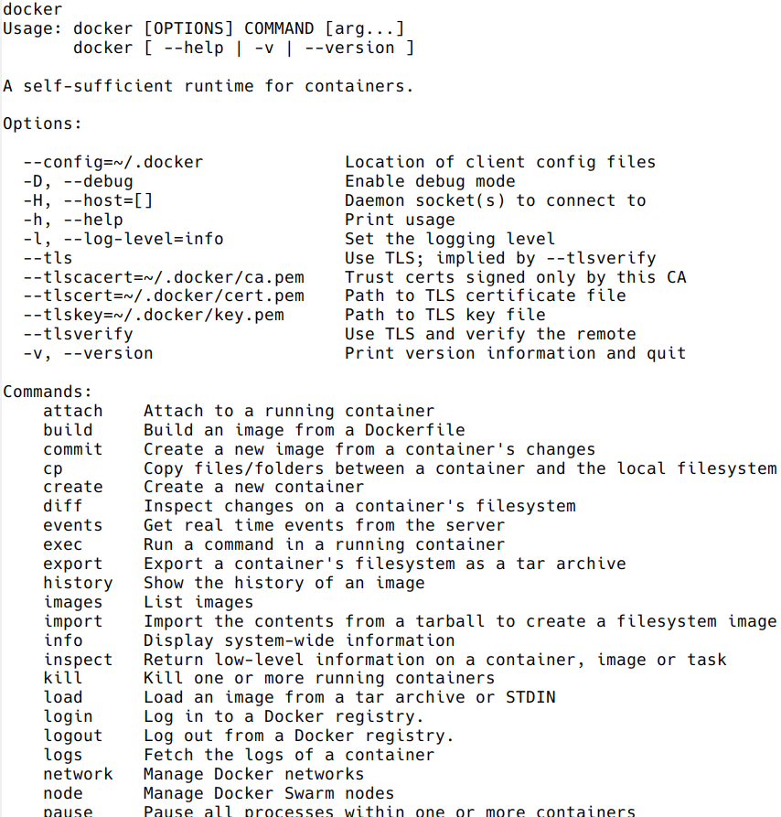
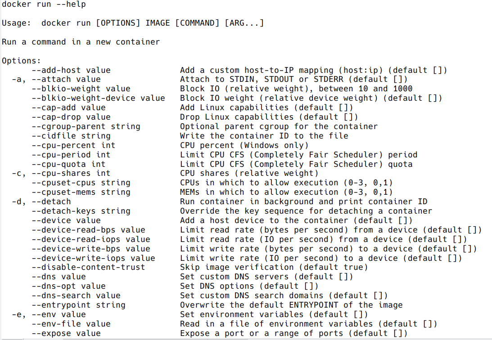
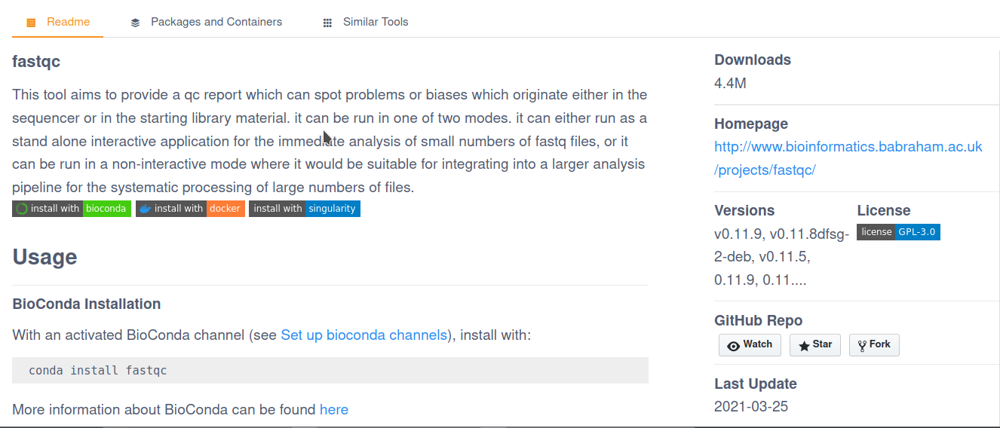

# Docker

```{r, include=FALSE}
knitr::opts_chunk$set(echo = TRUE, eval = FALSE, warning = FALSE)
```

## Introduction to Docker

<a href="https://connpass-tokyo.s3.amazonaws.com/thumbs/80/52/80521f18aec0945dfedbb471dad6aa1a.png"></a>

### What is Docker?

* Platform for developing, shipping and running applications
* Infrastructure as application / code
* First version: 2013
* Company. Original dotCloud (2010), later named Docker
* Established [Open Container Initiative](https://www.opencontainers.org/)

As a software:

* [Docker Community Edition](https://www.docker.com/products/container-runtime)
* Docker Enterprise Edition


### Docker components

<a href="http://apachebooster.com/kb/wp-content/uploads/2017/09/docker-architecture.png"></a>

* Read-only templates
* Containers are run from them
* Images are not run
* Images have several layers

<a href="https://i.stack.imgur.com/vGuay.png"></a>


### Images versus containers

* **Image**: set of layers. read-only templates. Inert.
* An instance of an image is called a **container**.

When you start an image, you have a running container of this image. You can have many running containers of the same image.

The image is the recipe, the container is the cake.

https://stackoverflow.com/questions/23735149/what-is-the-difference-between-a-docker-image-and-a-container

### Docker vocabulary

Get all the docker commands:

```{bash}
docker
```



Get help on a particular command:

```{bash}
docker run --help
```




<center><h4 style="background-color: #e6fadc; display: inline-block;">**HANDS-ON**</h4></center>

What are the following commands doing?

* `docker images`
* `docker export`

<details>
<summary>
<h5 style="background-color: #e6fadc; display: inline-block;">*Answer*</h5>
</summary>
here
</details>


## Using existing images

### Getting started

Run the following in the terminal:

```{bash}
docker images
```

The `docker images` command lists the Docker images that you have on your computer.
<br>
Now run the following:

```{bash}
docker pull hello-world
```

Run `docker images` again: now you see the "hello-world" image listed!
<br>
`docker pull` imports an image from - by default - **Docker hub**.

<br>
We will see in more details the `docker images` and `docker run` commands, but let's first explore the **Docker images repositories**.


### Explore Docker hub

Images can be stored locally or shared in a registry.
<br>
[Docker hub](https://hub.docker.com/) is the main public registry for Docker images.
<br>

Let's search the keyword **ubuntu**:


You can also search existing Docker images with the `docker search` command.
<br>
Example: let's look for images that have the keyword **blast** in their name or description.

```{bash}
docker search blast
```

Too many results? You can apply some filters:

* Minimum number of **stars**: `docker search blast --filter stars=5`
* The image is an **official build**: `docker search blast --filter is-official=true`
* The image is an **automated build**: `docker search blast --filter is-automated=true`

```{bash}
# Apply one filter
docker search blast --filter stars=2

# Apply more than one filter
docker search blast --filter is-automated=true --filter stars=2
```

<center><h4 style="background-color: #e6fadc; display: inline-block;">**HANDS-ON**</h4></center>

Use `docker search` to find a Docker image for the keyword `ubuntu`. Using the filters, answer the following questions:

* How many images are **official builds**?
* How many images have **3 or more stars**?
* How many images are **official builds** AND have **3 or more stars**?
* What is the NAME of the image with the highest number of stars?

<details>
<summary>
<h5 style="background-color: #e6fadc; display: inline-block;">*Answer*</h5>
</summary>

```{bash}
# Official builds
docker search ubuntu --filter is-official=true

# 3 or more stars
docker search ubuntu --filter stars=3

# Both filters
docker search ubuntu --filter is-official=true --filter stars=3
```

</details>


### docker pull: import an image

Say we are now interested in the `ubuntu` image from Docker hub. We can retrieve it with `docker pull`.

* By default, we get the latest image / latest release.

```{bash}
docker pull ubuntu
```


* You can choose the version of Ubuntu you are fetching: check the different tags on the website (*latest* is also a tag):


> Note: `docker search` doesn't allow to search for tags.

Let's get the Ubuntu image with tag **18.04** (version 18.04 of Ubuntu = bionic):


```{bash}
docker pull ubuntu:18.04
```

**Where is the image now?**
<br>
As we have seen before, you can `docker images` in the terminal, to see a list of the most recently created images. `docker images` gives you information such as:

* Repository
* Tag
* Unique image ID
* Creation date
* Image size


<center><h4 style="background-color: #e6fadc; display: inline-block;">**HANDS-ON**</h4></center>

* Run `docker images`. How many images do you get?
* What is the size of the `ubuntu` image you just pulled?
* How many images do you get if you run `docker images --all`? What are those? Perhaps the [documentation](https://docs.docker.com/engine/reference/commandline/images/) can help.

<details>
<summary>
<h5 style="background-color: #e6fadc; display: inline-block;">*Answer*</h5>
</summary>

`docker images --all`: intermediate images.

</details>


### BioContainers

[BioContainers](https://biocontainers.pro/) is a community-driven project that provides the infrastructure and basic guidelines to create, manage and distribute bioinformatics packages and **containers**.
<br>
Images are normally created from [Bioconda](https://bioconda.github.io)
<br><br>
**How to search for images?**

* Ready-to use images on the [dedicated website](https://biocontainers.pro/registry)
* Entries are also stored in [Docker hub](https://hub.docker.com/u/biocontainers) and/or [Quay.io](https://quay.io) (RedHat registry)
* *Dockerfile recipes* (next topic!) on the [github page](https://github.com/BioContainers/containers).

**How to pull images from BioContainers?**
<br>
Example: [**FastQC** software](https://biocontainers.pro/#/tools/fastqc)



Load version / tag **v0.11.9_cv7** as:

    docker pull biocontainers/fastqc:v0.11.9_cv7


<center><h4 style="background-color: #e6fadc; display: inline-block;">**HANDS-ON**</h4></center>

* [Search](https://biocontainers.pro/registry) for the tool **blast**.
* Pull the Docker image with version **2.2.31** (check the instructions).

<details>
<summary>
<h5 style="background-color: #e6fadc; display: inline-block;">*Answer*</h5>
</summary>

    docker pull biocontainers/blast:2.2.31

</details>


### docker run: run image, i.e. start a container

Now we want to use what is **inside** the image.
<br>
`docker run` creates a fresh container (active instance of the image) from a **Docker (static) image**, and runs it.

<br>
The format is:<br>

docker run image:tag **command** (command being a command called *inside the image*)

<br>
We can start a container from the **ubuntu tag 18.04 image**, executing the command `ls` (stored in /bin in the container).

```{bash}
docker run ubuntu:18.04 /bin/ls
```


Now execute **ls** in your current working directory: is the result the same?


You can execute any program/command that is stored inside the image:

```{bash}
docker run ubuntu:18.04 /bin/whoami
docker run ubuntu:18.04 cat /etc/issue
```

You can either execute programs in the image from the command line (see above) or **execute a container interactively**, i.e. **"enter"** the container, with `docker run -it`.

```{bash}
docker run -it ubuntu:18.04 /bin/bash
```

If you want to leave and stop the container, type `exit` and ENTER.

<center><h4 style="background-color: #e6fadc; display: inline-block;">**HANDS-ON**</h4></center>

* Run the **hello-world** image:
  * What is happening?
* Now run the **blast** image from BioContainers we previously pulled (version 2.2.31):
  * Is something happening?
* Start again a container from the same **blast** image (not interactively), and run **the blastp command**. What happens?
* Start a container **interactively** from the same **blast** image:
  * What is the default working directory? What is inside the directory?
  * Where is the `blastp` program located in the image? 
  * Exit the container.

<details>
<summary>
<h5 style="background-color: #e6fadc; display: inline-block;">*Answer*</h5>
</summary>

```{bash}
# Run the hello-world image
docker run hello-world

# Run the blast image
docker run biocontainers/blast:2.2.31

#  Start again a container from the same blast image, and run the path to the blastp command:
docker run biocontainers/blast:2.2.31 blastp

# Start a container interactively from the same blast image:
docker run -ti biocontainers/blast:2.2.31

# What is the default working directory? 
pwd; ls

# Where is the `blastp` program located in the image? 
which blastp

# Exit the container.
exit
```

</details>


You can run the container as daemon (in background), instead of the default foreground running, with the `--detach` parameter:

```{bash}
docker run --detach ubuntu:18.04 tail -f /dev/null
```

Run container as daemon (in background) with a given name:

```{bash}
docker run --detach --name myubuntu ubuntu:18.04 tail -f /dev/null
```

### docker ps: check containers status

List running containers:

```{bash}
docker ps
```

List all containers (whether they are running or not):

```{bash}
docker ps -a
```

Each container has a **unique ID**.


### docker exec: execute process in running container

Difference between `docker run` and `docker exec`: 

* `docker run` creates a temporary container, runs the command and stops the container.
* `docker exec` needs an already running container to query the command (i.e. a *detached* container).

```{bash}
docker exec myubuntu uname -a
```

* Interactively

```{bash}
docker exec -it myubuntu /bin/bash
```


### docker stop, start, restart: actions on container

Stop a running container with `docker stop`.

```{bash}
# check the list of running containers
docker ps

# stop the myubuntu container
docker stop myubuntu

# check the list of all containers
docker ps -a
```

Start a stopped container (does NOT create a new one):

```{bash}
docker start myubuntu

docker ps -a
```

Restart a running container: 

```{bash}
docker restart myubuntu

docker ps -a
```

Run with restart enabled (by default, Docker does not automatically restart the container when it exits).
<br>
In the example below we start a **detached container named "myubuntu2"** with the **unless-stopped** restart policy: *restart the container unless it is explicitly stopped or Docker itself is stopped or restarted.*

```{bash}
docker run --restart=unless-stopped --detach --name myubuntu2 ubuntu:18.04 tail -f /dev/null
```

* [Restart policies](https://docs.docker.com/engine/reference/commandline/run/#restart-policies---restart): no (default), always, on-failure, unless-stopped

Update restart policy:

```{bash}
docker update --restart unless-stopped myubuntu
```


<center><h4 style="background-color: #e6fadc; display: inline-block;">**HANDS-ON**</h4></center>

* Start a container from the "hello-world" image **in the background**. Give it a name.
  * Is your container running? Can you explain why (or why not)?
* Start another detached container from the same image (with a new name), with the **always restart policy**.
  * Is the container running?

<details>
<summary>
<h5 style="background-color: #e6fadc; display: inline-block;">*Answer*</h5>
</summary>

```{bash}
# start a "detached" container (in the background)
docker run --detach --name helloworld1 hello-world

# start a "detached" container with the "--restart=always" option
docker run --detach --restart=always --name helloworld2 hello-world 
```

</details>


### docker rm, docker rmi: clean up!

`docker rm` is used to remove a **container** (set `-f` is the container is running, to force the removal):

```{bash}
docker rm myubuntu
docker rm -f myubuntu
```

`docker rmi` is used to remove an **image**:

```{bash}
docker rmi ubuntu:18.04
```

<center><h4 style="background-color: #e6fadc; display: inline-block;">**HANDS-ON**</h4></center>

* Remove any container (whether it is running or not).
* Remove the "hello-world" image.

<details>
<summary>
<h5 style="background-color: #e6fadc; display: inline-block;">*Answer*</h5>
</summary>

```{bash}
# check all containers
docker ps -a 

# remove by their ID:
docker rm -f CONTAINER1_ID CONTAINER2_ID ...

# remove the "hello-world" image
docker rmi hello-world
```

</details>


#### Major clean

*docker system failing for me (Sarah) on a qlogin node: why? (I see from the documentation that it still exists) Version issue perhaps?*

Check used space
```{bash}
docker system df
```

Remove unused containers (and others) - **DO WITH CARE**
```{bash}
docker system prune
```

Remove ALL non-running containers, images, etc. - **DO WITH MUCH MORE CARE!!!**
```{bash}
docker system prune -a
```

* Reference: https://www.digitalocean.com/community/tutorials/how-to-remove-docker-images-containers-and-volumes


### Exercise


* **Search** and **pull** the `alpine` image (tag **3.12**) - it is an **official build**.
* Can you run a container from this image and make it print a “hello world” message?
* Now run a container **interactively** from the same image. 
  * Run `uname -a`
  * Exit the container.
* Restart the container you just exited: 
  * Is it now running?
  * Make the container execute the command `ls`
  * Stop the container
* Remove the alpine image and all its containers (running or stopped)

<details>
<summary>
<h5 style="background-color: #e6fadc; display: inline-block;">*Answer*</h5>
</summary>

```{bash}
# Search and pull the alpine image (tag 3.12) - it is an official build.
docker search alpine --filter is-official=true
docker pull  alpine:3.12

# Can you run a container from this image and make it print a “hello world” message?
docker run alpine:3.12 echo "hello world"

# Now run a container **interactively** from the same image. 
docker run -ti alpine:3.12
  # Run `uname -a`
  uname -a 
  # Exit the container.
  exit

# Restart the container you just exited: is it now running?
docker restart CONTAINER_ID # find it with `docker ps -a`

# Make the container execute the command `ls`
docker exec CONTAINER_ID ls

# Stop the container
docker stop CONTAINER_ID

# Remove the alpine image and all its containers (running or stopped)
docker rmi alpine:3.12
docker rm CONTAINER_ID # check all containers with `docker ps -a`
```

</details>


## Linux packages

In the next step, we will create Docker images.
<br>
For this to go smoothly, you should know your **base system**, and how to interact with it (update, upgrade and install packages for example).
<br>
In Linux-based environment, software is usually distributed in the form of **packages**, kept in repositories.
<br>
With different operating systems come different tools to fetch and install packages:

| Operating System | Format | Tool(s) |
| [Debian](https://packages.debian.org) / Ubuntu / Linux Mint / Raspbian | .deb | apt, apt-cache, apt-get, dpkg |
| [CentOS](https://centos.pkgs.org/) (RedHat) | .rpm | yum |
| Fedora (RedHat) | .rpm | dnf |
| FreeBSD | .txz | make, pkg |
| Alpine | | apk |

More on the subject in [this post](https://www.digitalocean.com/community/tutorials/package-management-basics-apt-yum-dnf-pkg)

> Note that the environment you are working on for this course is *CentOS-based* 

<br>
During this course, we will build images based on **Ubuntu** and **CentOS**. 


### Update and upgrade packages

* In **Ubuntu**:

```
apt-get update && apt-get upgrade -y
```

In **CentOS**:

```
yum check-update && yum update -y
```

### Search and install packages:

* In **Ubuntu**:

```
apt search libxml2
apt install -y libxml2-dev
```

* In **CentOS**:

```
yum search libxml2
yum install -y libxml2-devel.x86_64
```

Note the **-y** option that we set for updating and for installing.<br>
It is an important option in the context of Docker: it means that you *answer yes for all questions*, regarding whether you want to confirm the installation, for example.

<br>

Note that Conda is a nice and easy way to install software:
  * [Anaconda](https://anaconda.org/anaconda/repo)
  * [Conda-forge](https://conda-forge.org/feedstocks/)
  * [Bioconda](https://anaconda.org/bioconda/repo)


## Docker recipes

A **Docker recipe** contains a set of instructions and commands that will be used to **create/build a Docker image**.

### Building recipes

All commands should be saved in a text file, named by default **Dockerfile**.

#### Basic instructions

Each row in the recipe corresponds to a **layer** of the final image.

**FROM**: parent image. Typically, an operating system. This is the **base layer**.

```docker
FROM ubuntu:18.04
```

**RUN**: the command to execute inside the image filesystem.
<br>
Think about it this way: every **RUN** line is essentially what you would run to install programs on a freshly installed Ubuntu OS.

```docker
RUN apt install wget
```

A basic recipe that is taking the **ubuntu:18.04** image as a base layer, that updates and upgrades Linux packages, and that installs `wget`:

```docker
FROM ubuntu:18.04

RUN apt update && apt -y upgrade
RUN apt install -y wget
```

<center><h4 style="background-color: #e6fadc; display: inline-block;">**HANDS-ON**</h4></center>

Explore this [Dockerfile](https://github.com/BioContainers/containers/blob/master/blast/2.2.31/Dockerfile):

* What is the **base layer**?
* What is being installed in the image? How?

<details>
<summary>
<h5 style="background-color: #e6fadc; display: inline-block;">*Answer*</h5>
</summary>

Base layer: biocontainers/biocontainers:v1.0.0_cv4
<br>
Tool `blast` is installed using **conda**.

</details>


#### More instructions

**MAINTAINER**

Who is maintaining the container?

```docker
MAINTAINER Toni Hermoso Pulido <toni.hermoso@crg.eu>
```

**WORKDIR**: all subsequent actions will be executed in that working directory

```docker
WORKDIR ~
```

**ADD, COPY**: add files to the image filesystem

Difference between ADD and COPY explained [here](https://stackoverflow.com/questions/24958140/what-is-the-difference-between-the-copy-and-add-commands-in-a-dockerfile) and [here](https://nickjanetakis.com/blog/docker-tip-2-the-difference-between-copy-and-add-in-a-dockerile)

**COPY**: lets you copy a local file or directory from your host (the machine from which you are building the image)

**ADD**: same, but ADD works also for URLs, and for .tar archives that will be automatically extracted upon being copied.


```docker
# COPY source destination
COPY ~/.bashrc .
```

**ENV, ARG**: run and build environment variables

Difference between ARG and ENV explained [here](https://vsupalov.com/docker-arg-vs-env/).


* **ARG** values: available only while the image is built.
* **ENV** values: available for the future running containers.


**CMD, ENTRYPOINT**: command to execute when generated container starts

The ENTRYPOINT specifies a command that will always be executed when the container starts.
<br>
The CMD specifies arguments that will be fed to the ENTRYPOINT.

<br>

In the example below, when the container is run without an argument, it will execute `echo "hello world"` (default).<br>
If it is run with the argument **nice** it will execute `echo "nice"`.

```docker
FROM ubuntu:18.04
ENTRYPOINT ["/bin/echo"]
CMD ["hello world"]
```

A more complex recipe (save it in a text file named **Dockerfile**!):

```docker
FROM ubuntu:18.04

MAINTAINER Toni Hermoso Pulido <toni.hermoso@crg.eu>

WORKDIR ~

RUN apt-get update && apt-get -y upgrade
RUN apt-get install -y wget

ENTRYPOINT ["/usr/bin/wget"]
CMD ["https://cdn.wp.nginx.com/wp-content/uploads/2016/07/docker-swarm-hero2.png"]
```


### docker build

Implicitely looks for a **Dockerfile** file in the current directory:

```{bash}
docker build .
```

Same as:

```{bash}
docker build --file Dockerfile .
```

Syntax: **--file / -f**

**.** stands for the context (in this case, current directory) of the build process. This makes sense if copying files from filesystem, for instance. 
<br>
**IMPORTANT**: Avoid contexts (directories) overpopulated with files (even if not actually used in the recipe).

You can define a specific name for the image during the build process.

Syntax: **-t** *imagename:tag*. If not defined `:tag` default is latest.

```{bash}
docker build -t mytestimage .
```

The last line of installation should be **Successfully built ...**: then you are good to go.
<br>
Check with `docker images` that you see the newly built image in the list...


Then let's check the ID of the image and run it!

```{bash}
docker images

docker run f9f41698e2f8
docker run mytestimage
```

Try to run it with an argument:

```{bash}
docker run f9f41698e2f8 https://cdn-images-1.medium.com/max/1600/1*_NQN6_YnxS29m8vFzWYlEg.png
```

<center><h4 style="background-color: #e6fadc; display: inline-block;">**HANDS-ON**</h4></center>

1. Write a docker recipe in a file **Dockerfile_test** that: 
* is based on **ubuntu:18.04**
* **echoes "I love containers"** by default or any other word/sentence, if given as the argument.
2. Build the image (give the image the name of your choice)
3. Run the image:
* with no argument.
* with **"Docker course"** as an argument.
4. Modify the **Dockerfile_test**:
* add the MAINTAINER field
* update and upgrade Ubuntu packages.
* install [**figlet**](https://zoomadmin.com/HowToInstall/UbuntuPackage/figlet)
* change "echo" to "figlet" in the **ENTRYPOINT**
5. Build and run the new image, with the default parameter, then with **"Docker course"** as an argument.

<details>
<summary>
<h5 style="background-color: #e6fadc; display: inline-block;">*Answer*</h5>
</summary>

1. Recipe saved in **Dockerfile_test**:

```
FROM ubuntu:18.04
ENTRYPOINT ["echo"]
CMD ["I love containers"]
```

2. Build:

```
docker build --file Dockerfile_test -t mytest .
```

3. Run the image:

```
# with no argument
docker run mytest

# with argument "Docker course"
docker run mytest "Docker course"
```

4. Recipe:

```
FROM ubuntu:18.04

MAINTAINER Name Surname <name.surname@mail.com>

RUN apt-get update && apt-get upgrade -y
RUN apt-get install -y figlet

ENTRYPOINT ["figlet"]
CMD ["I love containers"]
```

5. Build and run the new image, with the default parameter, then with **"Docker course"** as an argument.

```
# Build
docker build --file Dockerfile_test -t mytest .

# run with no argument
docker run mytest

# run with argument "Docker course"
docker run mytest "Docker course"
```

</details>


### docker tag

Use `docker tag` in order to **tag a local image** that has - for example - ID "e23aaea5dff1" into the "ubuntu_wget" image name repository with version/tag "1.0":

```{bash}
docker tag e23aaea5dff1 --tag ubuntu_wget:1.0
```

<center><h4 style="background-color: #e6fadc; display: inline-block;">**HANDS-ON**</h4></center>

<details>
<summary>
<h5 style="background-color: #e6fadc; display: inline-block;">*Answer*</h5>
</summary>
here
</details>


### Build cache ###

Every line of a Dockerfile is actually an image/layer by itself.

Modify for instance the last bit of the previous image (let's change the image URL) and rebuild it (even with a different name/tag):

```docker
FROM ubuntu:18.04

MAINTAINER Toni Hermoso Pulido <toni.hermoso@crg.eu>

WORKDIR ~

RUN apt-get update && apt-get -y upgrade
RUN apt-get install -y wget

ENTRYPOINT ["/usr/bin/wget"]
CMD ["https://cdn-images-1.medium.com/max/1600/1*_NQN6_YnxS29m8vFzWYlEg.png"]
```

```{bash}
docker build -t mytestimage2 .
```

It will start from the last line, and not re-run commands before the modification that were successfully built.
<br>
This is OK most of the times and very convenient for testing and trying new steps, but it may lead to errors when versions are updated (either FROM image or included packages). 
<br>
It is beneficial to start from scratch with ```--no-cache``` option when building the image.

```{bash}
docker build --no-cache -t mytestimage2 .
```

### Exercise: writing more complex recipes

Build an image based on **CentOS** (use base layer [centos:7](https://hub.docker.com/_/centos?tab=tags&page=1&ordering=last_updated)):

* Install [**bowtie2**](https://centos.pkgs.org/7/epel-x86_64/bowtie2-2.4.1-1.el7.x86_64.rpm.html) and **show the help page by default**.
  * you will need to download and install the **.rpm** package inside the image !
* Change the name (and version) of the image to **bowtie2image:1.0**. Check that the change was taken into account with `docker images`

<details>
<summary>
<h5 style="background-color: #e6fadc; display: inline-block;">*Answer*</h5>
</summary>

File **Dockerfile_bowtie2**:

```
FROM centos:7

RUN yum update -y
RUN curl https://download-ib01.fedoraproject.org/pub/epel/7/x86_64/Packages/b/bowtie2-2.4.1-1.el7.x86_64.rpm > bowtie2-2.4.1-1.el7.x86_64.rpm
RUN yum install -y bowtie2-2.4.1-1.el7.x86_64.rpm

ENTRYPOINT ["bowtie2"]
CMD ["--help"]
```

Build:

```
docker build -t imagebowtie2 -f Dockerfile_bowtie2 .
```

Change name / tag:

```
docker tag imagebowtie2 bowtie2image:1.0
```

</details>


### Additional commands

* **docker inspect**: Get details from containers (both running and stopped). Things such as IPs, volumes, etc.

* **docker logs**: Get *console* messages from running containers. Useful when using with web services.

* **docker commit**: Turn a container into an image. It make senses to use when modifying container interactively. However this is bad for reproducibility if no steps are saved.

Good for long-term reproducibility and for critical production environments:

* **docker save**: Save an image into a tar archive.

* **docker export**: Save a container into a tar archive.

* **docker import**: Import a tar archive into an image.

<center><h4 style="background-color: #e6fadc; display: inline-block;">**HANDS-ON**</h4></center>

<details>
<summary>
<h5 style="background-color: #e6fadc; display: inline-block;">*Answer*</h5>
</summary>
here
</details>


## Volumes

Docker containers are fully isolated. It is necessary to mount volumes in order to handle input/output files.

Syntax: **--volume/-v** *host:container*

```{bash}
mkdir datatest
touch datatest/test
docker run --detach --volume $(pwd)/datatest:/scratch --name fastqc_container biocontainers/fastqc:v0.11.9_cv7 tail -f /dev/null
docker exec -ti fastqc_container /bin/bash
> ls -l /scratch
> exit
```

* Exercises:
1. Copy the 2 fastq files from available datasets in Github repository and place them in mounted directory
2. Run fastqc interactively (inside container): ```fastqc  /scratch/*.gz```
3. Run fastqc outside the container

<center><h4 style="background-color: #e6fadc; display: inline-block;">**HANDS-ON**</h4></center>

<details>
<summary>
<h5 style="background-color: #e6fadc; display: inline-block;">*Answer*</h5>
</summary>
here
</details>


## Ports

The same as with volumes, but with ports, to access Internet services.

Syntax: **--publish/-p** *host:container*


```{bash}
docker run --detach --name webserver nginx
curl localhost:80
docker exec webserver curl localhost:80
docker rm -f webserver

```

```{bash}
docker run --detach --name webserver --publish 80:80 nginx
curl localhost:80
docker rm -f webserver
```

```{bash}
docker run --detach --name webserver -p 8080:80 nginx
curl localhost:80
curl localhost:8080
docker exec webserver curl localhost:80
docker exec webserver curl localhost:8080
docker rm -f webserver
```


