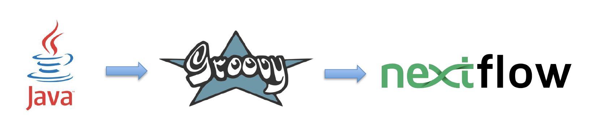
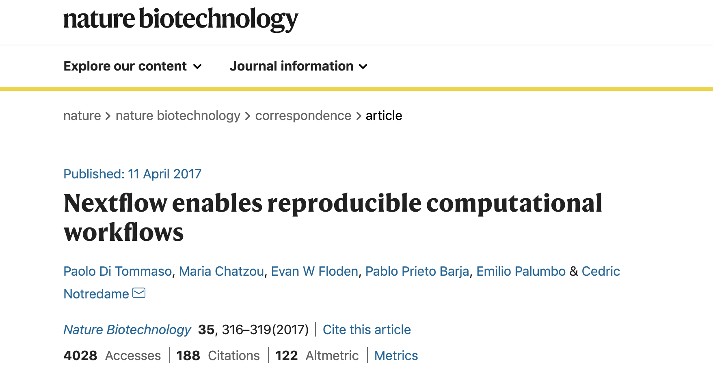
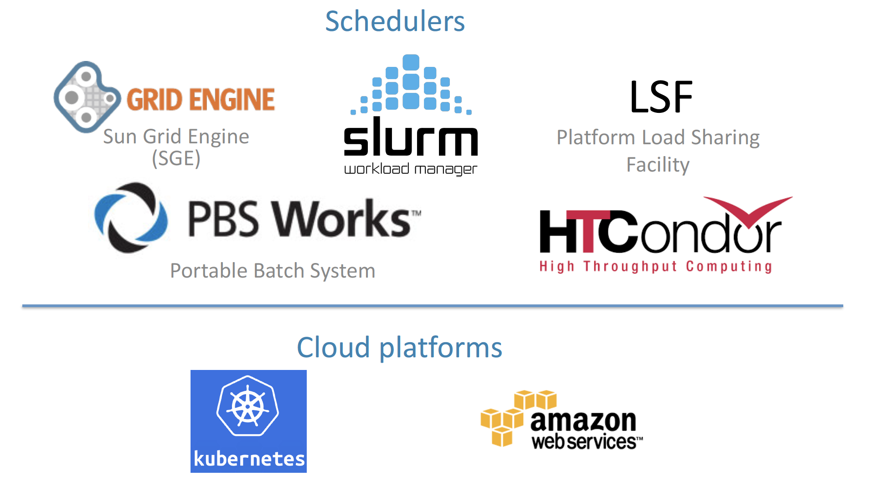
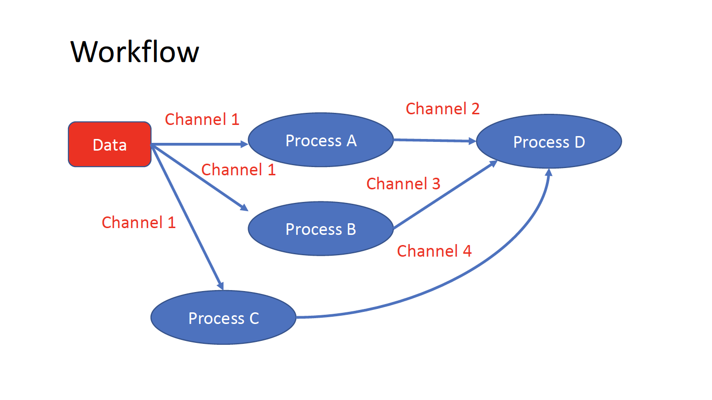

# Nextflow day 1
A DSL for data-driven computational pipelines. [www.nextflow.io](https://www.nextflow.io)

```{r, out.width="30%", echo=FALSE, eval = TRUE, fig.link='https://www.nextflow.io'}

```

## What is Nextflow?

```{r, out.width="600px", echo=FALSE, eval = TRUE, fig.link='https://www.nextflow.io'}

```

[Nextflow](https://www.nextflow.io) is a domain specific language for workflow orchestration that stems from [Groovy](https://groovy-lang.org/). It enables scalable and reproducible workflows using software containers. It was developed at [CRG](www.crg.eu) in the Lab of Cedric Notredame by Paolo Di Tommaso [https://github.com/pditommaso](https://github.com/pditommaso). The Nextflow documentantion is [available here](https://www.nextflow.io/docs/latest/) and you can ask help to the community using their [gitter channel](https://gitter.im/nextflow-io/nextflow)

Nextflow has been currently upgrade from DLS1 version to DLS2. In this course we will use exclusively DLS2.  

## What is Nextflow for?
It is for making pipelines without caring about parallelization, dependencies, intermediate file names, data structures, handling exceptions, resuming executions etc. It was published in [Nature Biotechnology in 2017](https://pubmed.ncbi.nlm.nih.gov/28398311/).


```{r, out.width="600px", echo=FALSE, eval = TRUE, fig.link='https://pubmed.ncbi.nlm.nih.gov/28398311/'}

```

There is a growing number of publication mentioning Nextflow in PubMed, since many bioinformaticians are starting to write their pipeline in Nextflow.


```{r, out.width="600px", echo=FALSE, eval = TRUE, fig.link='https://pubmed.ncbi.nlm.nih.gov/?term=nextflow&timeline=expanded&sort=pubdate&sort_order=asc'}

```

Here a curated list of [Nextflow pipelines](https://github.com/nextflow-io/awesome-nextflow)

And here a group of pipelines written in a collaborative way from project [NF-core](https://nf-co.re/pipelines)

Some pipelines written in Nextflow are being used for SARS-Cov-2 analysis like:

- the one from the [artic Network](https://artic.network/ncov-2019): [ncov2019-artic-nf](https://github.com/connor-lab/ncov2019-artic-nf)
- the one used from the [CRG / EGA viral Beacon](https://covid19beacon.crg.eu/info), [Master of Pores](https://github.com/biocorecrg/master_of_pores)
- the nf-core pipeline [viralrecon](https://nf-co.re/viralrecon)

etc. 

## Main advantages

- Fast prototyping

You can quickly write a small pipeline that can be expanded incrementally. Each task is independent and can be easily added to other ones.
You can reuse your scripts and tools without rewriting / adapting them.
- Reproducibility

Nextflow supports Docker and Singularity containers technology. Their use will make the pipelines reproducible in any unix environment. Nextflow is integrated with GitHub code sharing platform so you can call directly a specific version of pipeline from a repository, download it and use it on the fly.

- Portable

Nextflow can be executed on multiple platforms without modifiying the code. It supports several schedulers such as SGE, LSF, SLURM, PBS and HTCondor and  cloud platforms like Kubernetes, Amazon AWS and Google Cloud.

```{r, out.width="600px", echo=FALSE, eval = TRUE }

```

- Scalability

Nextflow is based on the dataflow programming model which simplifies writing complex pipelines. The tool takes care of parallelizing the processes without additional written code. The resulting applications are inherently parallel and can scale-up or scale-out, transparently, without having to adapt to a specific platform architecture.

- Resumable, thanks to continuous checkpoints

All the intermediate results produced during the pipeline execution are automatically tracked. For each process a temporary folder is created and is cached (or not) once resuming an execution.

## Workflow structure
The workflows can be repesented as graphs where the nodes are the **processes** and the edges are the **channels**.
The **processes** are block of code that can be executed such as scripts or programs, while the **channels** are asynchronous queue able to connect processess among them via input / output.


```{r, out.width="600px", echo=FALSE, eval = TRUE }

```

Each process is independent from the other and can be run in parallel depending on the number of elements in a channel. In the previous example the processes A, B and C can be run in parallel and only at their end the process D is triggered.

## Installation
We need at least Java version 8.

```{bash, eval=FALSE, echo=TRUE}
java -version
```

Then we can install it by typing:

```{bash, eval=FALSE, echo=TRUE}
curl -s https://get.nextflow.io | bash
```

This will create an executable called nextflow that can be moved to /usr/local/bin or where we prefer. We can finally test using:

```{bash, eval=FALSE, echo=TRUE}
./nextflow run hello

N E X T F L O W  ~  version 20.07.1
Pulling nextflow-io/hello ...
downloaded from https://github.com/nextflow-io/hello.git
Launching `nextflow-io/hello` [peaceful_brahmagupta] - revision: 96eb04d6a4 [master]
executor >  local (4)
[d7/d053b5] process > sayHello (4) [100%] 4 of 4 ✔
Ciao world!

Bonjour world!

Hello world!

Hola world!
```

This command download from the a github repository and it runs the test script hello.

## Channels

We can make a very simple Nextflow script by writing this code in a file (test.nf):

```{java, eval=FALSE, echo=TRUE}
#!/usr/bin/env nextflow

// This is a comment

/*
 * This is a block of comments
 */

// This is needed for activating the new DLS2
nextflow.enable.dsl=2


//Let's create a channel from string values

str = Channel.from('hello', 'hola', 'bonjour')

/*
* Let's print that channel using the operator view()
* https://www.nextflow.io/docs/latest/operator.html#view
*/
str.view()
```

Then to execute it you can just run:

```{bash, eval=FALSE, echo=TRUE}

$nextflow run test.nf
N E X T F L O W  ~  version 20.07.1
Launching `test.nf` [agitated_avogadro] - revision: 61a595c5bf
hello
hola
bonjour
```
As you can see the **Channel** is just a collection of values, but it can be also a collection of file paths.
Let's create three files:

```{bash, eval=FALSE, echo=TRUE}
touch aa.txt bb.txt cc.txt
```

And let's create another script:

```{java, eval=FALSE, echo=TRUE}
#!/usr/bin/env nextflow

nextflow.enable.dsl=2

/*
* Let's create the channel `my_files`
* using the method fromPath
*/

Channel
    .fromPath( "*.txt" )
    .set {my_fyles}

my_fyles.view()
```

```{bash, eval=FALSE, echo=TRUE}
nextflow run test2.nf
N E X T F L O W  ~  version 20.07.1
Launching `test2.nf` [condescending_hugle] - revision: f513c0fac3
/home/ec2-user/git/CoursesCRG_Containers_Nextflow_May_2021/nextflow/aa.txt
/home/ec2-user/git/CoursesCRG_Containers_Nextflow_May_2021/nextflow/bb.txt
/home/ec2-user/git/CoursesCRG_Containers_Nextflow_May_2021/nextflow/cc.txt
```

Once executed we can see that a folder named **work** is generated. In that folder Nextflow will store the intermediate files generated by the processes.

## EXERCISE 1

- Let's create couple of files (like paired end reads) and let's try to read it as they were a tuple.


- Let's create couple of files (like paired end reads) and let's try to read it as they were a tuple.

See here [https://www.nextflow.io/docs/latest/channel.html#fromfilepairs](https://www.nextflow.io/docs/latest/channel.html#fromfilepairs).


<details>
<summary>
<h5>*Answer*</h5>
</summary>

First create a couple of files:

```{bash, eval=FALSE, echo=TRUE}
touch aaa_1.txt aaa_2.txt
```

then use fromFilePairs

```{java, eval=FALSE, echo=TRUE}
#!/usr/bin/env nextflow

nextflow.enable.dsl=2

/*
* Let's create the channel `my_files`
* using the method fromFilePairs 
*/

Channel
    .fromFilePairs( "aaa_{1,2}.txt" )
    .set {my_fyles}

my_fyles.view()
```

</details>


## Processes

Let's add now a process to our previous script test.nf:

```{java, eval=FALSE, echo=TRUE}
#!/usr/bin/env nextflow

nextflow.enable.dsl=2

str = Channel.from('hello', 'hola', 'bonjour')

/*
 * Creates a process which receive an input channel containing values
 * Each value emitted by the channel triggers the execution
 * of the process. The process stdout is caputured and send over
 * the another channel.
 */

process printHello {

   tag { str_in } // this is for displaying the content of `str_in` in the log file

   input:        
   val str_in

   output:        
   stdout

   script:        
   """
   echo ${str_in} in Italian is ciao
   """
}
```

The process can be seen as a function and is composed by:
- An **input** part where the input channels are defined
- An **output** part where we indicates what to store as a result that will be sent to other processes or published as final result
- A **script** part where we have the block of code to be executed with the data from the input channel and will produce the output for the ouput channel. You can run any kind of code / command line there, it is language agnostic. You can have some trouble with escaping some characters, in that case is better to wrap your code in a file and call it as a program.

Before the input you can indicate a **tag** that will be reported in the log. This is quite useful for logging / debugging.

## Workflow

The code as it is will not produce anything, because you need another part that actually call the process and connect it to the input channel.
This part is called a **workflow**. So let's change our code:

```{java, eval=FALSE, echo=TRUE}
#!/usr/bin/env nextflow

nextflow.enable.dsl=2

str = Channel.from('hello', 'hola', 'bonjour')

process printHello {

   tag { str_in }

   input:        
   val str_in

   output:        
   stdout

   script:        
   """
   echo ${str_in} in Italian is ciao
   """
}

/*
 * A workflow consist of a number of invocations of processes
 * where they are fed with the expected input channels
 * as they were cutom functions. You can only invoke a process once per workflow.
 */

workflow {
 result = printHello(str)
 result.view()
}
```
We can run the script this time sending the execution in background and sending the log to a file.

```{bash, eval=FALSE, echo=TRUE}
nextflow run test.nf -bg > log.txt
```

## Nextflow log
Let's inspect now the log file:

```{bash, eval=FALSE, echo=TRUE}
cat log.txt
N E X T F L O W  ~  version 20.07.1
Launching `test.nf` [high_fermat] - revision: b129d66e57
[6a/2dfcaf] Submitted process > printHello (hola)
[24/a286da] Submitted process > printHello (hello)
[04/e733db] Submitted process > printHello (bonjour)
hola in Italian is ciao

hello in Italian is ciao

bonjour in Italian is ciao
```
The **tag** allows us to see that the process **printHello** was launched three times on hola, hello and bonjour values contained in the input channel. In each row there is a code before:

**[6a/2dfcaf]** Submitted process > printHello (hola)

This code indicates also the path in which is process is "isolated" and where you have the temporary files. Let's have a look:

```{bash, eval=FALSE, echo=TRUE}
echo work/6a/2dfcaf*
work/6a/2dfcafc01350f475c60b2696047a87

ls -alht work/6a/2dfcaf*

ls -alht work/6a/2dfcaf*
total 40
-rw-r--r--  1 lcozzuto  staff     1B Oct  7 13:39 .exitcode
drwxr-xr-x  9 lcozzuto  staff   288B Oct  7 13:39 .
-rw-r--r--  1 lcozzuto  staff    24B Oct  7 13:39 .command.log
-rw-r--r--  1 lcozzuto  staff    24B Oct  7 13:39 .command.out
-rw-r--r--  1 lcozzuto  staff     0B Oct  7 13:39 .command.err
-rw-r--r--  1 lcozzuto  staff     0B Oct  7 13:39 .command.begin
-rw-r--r--  1 lcozzuto  staff    45B Oct  7 13:39 .command.sh
-rw-r--r--  1 lcozzuto  staff   2.5K Oct  7 13:39 .command.run
drwxr-xr-x  3 lcozzuto  staff    96B Oct  7 13:39 ..
```
You see a lot of "hidden" files:
- **.exitcode**, contains 0 if everything is ok, another value if there was a problem.
- **.command.log**, contains the log of the command execution. Often is identical to .command.out
- **.command.out**, contains the standard output of the command execution
- **.command.err**, contains the standard error of the command execution
- **.command.begin**, contains what has to be executed before .command.sh
- **.command.sh**, contains the block of code indicated in the process
- **.command.run**, contains the code made by nextflow for the execution of .command.sh and contains environmental variables, eventual invocations of linux containers etc.

For instance the content of .command.sh is:

```{bash, eval=FALSE, echo=TRUE}
cat work/6a/2dfcaf*/.command.sh
#!/bin/bash -ue
echo hola in Italian is ciao
```

And the content of .command.out is

```{bash, eval=FALSE, echo=TRUE}
cat work/6a/2dfcaf*/.command.out
hola in Italian is ciao
```

You can also name workflows as they were collections of processes. For instance we can write:

```{java, eval=FALSE, echo=TRUE}
#!/usr/bin/env nextflow

nextflow.enable.dsl=2

str = Channel.from('hello', 'hola', 'bonjour')

process printHello {

   tag { str_in }

   input:        
   val str_in

   output:        
   stdout

   script:        
   """
   echo ${str_in} in Italian is ciao
   """
}

/*
 * A workflow can be named as a function and receive an input using the take keyword
 */

workflow first_pipeline {
    take: str_input
    main:
    printHello(str_input).view()
}


/*
 * You can re-use the previous processes an combine as you prefer
 */

workflow second_pipeline {
    take: str_input
    main:
    printHello(str_input).collect().view()
}

/*
 * You can then invoke the different named workflows in this way
 * passing the same input channel `str` to both  
 */

workflow {
    first_pipeline(str)
    second_pipeline(str)
}

```

You can see that with the previous code you can execute two workflows containing the same process. We add the **collect** operator to the second workflow that collects the output from different executions and return the resulting list as a sole emission.

Let's run the code:

```{bash, eval=FALSE, echo=TRUE}
nextflow run test.nf -bg > log2

cat log2

cat log2
N E X T F L O W  ~  version 20.07.1
Launching `test.nf` [irreverent_davinci] - revision: 25a5511d1d
[de/105b97] Submitted process > first_pipeline:printHello (hello)
[ba/051c23] Submitted process > first_pipeline:printHello (bonjour)
[1f/9b41b2] Submitted process > second_pipeline:printHello (hello)
[8d/270d93] Submitted process > first_pipeline:printHello (hola)
[18/7b84c3] Submitted process > second_pipeline:printHello (hola)
hello in Italian is ciao

bonjour in Italian is ciao

[0f/f78baf] Submitted process > second_pipeline:printHello (bonjour)
hola in Italian is ciao

['hello in Italian is ciao\n', 'hola in Italian is ciao\n', 'bonjour in Italian is ciao\n']

```

## EXERCISE 2
Change the pipeline for producing files instead of standard output. You need to specify within the workflow what to output using **emit** keyword.
	
```{java, eval=FALSE, echo=TRUE}

workflow pipeline {
    ...
    emit: output
}
```

<details>
<summary>
<h5>*Answer*</h5>
</summary>


```{java, eval=FALSE, echo=TRUE}

#!/usr/bin/env nextflow

nextflow.enable.dsl=2

str = Channel.from('hello', 'hola', 'bonjour')

process printHello {

   tag { str_in }

   input:        
   val str_in

   output:        
   path("${str_in}.txt")

   script:        
   """
   echo ${str_in} in Italian is ciao > ${str_in}.txt
   """
}

/*
 * A workflow can be named as a function and receive an input using the take keyword
 */

workflow first_pipeline {
    take: str_input
    main:
    out = printHello(str_input)
    emit: out
}


/*
 * You can re-use the previous processes an combine as you prefer
 */

workflow second_pipeline {
    take: str_input
    main:
    out = printHello(str_input).collect()
    emit: out
}

/*
 * You can then invoke the different named workflows in this way
 * passing the same input channel `str` to both  
 */

workflow {
    out1 = first_pipeline(str)
    out2 = second_pipeline(str)
}
```

</details>


## More complex scripts

We can feed the channel that is generated by a process to another process in the workflow definition. In this way we have a proper pipeline.  


```{java, eval=FALSE, echo=TRUE}
#!/usr/bin/env nextflow

nextflow.enable.dsl=2

// this can be overridden by using --inputfile OTHERFILENAME
params.inputfile = "$baseDir/testdata/test.fa"

// the "file method" returns a file system object given a file path string  
sequences_file = file(params.inputfile)				

// check if the file exists
if( !sequences_file.exists() ) exit 1, "Missing genome file: ${genome_file}"


/*
 * Process 1 for splitting a fasta file in multiple files
 */

process splitSequences {

    input:
    path sequencesFile

    output:
    path ('seq_*')    

    // simple awk command
    script:
    """
    awk '/^>/{f="seq_"++d} {print > f}' < ${sequencesFile}
    """
}


/*
 * Process 2 for reversing the sequences
 */

process reverseSequence {
    tag "$seq"  				
    publishDir "output"

    input:
    path seq

    output:
    path "all.rev"

	script:
    """
    cat ${seq} | awk '{if (\$1~">") {print \$0} else system("echo " \$0 " |rev")}' > all.rev
    """
}

workflow {
    splitted_seq	= splitSequences(sequences_file)

    // Here you have the output channel as a collection
    splitted_seq.view()

    // Here you have the same channel reshaped to send separately each value
    splitted_seq.flatten().view()

    // DLS2 allows you to reuse the channels! In past you had to create many identical
    // channels for sending the same kind of data to different processes

    rev_single_seq	= reverseSequence(splitted_seq)
}

```

Here we have two simple processes:

- the former splits the input fasta file in single sequences
- the latter is able to reverse the position of the sequences.

The input path is fed as a parameter using the script parameters **${seq}**

```
params.inputfile
```

In this way this value can be overridden when calling the script in this way:

```{bash, eval=FALSE, echo=TRUE}
nextflow run test.nf --inputfile another_input.fa
```

The workflow part connects the two processes so that the output of the first process is fed to the second one.

During the execution Nextflow creates a number of temporary folders and this time will make also a soft link to the original input file. Then it will store output files locally.

The output file is then linked in other folders for being used as input from other processes. In this way there are no clashes and each process is nicely isolated from the others.

```{bash, eval=FALSE, echo=TRUE}
nextflow run test.nf -bg
N E X T F L O W  ~  version 20.07.1
Launching `test.nf` [sad_newton] - revision: 82e66714e4
[09/53e071] Submitted process > splitSequences
[/home/ec2-user/git/CoursesCRG_Containers_Nextflow_May_2021/nextflow/nextflow/work/09/53e071d286ed66f4020869c8977b59/seq_1, /home/ec2-user/git/CoursesCRG_Containers_Nextflow_May_2021/nextflow/nextflow/work/09/53e071d286ed66f4020869c8977b59/seq_2, /home/ec2-user/git/CoursesCRG_Containers_Nextflow_May_2021/nextflow/nextflow/work/09/53e071d286ed66f4020869c8977b59/seq_3]
/home/ec2-user/git/CoursesCRG_Containers_Nextflow_May_2021/nextflow/nextflow/work/09/53e071d286ed66f4020869c8977b59/seq_1
/home/ec2-user/git/CoursesCRG_Containers_Nextflow_May_2021/nextflow/nextflow/work/09/53e071d286ed66f4020869c8977b59/seq_2
/home/ec2-user/git/CoursesCRG_Containers_Nextflow_May_2021/nextflow/nextflow/work/09/53e071d286ed66f4020869c8977b59/seq_3
[fe/0a8640] Submitted process > reverseSequence ([seq_1, seq_2, seq_3])
```

if we inspect the content of work/09/53e071* generated by the process **splitSequences**

```{bash, eval=FALSE, echo=TRUE}
ls -l work/09/53e071*
total 24
-rw-r--r--  1 lcozzuto  staff  29 Oct  8 19:16 seq_1
-rw-r--r--  1 lcozzuto  staff  33 Oct  8 19:16 seq_2
-rw-r--r--  1 lcozzuto  staff  27 Oct  8 19:16 seq_3
lrwxr-xr-x  1 lcozzuto  staff  69 Oct  8 19:16 test.fa -> /home/ec2-user/git/CoursesCRG_Containers_Nextflow_May_2021/nextflow/nextflow/testdata/test.fa
```

we have the file test.fa that is a soft link to the orinal input. And inspecting work/fe/0a8640* that is generated by the process **reverseSequence** reveals that the files generated by **splitSequences** are now linked as input.

```{bash, eval=FALSE, echo=TRUE}
ls -l work/fe/0a8640*
total 8
-rw-r--r--  1 lcozzuto  staff  89 Oct  8 19:16 all.rev
lrwxr-xr-x  1 lcozzuto  staff  97 Oct  8 19:16 seq_1 -> /home/ec2-user/git/CoursesCRG_Containers_Nextflow_May_2021/nextflow/nextflow/work/09/53e071d286ed66f4020869c8977b59/seq_1
lrwxr-xr-x  1 lcozzuto  staff  97 Oct  8 19:16 seq_2 -> /home/ec2-user/git/CoursesCRG_Containers_Nextflow_May_2021/nextflow/nextflow/work/09/53e071d286ed66f4020869c8977b59/seq_2
lrwxr-xr-x  1 lcozzuto  staff  97 Oct  8 19:16 seq_3 -> /home/ec2-user/git/CoursesCRG_Containers_Nextflow_May_2021/nextflow/nextflow/work/09/53e071d286ed66f4020869c8977b59/seq_3
```

**IMPORTANT: Nextflow will randomly generate temporary folders so they will be named differently in your execution!!!**

At this point we can make two different workflows so that we show how the new DSL allows reusing of the code.

```{java, eval=FALSE, echo=TRUE}
#!/usr/bin/env nextflow

nextflow.enable.dsl=2

// this can be overridden by using --inputfile OTHERFILENAME
params.inputfile = "$baseDir/testdata/test.fa"

// the "file method" returns a file system object given a file path string  
sequences_file = file(params.inputfile)				

// check if the file exists
if( !sequences_file.exists() ) exit 1, "Missing genome file: ${genome_file}"


/*
 * Process 1 for splitting a fasta file in multiple files
 */

process splitSequences {

    input:
    path sequencesFile

    output:
    path ('seq_*')    

    // simple awk command

    script:
    """
    awk '/^>/{f="seq_"++d} {print > f}' < ${sequencesFile}
    """
}


/*
 * Process 2 for reversing the sequences
 */

process reverseSequence {
    tag "$seq"  				

    input:
    path seq

    output:
    path "all.rev"

	script:
    """
    cat ${seq} | awk '{if (\$1~">") {print \$0} else system("echo " \$0 " |rev")}' > all.rev
    """
}

workflow flow1 {
    take: sequences
    main:
    splitted_seq        = splitSequences(sequences)
    rev_single_seq      = reverseSequence(splitted_seq)
}

workflow flow2 {
    take: sequences
    main:
    splitted_seq        = splitSequences(sequences).flatten()
    rev_single_seq      = reverseSequence(splitted_seq)

}

workflow {
   flow1(sequences_file)
   flow2(sequences_file)
}

```
The first workflow will just run like the previous script, while the second will "flatten" the output of the first process and will launch the second process on each single sequence.

The **reverseSequence** processes of the second workflow will run in parallel if you have enough processors or you are in a cluster environment with a scheduler supported by Nextflow.

```{bash, eval=FALSE, echo=TRUE}
nextflow run test1.nf -bg
C02WX1XFHV2Q:nextflow lcozzuto$ N E X T F L O W  ~  version 20.07.1
Launching `test.nf` [insane_plateau] - revision: d33befe154
[bd/f4e9a6] Submitted process > flow1:splitSequences
[37/d790ab] Submitted process > flow2:splitSequences
[33/a6fc72] Submitted process > flow1:reverseSequence ([seq_1, seq_2, seq_3])
[87/54bfe8] Submitted process > flow2:reverseSequence (seq_2)
[45/86dd83] Submitted process > flow2:reverseSequence (seq_1)
[93/c7b1c6] Submitted process > flow2:reverseSequence (seq_3)
```

## Directives

The **directives** are declarations blocks that can provide optional settings to a process. For instance they can affect the way a process stage in and out the input and ouptut files ([**stageInMode**](https://www.nextflow.io/docs/latest/process.html#stageinmode) and [**stageOutMode**](https://www.nextflow.io/docs/latest/process.html#stageoutmode) or they can indicate which files has to be considered a final result and to be published in which folder ([**publishDir**](https://www.nextflow.io/docs/latest/process.html#publishdir)).

We can add the directive publishDir to our previous example:


```{java, eval=FALSE, echo=TRUE}
/*
 * Simple reverse the sequences
 */
 
process reverseSequence {
    tag "$seq"                                          // during the execution prints the indicated variable for follow-up
    publishDir "output"

    input:
    path seq 

    output:
    path "all.rev" 
 
        script:
    """
    cat ${seq} | awk '{if (\$1~">") {print \$0} else system("echo " \$0 " |rev")}' > all.rev
    """
}
```

We can also use **storeDir** in case we want to have a permanent cache. Basically the process is executed only if the output files do not exist in the folder specified by **storeDir**. 
When the output files exist the process execution is skipped and these files are used as the actual process result.
As an example this can be useful in case we don't want to generate indexes each time and we prefer to reuse them.

We can also indicate what to do in case a process fail. The default is to stop the pipeline and to raise an error. But we can also skip the process using this directive:

```{java, eval=FALSE, echo=TRUE}
errorStrategy 'ignore'
```

or retry a number of times changing something like the memory available or the maximum execution time. This time we need a number of directives:


```{java, eval=FALSE, echo=TRUE}
    memory { 1.GB * task.attempt }
    time { 1.hour * task.attempt }

    errorStrategy 'retry' 
    maxRetries 3
```

## Resuming your pipeline

You can resume the execution after the code modification using the parameter **-resume**. Nextflow is smart enough to cache the execution since input and output were not changed.

```{bash, eval=FALSE, echo=TRUE}
nextflow run test.nf -bg -resume
N E X T F L O W  ~  version 20.07.1
Launching `test.nf` [determined_celsius] - revision: eaf5b4d673
[bd/f4e9a6] Cached process > flow1:splitSequences
[37/d790ab] Cached process > flow2:splitSequences
[93/c7b1c6] Cached process > flow2:reverseSequence (seq_3)
[45/86dd83] Cached process > flow2:reverseSequence (seq_1)
[87/54bfe8] Cached process > flow2:reverseSequence (seq_2)
[33/a6fc72] Cached process > flow1:reverseSequence ([seq_1, seq_2, seq_3])
/home/ec2-user/git/CoursesCRG_Containers_Nextflow_May_2021/nextflow/nextflow/work/33/a6fc72786d042cacf733034d501691/all.rev
```

**IMPORTANT: Nextflow parameters are with one hyphen (-resume) while pipeline parameters are with two (--inputfile)**

Sometimes you might want to resume a previous run of your pipeline. For doing so you need to extract the job id of that run. You can do this by using the command **nextflow log**

```{bash, eval=FALSE, echo=TRUE}
nextflow log

TIMESTAMP          	DURATION	RUN NAME           	STATUS	REVISION ID	SESSION ID                          	COMMAND                         
2020-10-06 14:49:09	2s      	agitated_avogadro  	OK    	61a595c5bf 	4a7a8a4b-9bdb-4b15-9cc6-1b2cabe9a938	nextflow run test.nf            
2020-10-08 19:14:38	2.8s    	sick_edison        	OK    	82e66714e4 	4fabb863-2038-47b4-bac0-19e71f93f284	nextflow run test.nf -bg        
2020-10-08 19:16:03	3s      	sad_newton         	OK    	82e66714e4 	2d13e9f8-1ba6-422d-9087-5c6c9731a795	nextflow run test.nf -bg        
2020-10-08 19:30:59	2.3s    	disturbed_wozniak  	OK    	d33befe154 	0a19b60d-d5fe-4a26-9e01-7a63d0a1d300	nextflow run test.nf -bg        
2020-10-08 19:35:52	2.5s    	insane_plateau     	OK    	d33befe154 	b359f32c-254f-4271-95bb-6a91b281dc6d	nextflow run test.nf -bg        
2020-10-08 19:56:30	2.8s    	determined_celsius 	OK    	eaf5b4d673 	b359f32c-254f-4271-95bb-6a91b281dc6d	nextflow run test.nf -bg -resume
```

You can then resume the state of your execution using the **SESSION ID** in this way:

```{bash, eval=FALSE, echo=TRUE}
nextflow run -resume 0a19b60d-d5fe-4a26-9e01-7a63d0a1d300 test.nf
```

Nextflow's cache can be disabled for a specific process adding setting the directive **cache** to **false**. You can also choose three caching methods:

```{bash, eval=FALSE, echo=TRUE}
cache = true // (default) Cache keys are created indexing input files meta-data information (name, size and last update timestamp attributes).
cache = 'deep' // Cache keys are created indexing input files content.
cache = 'lenient' // (Best in HPC and shared file systems) Cache keys are created indexing input files path and size attributes
```

**IMPORTANT On some shared file systems you might have inconsistent files timestamps. So cache lenient prevent you from unwanted restarting of cached processes.**

## EXERCISE 3
Try to make the previous pipeline resilient to the failing of a process and store the results in order to skip the process execution when launched again.

<details>
<summary>
<h5>*Answer*</h5>
</summary>
	
```{nextflow, eval=FALSE, echo=TRUE}
workflow flow1 {
    take: sequences
    main:
    splitSequences(sequences) | reverseSequence | view()
}
```
	
</details>

Write the first workflow using pipes. Nextflow DLS2 allows you to use pipes for connecting channels via input / output.
See documentation here:

[https://www.nextflow.io/docs/latest/dsl2.html#pipes](https://www.nextflow.io/docs/latest/dsl2.html#pipes)


<details>
<summary>
<h5>*Answer*</h5>
</summary>
	
```{nextflow, eval=FALSE, echo=TRUE}
workflow flow1 {
    take: sequences
    main:
    splitSequences(sequences) | reverseSequence | view()
}
```
	
</details>


