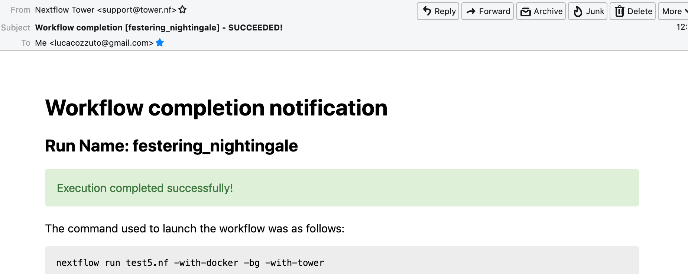

# Nextflow day 2
During this day we will make more complex pipelines and separate the main code from the configuration. Then we will focus on the reuse of the code and on how to share your code.

```{r, out.width="30%", echo=FALSE, eval = TRUE, fig.link='https://www.nextflow.io'}
knitr::include_graphics('docs/images/nextflow_logo_deep.png')
```

## Decoupling resources, parameters and nextflow script
When you make a complex pipelines you might want to keep separated the definition of resources needed, the default parameters and the main script.
You can achieve this by two additional files:

- nextflow.config
- params.config

The **nextflow.config** file allows to indicate the resources needed for each class of processes.
You can label your processes to make a link with the definitions in the nextflow.config file. This is an example of a nextflow.config file:

```{bash, eval=FALSE, echo=TRUE}
includeConfig "$baseDir/params.config"

process {
     memory='0.6G'
     cpus='1'
     time='6h'

     withLabel: 'onecpu'
   	{
		memory='0.6G'
   	 	cpus='1'
	} 	

}

process.container = 'biocorecrg/c4lwg-2018:latest'
singularity.cacheDir = "$baseDir/singularity"
```

The first row indicates to use the information stored in the **params.config** file (described later). Then we have the definition of the default resources for a process:

```{bash, eval=FALSE, echo=TRUE}
process {
     memory='0.6G'
     cpus='1'
     time='6h'
...
```

Then we have the resources needed for a class of processes in particular labeled with **bigmem** (i.e. the default options will be overridden)

```
     withLabel: 'bigmem'
   	{
		memory='0.7G'
   	 	cpus='1'
	} 	
```
In the script [test2.nf file](https://github.com/biocorecrg/CoursesCRG_Containers_Nextflow_May_2021/tree/main/nextflow/test2) we have two processes that will run two programs:
- [fastQC](https://www.bioinformatics.babraham.ac.uk/projects/fastqc/): a tool that calculates a number of quality control metrics on single fastq files.
- [multiQC](https://multiqc.info/): an aggregator of results from bioinformatics tools and samples for generating a single report.

If we have a look at process **fastQC** we can see the use of the label.

```{java, eval=FALSE, echo=TRUE}
/*
 * Process 1. Run FastQC on raw data.
 */
process fastQC {
    publishDir fastqcOutputFolder  		
    tag { "${reads}" }  					
    label 'bigmem'

    input:
    path reads   							
...
```

The last two rows of the config file indicate which container needs to be used. <br>
In this example, it is pulling it from [DockerHub](https://hub.docker.com/). <br>
In case you want to use a singularity container, you can indicate where to store the local image by using the **singularity.cacheDir** option.

```{java, eval=FALSE, echo=TRUE}
process.container = 'biocorecrg/c4lwg-2018:latest'
singularity.cacheDir = "$baseDir/singularity"
```

Let's now launch the script test2.nf.

```{java, eval=FALSE, echo=TRUE}
cd test2;
nextflow run test2.nf

N E X T F L O W  ~  version 20.07.1
Launching `test2.nf` [distracted_edison] - revision: e3a80b15a2
BIOCORE@CRG - N F TESTPIPE  ~  version 1.0
=============================================
reads                           : /home/ec2-user/git/CoursesCRG_Containers_Nextflow_May_2021/nextflow/nextflow/test2/../testdata/*.fastq.gz
executor >  local (2)
[df/2c45f2] process > fastQC (B7_input_s_chr19.fastq.gz) [  0%] 0 of 2
[-        ] process > multiQC                            -
Error executing process > 'fastQC (B7_H3K4me1_s_chr19.fastq.gz)'

Caused by:
  Process `fastQC (B7_H3K4me1_s_chr19.fastq.gz)` terminated with an error exit status (127)

Command executed:

  fastqc B7_H3K4me1_s_chr19.fastq.gz

Command exit status:
  127

executor >  local (2)
[df/2c45f2] process > fastQC (B7_input_s_chr19.fastq.gz) [100%] 2 of 2, failed: 2 ✘
[-        ] process > multiQC                            -
Error executing process > 'fastQC (B7_H3K4me1_s_chr19.fastq.gz)'

Caused by:
  Process `fastQC (B7_H3K4me1_s_chr19.fastq.gz)` terminated with an error exit status (127)

Command executed:

  fastqc B7_H3K4me1_s_chr19.fastq.gz

Command exit status:
  127

Command output:
  (empty)

Command error:
  .command.sh: line 2: fastqc: command not found

Work dir:
  /home/ec2-user/git/CoursesCRG_Containers_Nextflow_May_2021/nextflow/nextflow/test2/work/c5/18e76b2e6ffd64aac2b52e69bedef3

Tip: when you have fixed the problem you can continue the execution adding the option `-resume` to the run command line
```

We will get a number of errors since no executable is found in our environment / path. This because they are stored in our docker image! So we can launch it this time with the `-with-docker` parameter.

```{java, eval=FALSE, echo=TRUE}
nextflow run test2.nf -with-docker

nextflow run test2.nf -with-docker
N E X T F L O W  ~  version 20.07.1
Launching `test2.nf` [boring_hamilton] - revision: e3a80b15a2
BIOCORE@CRG - N F TESTPIPE  ~  version 1.0
=============================================
reads                           : /home/ec2-user/git/CoursesCRG_Containers_Nextflow_May_2021/nextflow/nextflow/test2/../testdata/*.fastq.gz
executor >  local (3)
[22/b437be] process > fastQC (B7_H3K4me1_s_chr19.fastq.gz) [100%] 2 of 2 ✔
[1a/cfe63b] process > multiQC                              [  0%] 0 of 1
executor >  local (3)
[22/b437be] process > fastQC (B7_H3K4me1_s_chr19.fastq.gz) [100%] 2 of 2 ✔
[1a/cfe63b] process > multiQC                              [100%] 1 of 1 ✔

```
This time it worked beautifully since Nextflow used the image indicated within the nextflow.config file that contains our executables.

Now we can have a look at the **params.config** file

```{java, eval=FALSE, echo=TRUE}
params {
	reads		= "$baseDir/../testdata/*.fastq.gz"
	email		= "myemail@google.com"
}
```

As you can see we indicates the pipeline parameters that can be overridden by using `--reads` and `--email`. <br>
This is not mandatory but I found quite useful to modify this file instead of using very long command lines with tons of `--something`.

Now, let's have a look at the folders generated by the pipeline.

```{bash, eval=FALSE, echo=TRUE}
ls  work/2a/22e3df887b1b5ac8af4f9cd0d88ac5/

total 0
drwxrwxr-x 3 ec2-user ec2-user  26 Apr 23 13:52 .
drwxr-xr-x 2 root     root     136 Apr 23 13:51 multiqc_data
drwxrwxr-x 3 ec2-user ec2-user  44 Apr 23 13:51 ..
```

We observe that Docker runs as "root". This can be problematic and generates security issues. To avoid this we can add this line of code within the process section of the config file:

```{bash, eval=FALSE, echo=TRUE}
  containerOptions = { workflow.containerEngine == "docker" ? '-u $(id -u):$(id -g)': null}
```

This will tell Nextflow that if is running with Docker, this has to produce files that belong to your user and not to root.

### Publishing final results

After running the script you see two new folders named **output_fastqc** and **output_multiQC** that contain the result of the pipeline.<br>
We can indicate which process and which output can be considered the final output of the pipeline by using the **publishDir** directive that has to be specified at the beginning of a process.

In our pipeline we define these folders here:

```{java, eval=FALSE, echo=TRUE}
/*
 * Defining the output folders.
 */
fastqcOutputFolder    = "output_fastqc"
multiqcOutputFolder   = "output_multiQC"


[...]

/*
 * Process 1. Run FastQC on raw data. A process is the element for executing scripts / programs etc.
 */
process fastQC {
    publishDir fastqcOutputFolder  			// where (and whether) to publish the results

[...]

/*
 * Process 2. Run multiQC on fastQC results
 */
process multiQC {
    publishDir multiqcOutputFolder, mode: 'copy' 	// this time do not link but copy the output file

```

You can see that the default mode to publish the results in Nextflow is soft linking. You can change this behaviour by specifying the mode as indicated in the **multiQC** process.

**IMPORTANT: You can also "move" the results but this is not suggested for files that will be needed for other processes. This will likely disrupt your pipeline.**

We can copy the output files to our [S3 bucket](https://docs.aws.amazon.com/AmazonS3/latest/userguide/UsingBucket.html) to be accessed via web. Your bucket is mounted in **/mnt** 

```{bash, eval=FALSE, echo=TRUE}
ls /mnt

/mnt/class-bucket-1

```

Your number can be different (i.e. class-bucket-2, class-bucket-3, etc) since we have one bucket per student. Let's copy the **multiqc_output.html** file there and let's change the privileges.

```{bash, eval=FALSE, echo=TRUE}
cp output_multiQC/multiqc_output.html /mnt/class-bucket-1

sudo chmod 775 /mnt/class-bucket-1/multiqc_output.html 
```

Now you can see via browser at at:

```{bash, eval=FALSE, echo=TRUE}
http://class-bucket-1.s3.eu-central-1.amazonaws.com/multiqc_report.html
```

Of course again we need to change **class-bucket-1** with your own number.


## Adding a help section for the whole pipeline

In this example we also describe another good practice: the use of the `--help` parameter. At the beginning of the pipeline we can write:

```{java, eval=FALSE, echo=TRUE}

params.help             = false    // this prevents a warning of undefined parameter

// this prints the input parameters
log.info """
BIOCORE@CRG - N F TESTPIPE  ~  version ${version}
=============================================
reads                           : ${params.reads}
"""

// this prints the help in case you use --help parameter in the command line and it stops the pipeline
if (params.help) {
    log.info 'This is the Biocore\'s NF test pipeline'
    log.info 'Enjoy!'
    log.info '\n'
    exit 1
}

```
so launching the pipeline with `--help` will show you just the parameters and the help.

```{java, eval=FALSE, echo=TRUE}
nextflow run test2.nf --help

N E X T F L O W  ~  version 20.07.1
Launching `test2.nf` [mad_elion] - revision: e3a80b15a2
BIOCORE@CRG - N F TESTPIPE  ~  version 1.0
=============================================
reads                           : /home/ec2-user/git/CoursesCRG_Containers_Nextflow_May_2021/nextflow/nextflow/test2/../testdata/*.fastq.gz
This is the Biocore's NF test pipeline
Enjoy!
```

## EXERCISE 4 

- Look at [EXERCISE 3](https://biocorecrg.github.io/CoursesCRG_Containers_Nextflow_May_2021/exercise-3.html). <br>Can you make a configuration for that script with a new label for handling failing processes? 

<details>
<summary>
<h5 style="background-color: #e6fadc; display: inline-block;">*Answer*</h5>
</summary>


The process should become:

```{java, eval=FALSE, echo=TRUE}

process reverseSequence {
    tag { "${seq}" }                  
    publishDir "output"
	label 'ignorefail'
	
    input:
    path seq

    output:
    path "all.rev"

    script:
    """
    cat ${seq} | AAAAA '{if (\$1~">") {print \$0} else system("echo " \$0 " |rev")}' > all.rev
    """
}
```

while the nextflow.config file would be:

```{java, eval=FALSE, echo=TRUE}

process {
     withLabel: 'ignorefail'
    {
		errorStrategy = 'ignore' 
     }   
}
```

</details>

- Now look at **test2.nf**. <br>Can you make a configuration for that script with a new label for handling failing processes by retrying 3 times and incrementing the time? <br>You can give very low time (10 / 15 seconds) for the fastqc process so it would fail at beginning. 

<details>
<summary>
<h5 style="background-color: #e6fadc; display: inline-block;">*Answer*</h5>
</summary>

The process should become:

```{java, eval=FALSE, echo=TRUE}

process fastQC {
    publishDir fastqcOutputFolder	// where (and whether) to publish the results
    tag { "${reads}" } 	// during the execution prints the indicated variable for follow-up
    label 'keep_trying' 

    input:
    path reads   	// it defines the input of the process. It sets values from a channel

    output:									// It defines the output of the process (i.e. files) and send to a new channel
   	path "*_fastqc.*"

    script:									// here you have the execution of the script / program. Basically is the command line
    """
        fastqc ${reads} 
    """
}
```

while the nextflow.config file would be:

```{java, eval=FALSE, echo=TRUE}
includeConfig "$baseDir/params.config"

 
process {
     //containerOptions = { workflow.containerEngine == "docker" ? '-u $(id -u):$(id -g)': null}
     memory='0.6G'
     cpus='1'
     time='6h'

     withLabel: 'keep_trying'	
   	{ 
 		time = { 10.second * task.attempt }
     	errorStrategy = 'retry' 
    	maxRetries = 3	
    } 	

}

process.container = 'biocorecrg/c4lwg-2018:latest'
singularity.cacheDir = "$baseDir/singularity"

```
</details>


## Using Singularity

We recommend to use Singularity instead of Docker in HPC environments. <br>This can be done by using the Nextflow parameter `-with-singularity` and  without changing the code. <br>
Nextflow will take care of **pulling, converting and storing the image** for you. This will be done just once and then Nextflow will use the stored image for further executions.<br>
Within the AWS main node both Docker and singularity are available. Within the AWS batch system we only have Docker.

```{bash, eval=FALSE, echo=TRUE}
nextflow run test2.nf -with-singularity -bg > log

tail -f log 
N E X T F L O W  ~  version 20.10.0
Launching `test2.nf` [soggy_miescher] - revision: 5a0a513d38

BIOCORE@CRG - N F TESTPIPE  ~  version 1.0
=============================================
reads                           : /home/ec2-user/git/CoursesCRG_Containers_Nextflow_May_2021/nextflow/test2/../../testdata/*.fastq.gz

Pulling Singularity image docker://biocorecrg/c4lwg-2018:latest [cache /home/ec2-user/git/CoursesCRG_Containers_Nextflow_May_2021/nextflow/test2/singularity/biocorecrg-c4lwg-2018-latest.img]
[da/eb7564] Submitted process > fastQC (B7_H3K4me1_s_chr19.fastq.gz)
[f6/32dc41] Submitted process > fastQC (B7_input_s_chr19.fastq.gz)
...
```

We can then inspect the presence of the singularity image inside the folder singularity.

```{bash, eval=FALSE, echo=TRUE}
ls singularity/
biocorecrg-c4lwg-2018-latest.img
```

We can then reuse this image if we want to execute the code <u>exactly in the same way</u> as in the pipeline but outside the pipeline. <br>Sometimes we can be interested in launching just one job, because it failed or for just making a test. We can go to the corresponding temporary folder: as an example let's go to one of the fastQC temporary folder:

```{bash, eval=FALSE, echo=TRUE}
cd work/da/eb7564*/
```

Inspecting the `.command.run` file shows us this piece of code:

```{bash, eval=FALSE, echo=TRUE}
...

nxf_launch() {
    set +u; env - PATH="$PATH" SINGULARITYENV_TMP="$TMP" SINGULARITYENV_TMPDIR="$TMPDIR" singularity exec /home/ec2-user/git/CoursesCRG_Containers_Nextflow_May_2021/nextflow/test2/singularity/biocorecrg-c4lwg-2018-latest.img /bin/bash -c "cd $PWD; /bin/bash -ue /home/ec2-user/git/CoursesCRG_Containers_Nextflow_May_2021/nextflow/test2/work/da/eb756433aa0881d25b20afb5b1366e/.command.sh"
}
...
```

This means that Nextflow is running the code by using the **singularity exec** command. 

Then we can launch the following command:

```{bash, eval=FALSE, echo=TRUE}
bash .command.run 
Started analysis of B7_H3K4me1_s_chr19.fastq.gz
Approx 5% complete for B7_H3K4me1_s_chr19.fastq.gz
Approx 10% complete for B7_H3K4me1_s_chr19.fastq.gz
Approx 15% complete for B7_H3K4me1_s_chr19.fastq.gz
Approx 20% complete for B7_H3K4me1_s_chr19.fastq.gz
Approx 25% complete for B7_H3K4me1_s_chr19.fastq.gz
Approx 30% complete for B7_H3K4me1_s_chr19.fastq.gz
Approx 35% complete for B7_H3K4me1_s_chr19.fastq.gz
Approx 40% complete for B7_H3K4me1_s_chr19.fastq.gz
Approx 45% complete for B7_H3K4me1_s_chr19.fastq.gz
Approx 50% complete for B7_H3K4me1_s_chr19.fastq.gz
Approx 55% complete for B7_H3K4me1_s_chr19.fastq.gz
Approx 60% complete for B7_H3K4me1_s_chr19.fastq.gz
...
```

In this way you are doing the same execution done by Nextflow using the local machine. In case you are submitting a job to a HPC you need to use the corresponding program, for instance **qsub**.

```{bash, eval=FALSE, echo=TRUE}
qsub .command.run 
```

## Adding more steps

We can make pipelines incrementally complex by adding more and more processes. 
Nextflow will take care of the dependencies between the input / output and of the parallelization.<br>
Within the **test3** folder we have two more steps to add: the reference indexing and the read alignments with **bowtie** (http://bowtie-bio.sourceforge.net/index.shtml).

We add a new input for the reference sequence:

```nextflow
log.info """
BIOCORE@CRG - N F TESTPIPE  ~  version ${version}
=============================================
reads                           : ${params.reads}
reference                       : ${params.reference}
outdir                          : ${params.outdir}

"""

reference = file(params.reference)
```

The **singleton channel** called **reference** is created. Its content is never consumed and can be indefinitely used. We also add a path specifying where to place the output files.

```{java, eval=FALSE, echo=TRUE}
/*
 * Defining the output folders.
 */
fastqcOutputFolder    = "${params.outdir}/output_fastqc"
alnOutputFolder       = "${params.outdir}/output_aln"
multiqcOutputFolder   = "${params.outdir}/output_multiQC"

```

We add two more processes. The first one is for the indexing the reference genome (with `bowtie-build`):

```{java, eval=FALSE, echo=TRUE}
/*
 * Process 2. Bowtie index
 */
process bowtieIdx {
    tag { "${ref}" }  							

    input:
    path ref   							

    output:									
    tuple val("${ref}"), path ("${ref}*.ebwt")

    script:									
    """
        gunzip -c ${ref} > reference.fa
        bowtie-build reference.fa ${ref}
        rm reference.fa
    """
}
```

Since bowtie indexing requires unzipped reference fasta file, we first **gunzip** it, we then build the reference index, and we finally remove the unzipped file. <br>
The output channel generated is organized as a **tuple**, i.e. a list of elements. <br>
The first element of the list is the <u>name of the index as a value</u>, the second is a <u>list of files constituting the index</u>. <br>
The former is needed for building the command line of the alignment step, the latter are the files needed for the alignment.

The second process `bowtieAln` is the alignment step:

```{java, eval=FALSE, echo=TRUE}
/*
 * Process 3. Bowtie alignment
 */
process bowtieAln {
    publishDir alnOutputFolder, pattern: '*.sam'

    tag { "${reads}" }  							
    label 'twocpus'

    input:
    tuple val(refname), path (ref_files)
    path reads  							

    output:									
    path "${reads}.sam", emit: samples_sam
    path "${reads}.log", emit: samples_log

    script:									
    """
    bowtie -p ${task.cpus} ${refname} -q ${reads} -S > ${reads}.sam 2> ${reads}.log
    """
}
```

There are two different input channels: the **index** and the **reads**.<br>
The index name specified by **refname** is used for building the command line while the index files, indicated by **ref_files**, are just linked in the current directory by using the **path** qualifier.

We also produced two kind of outputs: the **alignments** and the **logs**.<br> The first one is the one we want to keep as a final result. So we specify this using the **pattern** parameter in **publishDir**.

```{java, eval=FALSE, echo=TRUE}
    publishDir alnOutputFolder, pattern: '*.sam'
```

The second one will be just passed to the next process for being used by the multiQC process. To distinguish them we can assign them different names.

```{java, eval=FALSE, echo=TRUE}
 output:									
    path "${reads}.sam", emit: samples_sam
    path "${reads}.log", emit: samples_log

```

This section will allow us to connect these outputs directly with other processes when we call them in the workflow section:

```{java, eval=FALSE, echo=TRUE}
workflow {
	fastqc_out = fastQC(reads)
	bowtie_index = bowtieIdx(reference)
	bowtieAln(bowtie_index, reads)
	multiQC(fastqc_out.mix(bowtieAln.out.samples_log).collect())
}
```

So we passed the **samples_log** output to the multiqc process after mixing it with the output channel from the fastqc process.

## Profiles 

For deploying a pipeline in a cluster environment or a cloud, we need to add some information in the **nextflow.config** file. 

In particular we need to indicate the kind of [executor](https://www.nextflow.io/docs/latest/process.html#executor) should be used. <br>

In the Nextflow framework architecture, the executor indicates which is the **batch-queuing system** to use to submit jobs to the HPC or to the cloud. <br>
The executor is completely abstracted, so you can switch from SGE to SLURM just by changing this parameter in the configuration file.

You can group different classes of configuration or **profiles** within a single **nextflow.config** file. 
In this way that you can indicate at run time which executor and resources to use for a pipeline execution.

Let's inspect the **nextflow.config** file in **test3** folder. We can look at three different profiles:

- standard
- cluster
- cloud

The first one indicates the resources needed for running the pipeline locally. They are quite small since we have little power and CPUs on the test node.

```{java, eval=FALSE, echo=TRUE}

profiles {
  standard {
     process {
        containerOptions = { workflow.containerEngine == "docker" ? '-u $(id -u):$(id -g)': null}
        executor="local"
        memory='0.6G'
        cpus='1'
        time='6h'

        withLabel: 'twocpus' {
            memory='0.6G'
            cpus='1'
        }
   	  }
   }
 ```
 
As you can see we indicate explicitly the **local** executor. So this will be the default when running the pipeline indicating without specifying a profiles.

The second one is **cluster**:

```{java, eval=FALSE, echo=TRUE}

   cluster {
     process {
        containerOptions = { workflow.containerEngine == "docker" ? '-u $(id -u):$(id -g)': null}
        executor="SGE"
        queue="smallcpus"

        memory='1G'
        cpus='1'
        time='6h'

        withLabel: 'twocpus' {
            queue="bigcpus"
            memory='4G'
            cpus='2'
        }
      }
   }
```

This indicates that the system uses **Sun Grid Engine** as job scheduler and that we have different queues for small jobs and more intensive ones.


## Deployment in the AWS cloud 

The final profile is for running the pipeline in the **Amazon Cloud**, known as Amazon Web Services or AWS. In particular we will use **AWS Batch** that allows the execution of containerised workloads in the Amazon cloud infrastructure.

```{java, eval=FALSE, echo=TRUE}

   cloud {
    workDir = 's3://class-bucket-1/work'
    aws.region = 'eu-central-1'
    aws.batch.cliPath = '/home/ec2-user/miniconda/bin/aws'
    
   process {
       containerOptions = { workflow.containerEngine == "docker" ? '-u $(id -u):$(id -g)': null}
       executor = 'awsbatch'
       queue = 'spot'
       memory='1G'
       cpus='1'
       time='6h'

       withLabel: 'twocpus' {
           memory='0.6G'
           cpus='2'
       }
    }
  }
```

We indicate some <u>AWS specific parameters</u> (**region** and **cliPath**) and the executor that is **awsbatch**. <br>
Then we indicate that the working directory, that is normally written locally, should be mounted as [S3 volume](https://aws.amazon.com/s3/). 
This is mandatory when running Nextflow on the cloud.<br>
We can now launch the pipeline indicating `-profile cloud`

```{bash, eval=FALSE, echo=TRUE}
nextflow run test3.nf -bg -with-docker -profile cloud > log
```

Note that there is no longer a **work** folder because, on the AWS cloud, the output is copied locally. 

Sometimes you can find that the Nextflow process itself is very memory intensive and the main node can run out of memory. To avoid this you can reduce the memory needed by setting an environmental variable:

```{bash, eval=FALSE, echo=TRUE}
export NXF_OPTS="-Xms50m -Xmx500m"
```

Again we can copy the output file to the bucket. <br>
We can also tell Nextflow to directly copy the output file to the S3 bucket: to do so, change the parameter **outdir** in the params file:

```{java, eval=FALSE, echo=TRUE}
outdir = "s3://class-bucket-1/results"
```

## EXERCISE 5 

Modify the **test3.nf** file to make two different subworkflows: 

* one for fastqc + bowtie alignment
* one for a new fastqc analysis of the aligned files produced by bowtie. 

For convenience you can use the multiqc config file called config.yaml in the multiqc process.

<details>
<summary>
<h5 style="background-color: #e6fadc; display: inline-block;">*Answer*</h5>
</summary>

Solution in the file test3_2.nf

</details>


## Modules and re-usage of the code

A great advance of the new DSL2 is to allow the **modularization of the code**.<br>
In particular, you can move a named workflow within a module and keep it aside for being accessed from different pipelines. <br>
Looking at the **test4** folder gives you an idea of how the code uses modules.

```{java, eval=FALSE, echo=TRUE}
#!/usr/bin/env nextflow

nextflow.enable.dsl=2

/*
 * Input parameters: read pairs
 * Params are stored in the params.config file
 */

version                 = "1.0"
params.help             = false

// this prints the input parameters
log.info """
BIOCORE@CRG - N F TESTPIPE  ~  version ${version}
=============================================
reads                           : ${params.reads}
"""

if (params.help) {
    log.info 'This is the Biocore\'s NF test pipeline'
    log.info 'Enjoy!'
    log.info '\n'
    exit 1
}

/*
 * Defining the output folders.
 */
fastqcOutputFolder    = "output_fastqc"
multiqcOutputFolder   = "output_multiQC"


Channel
    .fromPath( params.reads )  											                            
    .ifEmpty { error "Cannot find any reads matching: ${params.reads}" }
    .set {reads_for_fastqc} 											


/*
 * Here we include two modules from two files. We also add the parameter OUTPUT to pass them the folders where to publish the results
 */
include { fastqc } from "${baseDir}/lib/fastqc" addParams(OUTPUT: fastqcOutputFolder)
include { multiqc } from "${baseDir}/lib/multiqc" addParams(OUTPUT: multiqcOutputFolder)

// The main worflow can directly call the named workflows from the modules
workflow {
	fastqc_out = fastqc(reads_for_fastqc)
	multiqc(fastqc_out.collect())
}


workflow.onComplete {
	println ( workflow.success ? "\nDone! Open the following report in your browser --> ${multiqcOutputFolder}/multiqc_report.html\n" : "Oops .. something went wrong" )
}
```

We now include two modules named **fastqc** and **multiqc** from ```${baseDir}/lib/fastqc.nf``` and ```${baseDir}/lib/multiqc.nf```.
Let's inspect the **fastqc** module:

```{java, eval=FALSE, echo=TRUE}
/*
*  fastqc module
*/

params.CONTAINER = "quay.io/biocontainers/fastqc:0.11.9--0"
params.OUTPUT = "fastqc_output"

process qc {
    publishDir(params.OUTPUT, mode: 'copy')
    tag { "${reads}" }
    container params.CONTAINER

    input:
    path(reads)

    output:
    path("*_fastqc*")

    script:
    """
	fastqc ${reads}
    """
}

```

Module **fastqc** takes as **input** a channel with reads and produces as **output** the files generated by the fastqc program.

The module is quite simple: it contains the directive `publishDir`, the tag, the container to be used and has a similar input, output and script session than seen previously.

A module can contain its own parameters that can be used for connecting the main script to some variables inside the module.<br>
In this example we have the declaration of two **parameters** that are defined at the beginning:

```{java, eval=FALSE, echo=TRUE}
params.CONTAINER = "quay.io/biocontainers/fastqc:0.11.9--0"
params.OUTPUT = "fastqc_output"
```

They can be overridden from the main script that is calling the module:

- The parameter **params.OUTPUT** can be used for connecting the definition of the output of this module with the one in the main script.  
- The parameter **params.CONTAINER** can be used for deciding which image has to be used for this particular module.

In this example in our main script we pass only the OUTPUT parameters by writing in this way:

```{java, eval=FALSE, echo=TRUE}
include { fastqc } from "${baseDir}/lib/fastqc" addParams(OUTPUT: fastqcOutputFolder)
include { multiqc } from "${baseDir}/lib/multiqc" addParams(OUTPUT: multiqcOutputFolder)
```

While we keep the information of the container inside the module for better reproducibility:

```{java, eval=FALSE, echo=TRUE}
params.CONTAINER = = "quay.io/biocontainers/fastqc:0.11.9--0"
```

Here you see that we are not using our own image but one provided by **biocontainers** stored in [quay](https://quay.io/). <br>
Here you can find a list of fastqc images developed and stored by the biocontainers community [https://biocontainers.pro/#/tools/fastqc](https://biocontainers.pro/#/tools/fastqc).

Let's have a look at the **multiqc.nf** module:

```{java, eval=FALSE, echo=TRUE}
/*
*  multiqc module
*/

params.CONTAINER = "quay.io/biocontainers/multiqc:1.9--pyh9f0ad1d_0"
params.OUTPUT = "multiqc_output"
params.LABEL = ""

process multiqc {
    publishDir(params.OUTPUT, mode: 'copy')
    container params.CONTAINER
    label (params.LABEL)

    input:
    path (inputfiles)

    output:
    path "multiqc_report.html"					

    script:
    """
    multiqc .
    """
}

```

It is very similar to the fastqc one: we just add an extra parameter for connecting the resources defined in the nextflow.config file and the label indicated in the process.

In case we want to use it we would need to change the main code in this way:

```{java, eval=FALSE, echo=TRUE}
include { multiqc } from "${baseDir}/lib/multiqc" addParams(OUTPUT: multiqcOutputFolder, LABEL="onecpu")
```

This is because we specified the label **onecpu** in out **nextflow.config** file:

```{java, eval=FALSE, echo=TRUE}
includeConfig "$baseDir/params.config"

process {
     container = 'biocorecrg/debian-perlbrew-pyenv3-java'
     memory='0.6G'
     cpus='1'
     time='6h'

     withLabel: 'onecpu'
   	{
		memory='0.6G'
   	 	cpus='1'
	} 	

}

singularity.cacheDir = "$baseDir/singularity"
```

**IMPORTANT: you will need to specify a default image when you want to run nextflow -with-docker or -with-singularity and you have containers defined inside the modules**

## EXERCISE 6 

Try to make a module wrapper of the bowtie tool and change the script accordingly as the test3.

<details>
<summary>
<h5 style="background-color: #e6fadc; display: inline-block;">*Answer*</h5>
</summary>

Solution in the folder test5

</details>


## Reporting and graphical interface

Nextflow has an embedded function for reporting a number of informations about the resources needed by each job and the timing: you can get a nice html report with parameter `-with-report`:

```{java, eval=FALSE, echo=TRUE}
nextflow run test5.nf -with-docker -bg -with-report > log
```

```{r, out.width="800px", echo=FALSE, eval = TRUE }
knitr::include_graphics('docs/images/report.png')
```

**Nextflow Tower** is an open source monitoring and managing platform for Nextflow workflows. There are two versions:

- Open source for monitoring of single pipelines
- Commercial one for workflow management, monitoring and resource optimisation.

We will show the open source one. 

First of all you need to access the tower.nf website and doing the login using one of the methods.

```{r, out.width="800px", echo=FALSE, eval = TRUE, fig.link='https://tower.nf/'}
knitr::include_graphics('docs/images/tower.png')
```

We select the email for receiving the instructions and the token to be used for the pipeline.

```{r, out.width="800px", echo=FALSE, eval = TRUE }
knitr::include_graphics('docs/images/tower0.png')
```

So we check the email:

```{r, out.width="800px", echo=FALSE, eval = TRUE }
knitr::include_graphics('docs/images/tower1.png')
```

We then go on getting started and follow the instructions for exporting two environmental variables:

```{r, out.width="800px", echo=FALSE, eval = TRUE }
knitr::include_graphics('docs/images/tower2.png')
```

You can then generate your token here: [https://tower.nf/tokens](https://tower.nf/tokens) and copy paste in your pipeline using this snippet in the configuration file

```{java, eval=FALSE, echo=TRUE}
tower {
  accessToken = '<YOUR TOKEN>'
  enabled = true
}
```

or exporting those environmental variables:

```{bash, eval=FALSE, echo=TRUE}
export TOWER_ACCESS_TOKEN=*******YOUR***TOKEN*****HERE*******
export NXF_VER=21.04.0
```

we then launch the pipeline:

```{bash, eval=FALSE, echo=TRUE}
nextflow run test5.nf -with-singularity -with-tower -bg > log


CAPSULE: Downloading dependency io.nextflow:nf-tower:jar:20.09.1-edge
CAPSULE: Downloading dependency org.codehaus.groovy:groovy-nio:jar:3.0.5
CAPSULE: Downloading dependency io.nextflow:nextflow:jar:20.09.1-edge
CAPSULE: Downloading dependency io.nextflow:nf-httpfs:jar:20.09.1-edge
CAPSULE: Downloading dependency org.codehaus.groovy:groovy-json:jar:3.0.5
CAPSULE: Downloading dependency org.codehaus.groovy:groovy:jar:3.0.5
CAPSULE: Downloading dependency io.nextflow:nf-amazon:jar:20.09.1-edge
CAPSULE: Downloading dependency org.codehaus.groovy:groovy-templates:jar:3.0.5
CAPSULE: Downloading dependency org.codehaus.groovy:groovy-xml:jar:3.0.5
```

We finally go to the tower website again:

```{r, out.width="800px", echo=FALSE, eval = TRUE }
knitr::include_graphics('docs/images/tower3.png')
```

And in the end when the pipeline is finished we can also receive a mail.


```{r, out.width="800px", echo=FALSE, eval = TRUE }

```

## Share Nextflow pipelines and good practices

Nextflow supports a number of code sharing platforms: **BitBucket**, **GitHub**, and **GitLab**. <br>
This feature allows to run pipelines by just pointing to an online repository without caring about downloading etc. <br>
The default platform is **GitHub**, so we will use this repository as an example.

Let's create a new repository with a unique name:

```{r, out.width="300px", echo=FALSE, eval = TRUE }
knitr::include_graphics('docs/images/git_1.png')
```

```{r, out.width="800px", echo=FALSE, eval = TRUE }
knitr::include_graphics('docs/images/git_2.png')
```

And then let's clone it in one of our test folder. Let's choose **test5**. We can get the url path by clicking like on the figure:

```{r, out.width="800px", echo=FALSE, eval = TRUE }
knitr::include_graphics('docs/images/git_3.png')
```

```{bash, eval=FALSE, echo=TRUE}
git clone https://github.com/lucacozzuto/test_course.git
Cloning into 'test_course'...
remote: Enumerating objects: 3, done.
remote: Counting objects: 100% (3/3), done.
remote: Total 3 (delta 0), reused 0 (delta 0), pack-reused 0
Unpacking objects: 100% (3/3), done.

```

We have an almost empty folder named **test_course**. We can just move or copy our files there:

```{bash, eval=FALSE, echo=TRUE}
cp *.* lib -r test_course/ 
cd test_course

git status

# On branch main
# Untracked files:
#   (use "git add <file>..." to include in what will be committed)
#
#	lib/
#	nextflow.config
#	params.config
#	test5.nf
nothing added to commit but untracked files present (use "git add" to track)
```

Now we are ready for committing and pushing everything to the online repository. But before we need to rename **test5.nf** to **main.nf**.

```{bash, eval=FALSE, echo=TRUE}
mv test5.nf main.nf

git add *

git status
# On branch main
# Changes to be committed:
#   (use "git reset HEAD <file>..." to unstage)
#
#	new file:   lib/bowtie.nf
#	new file:   lib/fastqc.nf
#	new file:   lib/multiqc.nf
#	new file:   nextflow.config
#	new file:   params.config
#	new file:   main.nf
#


git commit -m "first commit"

[main 7681f85] first commit
 6 files changed, 186 insertions(+)
 create mode 100644 lib/bowtie.nf
 create mode 100644 lib/fastqc.nf
 create mode 100644 lib/multiqc.nf
 create mode 100644 nextflow.config
 create mode 100644 params.config
 create mode 100755 main.nf
[lcozzuto@nextflow test_course]$ git push
Username for 'https://github.com': ######
Password for 'https://######@github.com': 
Counting objects: 10, done.
Delta compression using up to 8 threads.
Compressing objects: 100% (7/7), done.
Writing objects: 100% (9/9), 2.62 KiB | 0 bytes/s, done.
Total 9 (delta 0), reused 0 (delta 0)
To https://github.com/lucacozzuto/test_course.git
   bbd6a44..7681f85  main -> main

```

If we go back to the GitHub website we can see that everything has been uploaded.

```{r, out.width="800px", echo=FALSE, eval = TRUE }
knitr::include_graphics('docs/images/git_2.png')
```

Now we can remove that folder and go in the home folder.

```{bash, eval=FALSE, echo=TRUE}
rm -fr test_course
cd $HOME
```

And we can launch directly this pipeline with:

```{bash, eval=FALSE, echo=TRUE}
nextflow run lucacozzuto/test_course -with-docker -r main \
--reads "/home/ec2-user/git/CoursesCRG_Containers_Nextflow_May_2021/nextflow/nextflow/testdata/*.fastq.gz" \
--reference "/home/ec2-user/git/CoursesCRG_Containers_Nextflow_May_2021/nextflow/nextflow/testdata/chr19.fasta.gz"

```

As you can see we just use the repository name and two Nextflow parameters:

- `-with-docker`, for using Docker
- `-r`, for using a specific branch. In this case the **main** branch.
  <br>
Then we pass to the pipelines the path of our input files:
- `--reads`
- `--reference`

```{bash, eval=FALSE, echo=TRUE}

N E X T F L O W  ~  version 20.10.0
Pulling lucacozzuto/test_course ...
downloaded from https://github.com/lucacozzuto/test_course.git
Launching `lucacozzuto/test_course` [voluminous_feynman] - revision: 95d1028adf [main]
BIOCORE@CRG - N F TESTPIPE  ~  version 1.0
=============================================
reads                           : /home/ec2-user/git/CoursesCRG_Containers_Nextflow_May_2021/nextflow/nextflow/testdata/*.fastq.gz
reference                       : /home/ec2-user/git/CoursesCRG_Containers_Nextflow_May_2021/nextflow/nextflow/testdata/chr19.fasta.gz
executor >  local (5)
[5b/4a36e8] process > fastqc (B7_input_s_chr19.fastq.gz)             [100%] 2 of 2 ✔
[5c/644577] process > BOWTIE:bowtieIdx (chr19.fasta.gz)              [100%] 1 of 1 ✔
executor >  local (5)
[5b/4a36e8] process > fastqc (B7_input_s_chr19.fastq.gz)           [100%] 2 of 2 ✔
[5c/644577] process > BOWTIE:bowtieIdx (chr19.fasta.gz)            [100%] 1 of 1 ✔
[4b/dad392] process > BOWTIE:bowtieAln (B7_input_s_chr19.fastq.gz) [100%] 2 of 2 ✔
/home/ec2-user/work/d1/11fe0bff99f424571033347bf4b042/B7_H3K4me1_s_chr19.fastq.gz.sam
/home/ec2-user/work/4b/dad392b12d2f78f976d2a890ebcaea/B7_input_s_chr19.fastq.gz.sam
Completed at: 27-Apr-2021 20:27:14
Duration    : 1m 26s
CPU hours   : (a few seconds)
Succeeded   : 5
```

Nextflow first pulls down the required version of the pipeline and it stores it in:

```{bash, eval=FALSE, echo=TRUE}
/home/ec2-user/.nextflow/assets/lucacozzuto/test_course/
```

then it pulls the Docker image and runs the pipeline.

You can use the Nextflow's command **list** that shows the number of pipelines installed in your environment and the command **info** for fetching some useful information.

```{bash, eval=FALSE, echo=TRUE}
nextflow list
lucacozzuto/test_course
...
```

```{bash, eval=FALSE, echo=TRUE}
nextflow info lucacozzuto/test_course

 project name: lucacozzuto/test_course
 repository  : https://github.com/lucacozzuto/test_course
 local path  : /home/ec2-user/.nextflow/assets/lucacozzuto/test_course
 main script : main.nf
 revision    : * main
```

Finally you can update, view or delete a project by using the Nextflow commands **pull**, **view** and **drop**.

```{bash, eval=FALSE, echo=TRUE}
nextflow view lucacozzuto/test_course

== content of file: /users/bi/lcozzuto/.nextflow/assets/lucacozzuto/test_course/main.nf
#!/usr/bin/env nextflow

/*
 * Copyright (c) 2013-2020, Centre for Genomic Regulation (CRG).
 *
 *   This file is part of 'CRG_Containers_NextFlow'.
 *
 *   CRG_Containers_NextFlow is free software: you can redistribute it and/or modify
 *   it under the terms of the GNU General Public License as published by
 *   the Free Software Foundation, either version 3 of the License, or
 *   (at your option) any later version.
 *
 *   CRG_Containers_NextFlow is distributed in the hope that it will be useful,
[...]
```


