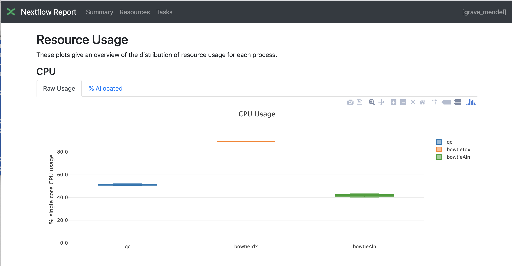
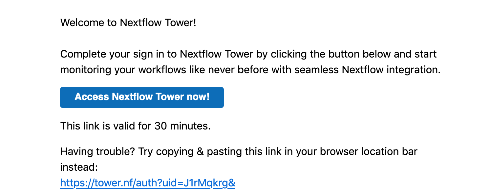
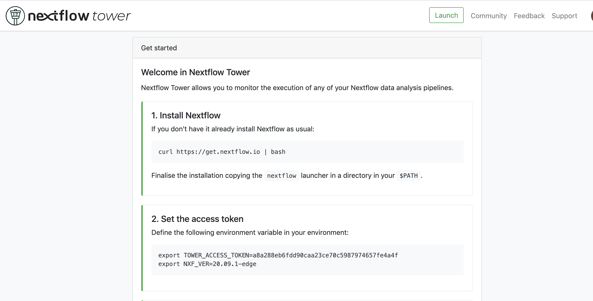
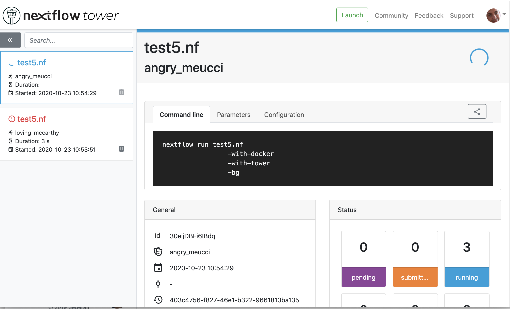

# Nextflow day 2
During this day we will make more complex pipelines and separate the main code from the configuration. Then we will focus on the reuse of the code and on how to share your code.

## Decoupling resources, parameters and nextflow script
When you make a complex pipelines you might want to keep separated the definition of resources needed, the default parameters and the main script.
You can achieve this by two additional files:

- nextflow.config
- params.config

The **nextflow.config** file allows to indicate the resources needed for each class of processes.
You can label your processes to make a link with the definitions in the nextflow.config file. This is an example of a nextflow.config file:

```{bash, eval=FALSE, echo=TRUE}
includeConfig "$baseDir/params.config"

process {
     memory='0.6G'
     cpus='1'
     time='6h'

     withLabel: 'onecpu'
   	{
		memory='0.6G'
   	 	cpus='1'
	} 	

}

process.container = 'biocorecrg/c4lwg-2018:latest'
singularity.cacheDir = "$baseDir/singularity"
```

The first row indicates to use the information stored in the **params.config** file (described later). Then we have the definition of the default resources for a process:

```{bash, eval=FALSE, echo=TRUE}
process {
     memory='0.6G'
     cpus='1'
     time='6h'
...
```

Then we have the resources needed for a class of processes in particular labeled with **bigmem**
```
     withLabel: 'bigmem'
   	{
		memory='0.7G'
   	 	cpus='1'
	} 	
```

If we have a look at the process **fastQC** within the test2.nf file, we can see the use of the label.

```{java, eval=FALSE, echo=TRUE}
/*
 * Process 1. Run FastQC on raw data.
 */
process fastQC {
    publishDir fastqcOutputFolder  		
    tag { reads }  					
    label 'bigmem'

    input:
    path reads   							
...
```

The latest two rows of the config file indicates which container needs to be used. In this case, it assumes has to be pulled from [DockerHub](https://hub.docker.com/). In case you want to use singularity you can indicate where to store the local image by using the **singularity.cacheDir** setting

```{java, eval=FALSE, echo=TRUE}
process.container = 'biocorecrg/c4lwg-2018:latest'
singularity.cacheDir = "$baseDir/singularity"
```

Let's now launch the script test2.nf

```{java, eval=FALSE, echo=TRUE}
cd test2;
nextflow run test2.nf

N E X T F L O W  ~  version 20.07.1
Launching `test2.nf` [distracted_edison] - revision: e3a80b15a2
BIOCORE@CRG - N F TESTPIPE  ~  version 1.0
=============================================
reads                           : /home/ec2-user/git/CoursesCRG_Containers_Nextflow_May_2021/nextflow/nextflow/test2/../testdata/*.fastq.gz
executor >  local (2)
[df/2c45f2] process > fastQC (B7_input_s_chr19.fastq.gz) [  0%] 0 of 2
[-        ] process > multiQC                            -
Error executing process > 'fastQC (B7_H3K4me1_s_chr19.fastq.gz)'

Caused by:
  Process `fastQC (B7_H3K4me1_s_chr19.fastq.gz)` terminated with an error exit status (127)

Command executed:

  fastqc B7_H3K4me1_s_chr19.fastq.gz

Command exit status:
  127

executor >  local (2)
[df/2c45f2] process > fastQC (B7_input_s_chr19.fastq.gz) [100%] 2 of 2, failed: 2 ✘
[-        ] process > multiQC                            -
Error executing process > 'fastQC (B7_H3K4me1_s_chr19.fastq.gz)'

Caused by:
  Process `fastQC (B7_H3K4me1_s_chr19.fastq.gz)` terminated with an error exit status (127)

Command executed:

  fastqc B7_H3K4me1_s_chr19.fastq.gz

Command exit status:
  127

Command output:
  (empty)

Command error:
  .command.sh: line 2: fastqc: command not found

Work dir:
  /home/ec2-user/git/CoursesCRG_Containers_Nextflow_May_2021/nextflow/nextflow/test2/work/c5/18e76b2e6ffd64aac2b52e69bedef3

Tip: when you have fixed the problem you can continue the execution adding the option `-resume` to the run command line
```

We will get a number of errors since no executable is found in our environment / path. This because they are stored in our docker image! So we can launch it this time with the -with-docker parameter.

```{java, eval=FALSE, echo=TRUE}
nextflow run test2.nf -with-docker

nextflow run test2.nf -with-docker
N E X T F L O W  ~  version 20.07.1
Launching `test2.nf` [boring_hamilton] - revision: e3a80b15a2
BIOCORE@CRG - N F TESTPIPE  ~  version 1.0
=============================================
reads                           : /home/ec2-user/git/CoursesCRG_Containers_Nextflow_May_2021/nextflow/nextflow/test2/../testdata/*.fastq.gz
executor >  local (3)
[22/b437be] process > fastQC (B7_H3K4me1_s_chr19.fastq.gz) [100%] 2 of 2 ✔
[1a/cfe63b] process > multiQC                              [  0%] 0 of 1
executor >  local (3)
[22/b437be] process > fastQC (B7_H3K4me1_s_chr19.fastq.gz) [100%] 2 of 2 ✔
[1a/cfe63b] process > multiQC                              [100%] 1 of 1 ✔

```
This time it worked beautifully since Nextflow used the image indicated within the nextflow.config file that contains our executables.

Now we can have a look at the **params.config** file

```{java, eval=FALSE, echo=TRUE}
params {
	reads		= "$baseDir/../testdata/*.fastq.gz"
	email		= "myemail@google.com"
}
```

As you can see we indicates the pipeline parameters that can be overridden by using **--reads** and **--email**. This is not mandatory but I found quite useful to modify this file instead of using very long command lines with tons of **--something**.

Now, let's have a look at the folders generated by the pipeline.

```{bash, eval=FALSE, echo=TRUE}
ls  work/2a/22e3df887b1b5ac8af4f9cd0d88ac5/

total 0
drwxrwxr-x 3 ec2-user ec2-user  26 Apr 23 13:52 .
drwxr-xr-x 2 root     root     136 Apr 23 13:51 multiqc_data
drwxrwxr-x 3 ec2-user ec2-user  44 Apr 23 13:51 ..
```

We observe that Docker runs as "root". This can be problematic and generates security issues. To avoid this we can add this line of code within the process section of the config file:

```{bash, eval=FALSE, echo=TRUE}
  containerOptions = { workflow.containerEngine == "docker" ? '-u $(id -u):$(id -g)': null}
```

This will tell to Nextflow that if is running with docker, this has to produce files that belong to your user and not to root.

### Publishing final results

After running the script you see two new folders named **ouptut_fastqc** and **ouptut_fastqc** that contain the result of the pipeline.
We can indicate which process and which output can be considered the final output of the pipeline by using the **publishDir** directive that has to be specified at the beginning of a process.

In our pipeline we define these folders here:

```{java, eval=FALSE, echo=TRUE}
/*
 * Defining the output folders.
 */
fastqcOutputFolder    = "ouptut_fastqc"
multiqcOutputFolder   = "ouptut_multiQC"


[...]

/*
 * Process 1. Run FastQC on raw data. A process is the element for executing scripts / programs etc.
 */
process fastQC {
    publishDir fastqcOutputFolder  			// where (and whether) to publish the results

[...]

/*
 * Process 2. Run multiQC on fastQC results
 */
process multiQC {
    publishDir multiqcOutputFolder, mode: 'copy' 	// this time do not link but copy the output file

```

You can see that the default mode to publish the results in Nextflow is soft linking. You can change this behaviour by specifying the mode as indicated in the **multiQC** process.

**IMPORTANT: You can also "move" the results but this is not suggested for files that will be needed for other processes. This will likely disrupt your pipeline.**

## Adding a help section for the whole pipeline

In this example we also describe another good practice: the use of the **--help** parameter. At the beginning of the pipeline we can write:

```{java, eval=FALSE, echo=TRUE}

params.help             = false    // this prevents a warning of undefined parameter

// this prints the input parameters
log.info """
BIOCORE@CRG - N F TESTPIPE  ~  version ${version}
=============================================
reads                           : ${params.reads}
"""

// this prints the help in case you use --help parameter in the command line and it stops the pipeline
if (params.help) {
    log.info 'This is the Biocore\'s NF test pipeline'
    log.info 'Enjoy!'
    log.info '\n'
    exit 1
}

```
so launching the pipeline with **--help** will show you just the parameters and the help.

```{java, eval=FALSE, echo=TRUE}
nextflow run test2.nf --help
N E X T F L O W  ~  version 20.07.1
Launching `test2.nf` [mad_elion] - revision: e3a80b15a2
BIOCORE@CRG - N F TESTPIPE  ~  version 1.0
=============================================
reads                           : /home/ec2-user/git/CoursesCRG_Containers_Nextflow_May_2021/nextflow/nextflow/test2/../testdata/*.fastq.gz
This is the Biocore's NF test pipeline
Enjoy!
```

## Using Singularity
We recommend to use Singularity instead of docker in HPC environments. This can be done by just using the Nextflow parameter **-with-singularity** and  without touching the code. Nextflow will take care of pulling, converting and storing the image for you. This will be done just once and then nextflow will use the stored image for further executions.
Within the AWS main node both Docker and singularity are available. Within the AWS batch we only have docker.

```{java, eval=FALSE, echo=TRUE}
nextflow run test2.nf -with-singularity
...

ls singularity/
biocorecrg-c4lwg-2018-latest.img
```

## Adding more steps
We can make pipelines incrementally by adding more and more processes. Nextflow will take care of the dependencies between the input / output and of the parallelization. Within the test3 folder we have two more steps: the reference indexing and the read alignments with **bowtie** (http://bowtie-bio.sourceforge.net/index.shtml).

So we add a new input for the reference sequence:

```nextflow
log.info """
BIOCORE@CRG - N F TESTPIPE  ~  version ${version}
=============================================
reads                           : ${params.reads}
reference                       : ${params.reference}
"""

reference = file(params.reference)
```

We generate in this way a **singleton channel** called **reference** which content is never consumed and can be indefinitely used.  

We add two more processes. The first one is for the indexing of the reference:

```{java, eval=FALSE, echo=TRUE}
/*
 * Process 2. Bowtie index
 */
process bowtieIdx {
    tag { ref }  							

    input:
    path ref   							

    output:									
    tuple val("${ref}"), path ("${ref}*.ebwt")

    script:									
    """
        gunzip -c ${ref} > reference.fa
        bowtie-build reference.fa ${ref}
        rm reference.fa
    """
}
```

Since bowtie indexing requires unzipped reference we unzip it then we build the reference and remove the unzipped file afterwards. The output channel generated is organized as a **tuple**, i.e. a list of elements. The first element of the list is the name of the index as a value, the second is a list of files constituting the index. The former is needed for building the command line of the alignment step, the latter are the files needed for the alignment.  

The second process is the alignment step:

```{java, eval=FALSE, echo=TRUE}
/*
 * Process 3. Bowtie alignment
 */
process bowtieAln {
    publishDir alnOutputFolder, pattern: '*.sam'

    tag { reads }  							
    label 'twocpus'

    input:
    tuple val(refname), path (ref_files)
    path reads  							

    output:									
    path "${reads}.sam", emit: samples_sam
    path "${reads}.log", emit: samples_log

    script:									
    """
    bowtie -p ${task.cpus} ${refname} -q ${reads} -S > ${reads}.sam 2> ${reads}.log
    """
}
```

As you see there are two different input channels: the index one and the reads. The index name specified by **refname** is used for building the command line while the index files, indicated by **ref_files**, are just linked in the current directory by using the **path** qualifier.

We also produced two kind of outputs: the alignments and the logs. The first one is the one we want to keep as a final result. So we specify this using the **publishDir** **pattern** parameter.

```{java, eval=FALSE, echo=TRUE}
    publishDir alnOutputFolder, pattern: '*.sam'
```

The second one will be just passed to the next process for being used by the multiQC process. To distinghuish among them we can assign them different names.

```{java, eval=FALSE, echo=TRUE}
 output:									
    path "${reads}.sam", emit: samples_sam
    path "${reads}.log", emit: samples_log

```

This section will allow us to connect these outputs directly with other processes when we call them in the workflow section:

```{java, eval=FALSE, echo=TRUE}
workflow {
	fastqc_out = fastQC(reads)
	bowtie_index = bowtieIdx(reference)
	bowtieAln(bowtie_index, reads)
	multiQC(fastqc_out.mix(bowtieAln.out.samples_log).collect())
}
```

So we passed the **samples_log** output to the multiqc process after mixing it with the output channel from the fastqc process.

## Profiles 
For deploying a pipeline on a cluster environment or a cloud we need to indicate some information on the **nextflow.config** file. 

In particular we need to indicate the kind of [executor](https://www.nextflow.io/docs/latest/process.html#executor) to be used. In the Nextflow framework architecture, the executor indicates which is the batch-queuing system to use to submit jobs to the HPC or to the cloud. 
The executor is completely abstracted, so you can switch from SGE to SLURM just by changing this parameter in the configuration file.

You can group different class of configuration or **profiles** within a single **nextflow.config** file. In this way that you can indicate at run time which executor and resources to use for a pipeline execution.

Let's inspect the **nextflow.config** file in **test3** folder. We can look at three different profiles:

- standard
- cluster
- cloud

The first one indicates the resources needed for running the pipeline locally. They are quite small since we have little power and CPUs on the test node.

```{java, eval=FALSE, echo=TRUE}

profiles {
  standard {
     process {
        containerOptions = { workflow.containerEngine == "docker" ? '-u $(id -u):$(id -g)': null}
        executor="local"
        memory='0.6G'
        cpus='1'
        time='6h'

        withLabel: 'twocpus' {
            memory='0.6G'
            cpus='1'
        }
   	  }
   }
 ```
 
As you can see we indicate explicitly the **local** executor. So this will be the default when running the pipeline indicating no profiles.

The second one is **cluster**

```{java, eval=FALSE, echo=TRUE}

   cluster {
     process {
        containerOptions = { workflow.containerEngine == "docker" ? '-u $(id -u):$(id -g)': null}
        executor="SGE"
        queue="smallcpus"

        memory='1G'
        cpus='1'
        time='6h'

        withLabel: 'twocpus' {
            queue="bigcpus"
            memory='4G'
            cpus='2'
        }
      }
   }
```

This indicates that the system uses Sun Grid Engine as job scheduler and that we have different queues for small jobs and more intensive ones.


## Deployment in the AWS cloud 

The final profile is for running the pipeline in the Amazon Cloud, known as Amazon Web Services or AWS. In particular we will use AWS Batch that allows the execution of containerised workloads in the Amazon cloud infrastructure.

```{java, eval=FALSE, echo=TRUE}

   cloud {
    workDir = 's3://class-bucket-1/work'
    aws.region = 'eu-central-1'
    aws.batch.cliPath = '/home/ec2-user/miniconda/bin/aws'
    
   process {
       containerOptions = { workflow.containerEngine == "docker" ? '-u $(id -u):$(id -g)': null}
       executor = 'awsbatch'
       queue = 'spot'
       memory='1G'
       cpus='1'
       time='6h'

       withLabel: 'twocpus' {
           memory='0.6G'
           cpus='2'
       }
    }
  }
```

We indicate some aws specific parameters (region and cliPath) and the executor that is awsbatch. Then we indicates that the working directory, that is normally written locally, to be mounted as [S3 volume](https://aws.amazon.com/s3/). This is mandatory when running nextflow on the cloud.
We can now launch the pipeline indicating **-profile cloud**

```{bash, eval=FALSE, echo=TRUE}
nextflow run test3.nf -bg -with-docker -profile cloud > log
```

We can see that there is no more a **work** folder because is on the AWS cloud and that the output is then copied locally. 

Sometimes you can find that the Nextflow process itself is very memory intensive and the main node can run out of memory. To avoid this you can reduce the memory needed by setting an environmental variable:

```{bash, eval=FALSE, echo=TRUE}
export NXF_OPTS="-Xms50m -Xmx500m"

```

## Modules and re-usage of the code
A great advance of the new DLS2 is to allow the modularization of the code. In particular you can move a named workflow within a module and keep it apart for being accessed from different pipelines. Looking at the test4 folder will give you an idea of what is the code using modules.

```{java, eval=FALSE, echo=TRUE}
#!/usr/bin/env nextflow

nextflow.enable.dsl=2

/*
 * Input parameters: read pairs
 * Params are stored in the params.config file
 */

version                 = "1.0"
params.help             = false

// this prints the input parameters
log.info """
BIOCORE@CRG - N F TESTPIPE  ~  version ${version}
=============================================
reads                           : ${params.reads}
"""

if (params.help) {
    log.info 'This is the Biocore\'s NF test pipeline'
    log.info 'Enjoy!'
    log.info '\n'
    exit 1
}

/*
 * Defining the output folders.
 */
fastqcOutputFolder    = "ouptut_fastqc"
multiqcOutputFolder   = "ouptut_multiQC"


Channel
    .fromPath( params.reads )  											                            
    .ifEmpty { error "Cannot find any reads matching: ${params.reads}" }
    .set {reads_for_fastqc} 											


/*
 * Here we include two modules from two files. We also add the parameter OUTPUT to pass them the folders where to publish the results
 */
include { fastqc } from "${baseDir}/lib/fastqc" addParams(OUTPUT: fastqcOutputFolder)
include { multiqc } from "${baseDir}/lib/multiqc" addParams(OUTPUT: multiqcOutputFolder)

// The main worflow can directly call the named workflows from the modules
workflow {
	fastqc_out = fastqc(reads_for_fastqc)
	multiqc(fastqc_out.collect())
}


workflow.onComplete {
	println ( workflow.success ? "\nDone! Open the following report in your browser --> ${multiqcOutputFolder}/multiqc_report.html\n" : "Oops .. something went wrong" )
}
```

We now include two modules named **fastqc** and **multiqc** from ```${baseDir}/lib/fastqc.nf``` and ```${baseDir}/lib/multiqc.nf```.
Let's inspect the **fastqc** module:

```{java, eval=FALSE, echo=TRUE}
/*
*  fastqc module
*/

params.CONTAINER = "quay.io/biocontainers/fastqc:0.11.9--0"
params.OUTPUT = "fastqc_output"

process qc {
    publishDir(params.OUTPUT, mode: 'copy')
    tag { reads }
    container params.CONTAINER

    input:
    path(reads)

    output:
    path("*_fastqc*")

    script:
    """
	fastqc ${reads}
    """
}

```

So we have the modules **fastqc** that take as **input** a channel with reads and produces as **output** the files generated by the fastq program.

The module is quite simple: it contains the directive publishDir, the tag, the container to be used and has similar input, output and script session we saw previously.

A module can contain its own parameters that can be used for connecting the main script to some variables inside the module.
in this example we have the declaration of two **parameters** that are defined at the beginning:

```{java, eval=FALSE, echo=TRUE}
params.CONTAINER = "quay.io/biocontainers/fastqc:0.11.9--0"
params.OUTPUT = "fastqc_output"
```

They can be overridden from the main script that is calling the module.
- The parameter **params.OUTPUT** can be used for connecting the definition of the output of this module with the one in the main script.  
- The parameter **params.CONTAINER** instead for deciding which image has to be used for this particular module.

In this example in our main script we pass only the OUTPUT parameters by writing in this way:

```{java, eval=FALSE, echo=TRUE}
include { fastqc } from "${baseDir}/lib/fastqc" addParams(OUTPUT: fastqcOutputFolder)
include { multiqc } from "${baseDir}/lib/multiqc" addParams(OUTPUT: multiqcOutputFolder)
```

While we keep the information of the container inside the module for better reproducibility:

```{java, eval=FALSE, echo=TRUE}
params.CONTAINER = = "quay.io/biocontainers/fastqc:0.11.9--0"
```

Here you see that we are not using own our image but using directly one provided by biocontainers. Here you can find a list of fastqc images developed and stored by the biocontainers community [https://biocontainers.pro/#/tools/fastqc](https://biocontainers.pro/#/tools/fastqc).

Let's have a look now at the **multiqc.nf** module:

```{java, eval=FALSE, echo=TRUE}
/*
*  multiqc module
*/

params.CONTAINER = "quay.io/biocontainers/multiqc:1.9--pyh9f0ad1d_0"
params.OUTPUT = "multiqc_output"
params.LABEL = ""

process multiqc {
    publishDir(params.OUTPUT, mode: 'copy')
    container params.CONTAINER
    label (params.LABEL)

    input:
    path (inputfiles)

    output:
    path "multiqc_report.html"					

    script:
    """
    multiqc .
    """
}

```

So it is very similar to the fastqc one, we just add an extra parameter for connecting the resources defined in the nextflow.config file and the label indicated in the process.

In case we want to use it we would need to change the main code in this way:

```{java, eval=FALSE, echo=TRUE}
include { multiqc } from "${baseDir}/lib/multiqc" addParams(OUTPUT: multiqcOutputFolder, LABEL="onecpu")
```

This because we specified the label **onecpu** in out **nextflow.config** file:

```{java, eval=FALSE, echo=TRUE}
includeConfig "$baseDir/params.config"

process {
     container = 'biocorecrg/debian-perlbrew-pyenv3-java'
     memory='0.6G'
     cpus='1'
     time='6h'

     withLabel: 'onecpu'
   	{
		memory='0.6G'
   	 	cpus='1'
	} 	

}

singularity.cacheDir = "$baseDir/singularity"
```

**IMPORTANT: you will need to specify a default image when you want to run nextflow -with-docker or -with-singularity and you have containers defined inside the modules**

## EXERCISE 4 
Try to make a module wrapper of the bowtie tool and change the script accordingly as the test3.

<details>
<summary>
<h5>*Answer*</h5>
</summary>
Solution in the folder test5
</details>


## Reporting and graphical interface
Nextflow has an embedded function for reporting a number of informations about the resources needed by each job and the timing. Just adding a parameter will give you a nice html report.

```{java, eval=FALSE, echo=TRUE}
nextflow run test5.nf -with-docker -bg -with-report > log
```

```{r, out.width="800px", echo=FALSE, eval = TRUE }

```

Nextflow Tower is an open source monitoring and managing platform for Nextflow workflows. There are two versions:
- Open source for monitoring of single pipelines
- Commercial one for workflow management, monitoring and resource optimisation.

We will show the open source one. 

First of all you need to access the tower.nf website and doing the login using one of the methods.

```{r, out.width="800px", echo=FALSE, eval = TRUE, fig.link='https://tower.nf/'}
knitr::include_graphics('docs/images/tower.png')
```

We select the email for receiving the instructions and the token to be used for the pipeline.

```{r, out.width="800px", echo=FALSE, eval = TRUE }

```

So we check the email:

```{r, out.width="800px", echo=FALSE, eval = TRUE }

```

We then follow the instructions exporting two environmental variables:

```{r, out.width="800px", echo=FALSE, eval = TRUE }

```

```{bash, eval=FALSE, echo=TRUE}
export TOWER_ACCESS_TOKEN=*******YOUR***TOKEN*****HERE*******
export NXF_VER=20.09.1-edge 
```

we then launch the pipeline:

```{bash, eval=FALSE, echo=TRUE}
nextflow run test5.nf -with-singularity -with-tower -bg > log


CAPSULE: Downloading dependency io.nextflow:nf-tower:jar:20.09.1-edge
CAPSULE: Downloading dependency org.codehaus.groovy:groovy-nio:jar:3.0.5
CAPSULE: Downloading dependency io.nextflow:nextflow:jar:20.09.1-edge
CAPSULE: Downloading dependency io.nextflow:nf-httpfs:jar:20.09.1-edge
CAPSULE: Downloading dependency org.codehaus.groovy:groovy-json:jar:3.0.5
CAPSULE: Downloading dependency org.codehaus.groovy:groovy:jar:3.0.5
CAPSULE: Downloading dependency io.nextflow:nf-amazon:jar:20.09.1-edge
CAPSULE: Downloading dependency org.codehaus.groovy:groovy-templates:jar:3.0.5
CAPSULE: Downloading dependency org.codehaus.groovy:groovy-xml:jar:3.0.5
```

We finally go to the tower website again:

```{r, out.width="800px", echo=FALSE, eval = TRUE }

```

## Share Nextflow pipelines and good practices

Nextflow supports a number of sharing platforms: BitBucket, GitHub, and GitLab. This feature allows people to run pipelines by just pointing to an online repository. The default repository is GitHub, so we will use this as an example. 
