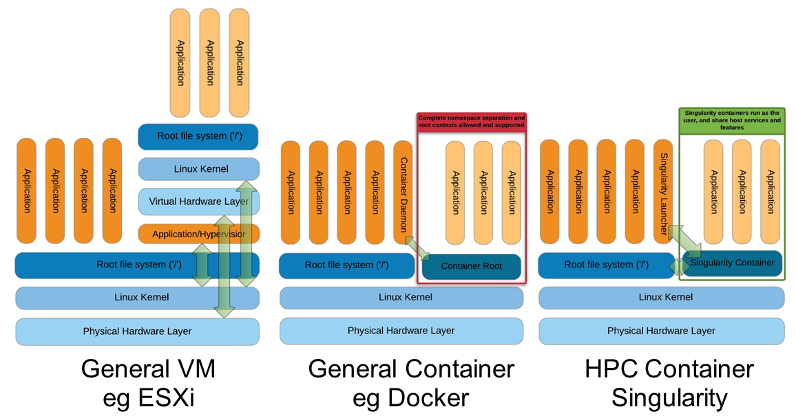

# Singularity


```{r, include=FALSE}
knitr::opts_chunk$set(echo = TRUE, eval = FALSE, warning = FALSE)
```


## Introduction to Singularity

* Focus:
  * Reproducibility to scientific computing and the high-performance computing (HPC) world.
* Origin: Lawrence Berkeley National Laboratory. Later spin-off: Sylabs
* Version 1.0 -> 2016
* More information: [https://en.wikipedia.org/wiki/Singularity_(software)](https://en.wikipedia.org/wiki/Singularity_(software))

### Singularity architecture



| Strengths | Weaknesses |
| ----- | ----- |
| No dependency of a daemon | At the time of writing only good support in Linux<br>Mac experimental. Desktop edition. Only running|
| Can be run as a simple user<br>Avoids permission headaches and hacks | For some features you need root account (or sudo) |
| Image/container is a file (or directory) ||
| More easily portable ||
| Two types of images:<br>Read-only (production)<br>Writable (development, via sandbox)||

### Strengths

* No dependency of a daemon
* Can be run as a simple user
  * Avoid permission headaches and hacks
* Image/container is a file (or directory)
* More easily portable
* Two type of images
  * Read-only (production)
  * Writable (development, via sandbox)


### Weaknesses

* At the time of writing only good support in Linux
  * Mac experimental. Desktop edition. Only running
* For some features you need root account (or sudo)


## Build process

<!-- New image needs to be created based on this -->


### Examples

There are different ways to generate Singularity image files. The most common way is so far thanks to existing Docker images already present in public registries.

#### Through registries

##### Docker Hub

[https://hub.docker.com/r/biocontainers/fastqc](https://hub.docker.com/r/biocontainers/fastqc)

    singularity build fastqc-0.11.9_cv7.sif docker://biocontainers/fastqc:v0.11.9_cv7


##### Biocontainers

###### Via quay.io

[https://quay.io/repository/biocontainers/fastqc](https://quay.io/repository/biocontainers/fastqc)

    singularity build fastqc-0.11.9.sif docker://quay.io/biocontainers/fastqc:0.11.9--0

###### Via Galaxy project prebuilt images

    singularity pull --name fastqc-0.11.9.sif https://depot.galaxyproject.org/singularity/fastqc:0.11.9--0

```{block2, type='rmdnote'}
Galaxy project provides all Bioinformatics software from Biocontainers initiative as Singularity prebuilt images. If download and conversion time of images is an issue for you, this is likely the best option if working in the biomedical field.
```

##### Sylabs registry

Not as popular so far, but it provides fast download of images.

* [https://cloud.sylabs.io/library](https://cloud.sylabs.io/library)


#### Docker Daemon

If you create your own images (as we did during the course) and you don't want to share them publicly (and you have not access to any private image registry, either), you can convert your locally built Docker images into Singularity image files.


        singularity build fastqc-web-0.11.9.sif docker-daemon://fastqcwww

### Sandboxing

Instead of generating an image file, it is actually possible to use a whole directory with its contents. This is handy when specific changes may be needed.

```
     singularity build --sandbox ./sandbox docker://ubuntu:18.04
     touch sandbox/etc/myetc.conf
     singularity build sandbox.sif ./sandbox
```

```{block2, type='rmdnote'}
Apart from testing or debugging, as we commented with Docker, we don't recommend this approach because it makes reproducibility more difficult.
```

### Singularity recipes

Singularity provides its own build system and recipe syntax. Despite it is actually possible to generate images from scratch (known as ***bootstraping***) thanks to these recipes, this is at time of writing far slower than converting from Docker ones. Docker has the advantage of saving every action line as a cached image. That is not happening with Singularity.

When using recipes, it's mandatory to have administrator permissions (e.g., as beeing root or via **sudo**).

In any case, it can still be useful to boostrap an image derived from a previously existing one. Below we provide two common approaches:


#### Docker bootstrap

Instead of converting a Docker image into a Singularity one, it's possible to use one as a base one and modify it by using Singularity recipe syntax.

````
BootStrap: docker
From: biocontainers/fastqc:v0.11.9_cv7

%runscript
    echo "Welcome to FastQC Image"
    fastqc --version

%post
    echo "Image built"
````

    sudo singularity build fastqc.sif docker.singularity


```{block2, type='rmdtip'}
The command %runscript would be equivalent to ENTRYPOINT/CMD in Docker. It is only triggered when using ```singularity run```. This is useful if you want to hide from the user the complexity of a command-line path or an included custom script.
```

#### Debian bootstrap

Alternatively, we can build the whole image from Debian/Ubuntu distribution. This will normally take a while.

```
BootStrap: debootstrap
OSVersion: bionic
MirrorURL:  http://fr.archive.ubuntu.com/ubuntu/
Include: build-essential curl python python-dev openjdk-11-jdk bzip2 zip unzip

%runscript
    echo "Welcome to my Singularity Image"
    fastqc --version
    multiqc --version
    bowtie --version

%post

    FASTQC_VERSION=0.11.9
    MULTIQC_VERSION=1.9
    BOWTIE_VERSION=1.3.0

    cd /usr/local; curl -k -L https://www.bioinformatics.babraham.ac.uk/projects/fastqc/fastqc_v${FASTQC_VERSION}.zip > fastqc.zip
    cd /usr/local; unzip fastqc.zip; rm fastqc.zip; chmod 775 FastQC/fastqc; ln -s /usr/local/FastQC/fastqc /usr/local/bin/fastqc

    cd /usr/local; curl --fail --silent --show-error --location --remote-name https://github.com/BenLangmead/bowtie/releases/download/v$BOWTIE_VERSION/bowtie-${BOWTIE_VERSION}-linux-x86_64.zip
    cd /usr/local; unzip -d /usr/local bowtie-${BOWTIE_VERSION}-linux-x86_64.zip
    cd /usr/local; rm bowtie-${BOWTIE_VERSION}-linux-x86_64.zip
    cd /usr/local/bin; ln -s ../bowtie-${BOWTIE_VERSION}-linux-x86_64/bowtie* .

    curl --fail --silent --show-error --location --remote-name  https://bootstrap.pypa.io/pip/2.7/get-pip.py
    python get-pip.py

    pip install numpy matplotlib
    pip install -I multiqc==${MULTIQC_VERSION}

    echo "Biocore image built"

%labels
    Maintainer Biocorecrg
Version 0.1.0
```

    sudo singularity build fastqc-multi-bowtie.sif debootstrap.singularity


```{block2, type='rmdtip'}
The available deboostrap recipes depend on the version you have installed in the system. Check at: ```/usr/share/debootstrap/scripts/``` for more details. For Debian, instead of Ubuntu, you can replace mirrorURL with https://ftp.debian.org/debian/ More details at: https://sylabs.io/guides/3.7/user-guide/appendix.html#build-debootstrap
```

```{block2, type='rmdnote'}
It's possible to sign cryptographically your images, so third parties can verify they are coming from their actual authors. This implies some matters beyond the scope of this course, but you have some details if interested at: https://sylabs.io/guides/3.7/user-guide/signNverify.html
```

### Remote building

This allows us to build a Singularity image without using our own computer. This is convenient if your machine has not many resources or if you don't have administrator privileges.

* We need to create a [https://cloud.sylabs.io/](Sylabs Cloud) account first.

```{bash, eval=FALSE, echo=TRUE}
    singularity remote login
```

* In order to use it our username and passwords we generate a token at https://cloud.sylabs.io/auth/tokens and copy its contents to a file (e.g., ``singularity.token``). Then we use in the command-line below:

```{bash, eval=FALSE, echo=TRUE}
    singularity remote login --tokenfile singularity.token
```

<details>
<summary>
<h5>*Output*</h5>
</summary>
    (base) [ec2-user@ip-172-31-47-200 ~]$ singularity remote login --tokenfile singularity.token
    INFO:    Access Token Verified!
    INFO:    Token stored in /home/ec2-user/.singularity/remote.yaml
</details>

```{block2, type='rmdtip'}
For safety reasons, remove the token from Cloud Sylabs interface after the course. Follow the same philosophy for similar circumstances. Keep an only token for a specific environment or action.
```

* Once we are authenticated with our access token, we can **build an image**:

```{bash, eval=FALSE, echo=TRUE}
    singularity build --remote focal.sif docker://ubuntu:focal
```

* Since we are already authenticated, we can take advantage to push a Singularity image in our account, similarly to what we did with Docker. We use ```-U``` so we do not sign the image.

```{bash, eval=FALSE, echo=TRUE}
    singularity push -U focal.sif library://toniher/test/focal.sif:latest
```

```{block2, type='rmdtip'}
IMPORTANT: Unless it is not defined in advance as private from Cloud Sylabs interface, pushed image will be public and there does not seem an easy way to turn it private.
As an interesting feature, you can actually sign your images after you pushed them from Cloud Sylabs web interface by using a key associated to your account (which can also be created there).
```

```{block2, type='rmdnote'}
More details at [https://sylabs.io/guides/3.7/user-guide/cloud_library.html](https://sylabs.io/guides/3.7/user-guide/cloud_library.html)
```

## Run and execution process

Once we have some image files (or directories) ready, we can run or favourite processes.

### Singularity shell

The straight-forward exploratory approach, equivalent to ```docker run -ti myimage /bin/shell```. But with a more handy syntax.

    singularity shell fastqc-multi-bowtie.sif

```{block2, type='rmdnote'}
Move around the directories and notice the different isolation approach compared to Docker. You can access most of the host filesystem.
```

### Singularity exec

That is the most common way to execute Singularity (equivalent to ```docker exec```). That would be the normal approach in HPC environments.

    singularity exec fastqc-multi-bowtie.sif fastqc

### Singularity run

This executes runscript from recipe definition (equivalent to ```docker run```). Not so common for HPC uses. More for instances (servers).

    singularity run fastqc-multi-bowtie.sif


### Environment control

By default Singularity inherits our profile environment (e.g., PATH environment variable). This may be convenient for some circumstances, but it can also lead to unexpected problems if you are not aware, when your own environment clashes with the default one from the image.

    singularity shell -e fastqc-multi-bowtie.sif

    singularity exec -e fastqc-multi-bowtie.sif fastqc

    singularity run -e fastqc-multi-bowtie.sif


Compare ```env``` command with and without -e modifier.

    singularity exec fastqc-multi-bowtie.sif env
    singularity exec -e fastqc-multi-bowtie.sif env

### Execute from sandboxed images / directories

    singularity exec ./sandbox ls -l /etc/myetc.conf
    # We can see file created in the directory before
    singularity exec ./sandbox bash -c 'apt-get update && apt-get install python'
    # We cannot install python
    singularity exec --writable ./sandbox bash -c 'apt-get update && apt-get install python'
    # We needed to add writable parameter

### Execute straight from a registry

Image is actually downloaded (and if a Docker one, converted) and stored in Singularity cache directory.

    singularity exec docker://ncbi/blast:2.10.1 blastp -version

## Bind paths (aka volumes)

Paths of host system mounted in the container

* Default ones, no need to mount them explicitly (for 3.7.x): ```$HOME``` , ```/sys:/sys``` , ```/proc:/proc```, ```/tmp:/tmp```, ```/var/tmp:/var/tmp```, ```/etc/resolv.conf:/etc/resolv.conf```, ```/etc/passwd:/etc/passwd```, and ```$PWD``` [https://sylabs.io/guides/3.7/user-guide/bind_paths_and_mounts.html](https://sylabs.io/guides/3.7/user-guide/bind_paths_and_mounts.html)

For others, need to be done explicitly (syntax: host:container)

    mkdir testdir
    touch testdir/testout
    singularity shell -e -B ./testdir:/scratch fastqc-multi-bowtie.sif
    > touch /scratch/testin
    > exit
    ls -l testdir

## Example execution:

Using the 2 fastqc available files, process them outside and inside the mounted directory.

Let's use our ```fastqc.sif``` image file and we place it in $HOME

```
# Let's create a dummy directory
mkdir $HOME/scratch

# Let's copy contents of testdata in scratch

singularity exec fastqc.sif fastqc scratch/*fastq.gz

# Check you have some HTMLs there. Remove them
rm scratch/*html

# Let's use shell
singularity shell fastqc.sif
> cd scratch
> fastqc *fastq.gz
> exit

# Check you have some HTMLs there. Remove them
singularity exec -B ./scratch:/fastqcdir fastqc.sif fastqc /fastqcdir/*fastq.gz

# What happens here!
singularity exec -B ./scratch:/fastqcdir fastqc.sif bash -c 'fastqc /fastqcdir/*fastq.gz'

```

## Instances

Also know as **services**. Despite Docker it is still more convenient for these tasks, it allows enabling thing such as webservices (e.g., via APIs) in HPC workflows. Instead of defining a **%runscript** block, we define a **%startscript** one. So, it would be possible to have both if needed.

Simple example:

```
Bootstrap: docker
From: library/mariadb:10.3

%startscript
        mysqld
```

    sudo singularity build mariadb.sif mariadb.singularity

    mkdir -p testdir
    mkdir -p testdir/db
    mkdir -p testdir/socket

    singularity exec -B ./testdir/db:/var/lib/mysql mariadb.sif mysql_install_db

    singularity instance start -B ./testdir/db:/var/lib/mysql -B ./testdir/socket:/run/mysqld mariadb.sif mydb

    singularity instance list

    singularity exec instance://mydb mysql -uroot

    singularity instance stop mydb


```{block2, type='rmdnote'}
When exposing ports below 1024 in a LINUX machine, administrator (sudo) privileges are needed. Historical reference: https://www.w3.org/Daemon/User/Installation/PrivilegedPorts.html
```

```{block2, type='rmdtip'}
Specially with instances (**but not only**), if you encounter some permission problems you may need to enable write permissions in the image. If you do not want changes to persist in the image, you may want to use the **--writable-tmpfs option**. Changes are stored in an in-memory temporary filesystem which is discarded as soon as the service stops. More details about special storage options with Singularity: https://sylabs.io/guides/3.7/user-guide/persistent_overlays.html
```

More information:

* [https://sylabs.io/guides/3.7/user-guide/running_services.html](https://sylabs.io/guides/3.7/user-guide/running_services.html)

* [https://sylabs.io/guides/3.7/user-guide/networking.html](https://sylabs.io/guides/3.7/user-guide/networking.html)

## Troubleshooting

     singularity --help

### Fakeroot

Singularity permissions are an evolving field. If you don't have access to ```sudo```, it might be worth considering using ``--fakeroot/-f`` parameter.

* More details at [https://sylabs.io/guides/3.7/user-guide/fakeroot.html](https://sylabs.io/guides/3.7/user-guide/fakeroot.html)

### Singularity cache directory

    $HOME/.singularity

* It stores cached images from registries, instances, etc.
* If problems may be a good place to clean. When running ```sudo```, $HOME is /root.

### Global singularity configuration

Normally at ```/etc/singularity/singularity.conf``` or similar (e.g preceded by ```/usr/local/``` is Singularity is installed manually)

* It can only be modified by users with administration permissions
* Worth noting ```bind path``` lines, which point default mounted directories in containers as commented in [bind paths section][Bind paths (aka volumes)]

## Exercise 4 - Singularity running and building

* Example running BLAST commands in different ways

<details>
<summary>
<h5 style="background-color: #e6fadc; display: inline-block;">*Answer*</h5>
</summary>
Compare with the previous Docker examples

First of all, let's generate a ```blast.sif``` image. We have plenty of ways to do this. One example below:

```
singularity build blast.sif docker://ncbi/blast:2.10.1
```

### Blast command-line (1)

```bash
# If not there create a DB dir
mkdir $HOME/db

cp blast.sif $HOME/db

cd $HOME/db

curl -L https://www.uniprot.org/uniprot/O75976.fasta -o O75976.fasta

curl -L https://www.uniprot.org/uniprot/Q90240.fasta -o Q90240.fasta

singularity exec blast.sif blastp -query O75976.fasta -subject Q90240.fasta

# We can mount if we prefer (as we did with Docker), but it's not strictly necessary
singularity exec -B /home/ec2-user/db:/blastdb blast.sif blastp -query /blastdb/O75976.fasta -subject /blastdb/Q90240.fasta > out.blast

singularity exec -B /home/ec2-user/db:/blastdb blast.sif blastp -query /blastdb/O75976.fasta -subject /blastdb/Q90240.fasta -out /blastdb/output.blast
```

### Blast command-line (2)

```bash
# If not there create a DB dir
mkdir $HOME/db

cp blast.sif $HOME/db

cd $HOME/db

# Let's download Swissprot DB
curl -L https://ftp.ncbi.nlm.nih.gov/blast/db/FASTA/swissprot.gz -o swissprot.gz

gunzip swissprot.gz

# Let format the Swissprot DB
singularity exec blast.sif makeblastdb -dbtype prot -parse_seqids -in swissprot
```

We can retrieve a FASTA sequence by ID

```bash
singularity exec blast.sif blastdbcmd -dbtype prot -db swissprot -entry O75976
```
</details>

* Example running nginx as a service (NGINX its actually the custom example in Singularity page)
  * Build a NGINX image and run as an instance
  * Retrieve NGINX version from the instance
  * Share a simply HTML page


<details>
<summary>
<h5 style="background-color: #e6fadc; display: inline-block;">*Answer*</h5>
</summary>

```
# Example recipe from: https://sylabs.io/guides/3.7/user-guide/running_services.html

Bootstrap: docker
From: nginx:1.20
Includecmd: no

%startscript
   nginx
```

We generate the image:

```
sudo singularity build nginx.sif nginx.singularity
```

Then, for using the instance. If you try as normal user:

```
(base) [ec2-user@ip-172-31-32-16 singularity]$ singularity instance start nginx.sif webserver
2021/04/30 12:23:12 [warn] 15#15: the "user" directive makes sense only if the master process runs with super-user privileges, ignored in /etc/nginx/nginx.conf:2
nginx: [warn] the "user" directive makes sense only if the master process runs with super-user privileges, ignored in /etc/nginx/nginx.conf:2
2021/04/30 12:23:12 [emerg] 15#15: mkdir() "/var/cache/nginx/client_temp" failed (30: Read-only file system)
nginx: [emerg] mkdir() "/var/cache/nginx/client_temp" failed (30: Read-only file system)

INFO:    instance started successfully

(base) [ec2-user@ip-172-31-32-16 singularity]$ singularity instance list
INSTANCE NAME    PID      IP    IMAGE
webserver        24350          /home/ec2-user/git/CoursesCRG_Containers_Nextflow_May_2021/containers/singularity/nginx.sif
```

If you try with sudo permissions:

```
(base) [ec2-user@ip-172-31-32-16 singularity]$ sudo singularity instance start nginx.sif webserver
2021/04/30 12:24:47 [emerg] 15#15: mkdir() "/var/cache/nginx/client_temp" failed (30: Read-only file system)
nginx: [emerg] mkdir() "/var/cache/nginx/client_temp" failed (30: Read-only file system)

INFO:    instance started successfully

(base) [ec2-user@ip-172-31-32-16 singularity]$ singularity instance list
INSTANCE NAME    PID    IP    IMAGE

(base) [ec2-user@ip-172-31-32-16 singularity]$ sudo singularity instance list
INSTANCE NAME    PID      IP    IMAGE
webserver        24409          /home/ec2-user/git/CoursesCRG_Containers_Nextflow_May_2021/containers/singularity/nginx.sif
```

For this case, it's necessary to allow writing in the image:

```
(base) [ec2-user@ip-172-31-32-16 singularity]$ sudo singularity instance start --writable-tmpfs nginx.sif webserver
2021/04/30 12:26:53 [notice] 16#16: using the "epoll" event method
2021/04/30 12:26:53 [notice] 16#16: nginx/1.20.0
2021/04/30 12:26:53 [notice] 16#16: built by gcc 8.3.0 (Debian 8.3.0-6)
2021/04/30 12:26:53 [notice] 16#16: OS: Linux 4.14.225-169.362.amzn2.x86_64
2021/04/30 12:26:53 [notice] 16#16: getrlimit(RLIMIT_NOFILE): 65535:65535
2021/04/30 12:26:53 [notice] 17#17: start worker processes
2021/04/30 12:26:53 [notice] 17#17: start worker process 18

INFO:    instance started successfully
```

You can check from the web browser if it worked pointing your machine.

We can get the specific NGINX version this way:

```
sudo singularity exec instance://webserver nginx -version
```


For a custom HTML file:
```
mkdir -p $HOME/www

cd $HOME/www
```

And we place a simply **index.html** file there:
```
<html>
        <body>
                Hello world!
        </body>
</html>
```

We execute now the command mounting where HTMLs are stored.

```
(base) [ec2-user@ip-172-31-32-16 singularity]$ sudo singularity instance start -B /home/ec2-user/www:/usr/share/nginx/html --writable-tmpfs nginx.sif webserver
2021/04/30 12:31:20 [notice] 15#15: using the "epoll" event method
2021/04/30 12:31:20 [notice] 15#15: nginx/1.20.0
2021/04/30 12:31:20 [notice] 15#15: built by gcc 8.3.0 (Debian 8.3.0-6)
2021/04/30 12:31:20 [notice] 15#15: OS: Linux 4.14.225-169.362.amzn2.x86_64
2021/04/30 12:31:20 [notice] 15#15: getrlimit(RLIMIT_NOFILE): 65535:65535
2021/04/30 12:31:20 [notice] 16#16: start worker processes
2021/04/30 12:31:20 [notice] 16#16: start worker process 17

INFO:    instance started successfully
```
</details>

```{block2, type='rmdtip'}
NGINX is serving web pages by default at the following location: /usr/share/nginx/html
```
